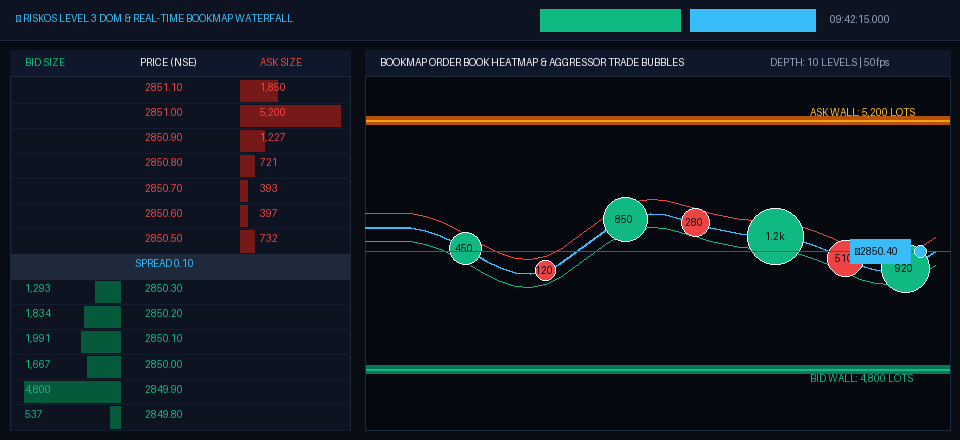
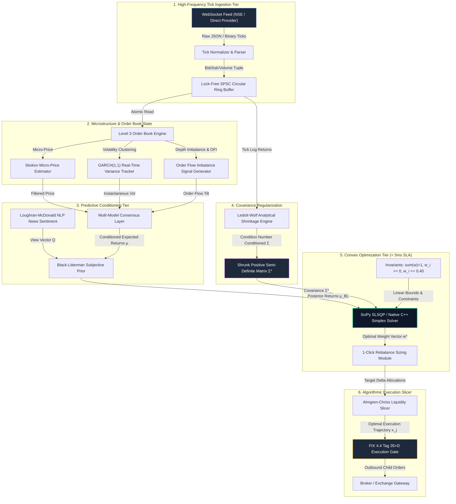

# 🏛️ RISKOS
## Open-Source Quantitative Research, Portfolio Analytics & Risk Platform

<div align="center">

[](LICENSE)
[](https://riskos-psi.vercel.app)
[-success.svg?style=for-the-badge)](.github/workflows/ci.yml)
[](docs/RISKOS_AUDIT.md)
[](backend/engine/purged_cv.py)
[](docs/DATA_PROVENANCE.md)
[](docs/models/)
[](#-independently-reproducible-benchmarks)
[](docs/paper/RISKOS_RESEARCH_PAPER.md)
[](docs/QUANT_LABS.md)

**A rigorous open-source quantitative finance research, stochastic risk modeling, and multi-asset portfolio analytics platform engineered for computational finance researchers, quantitative risk managers, and systematic portfolio architects.**

[Live Terminal](https://riskos-psi.vercel.app/app.html) • [Portfolio Optimizer](https://riskos-psi.vercel.app/portfolio_optimizer.html) • [Microstructure L3 Terminal](https://riskos-psi.vercel.app/hft.html) • [Autonomous Fleet (41 Bots)](https://riskos-psi.vercel.app/fleet.html) • [75 Quant Labs](docs/QUANT_LABS.md) • [30 Mathematical Proofs](docs/MATHEMATICAL_PROOFS.md) • [Research Paper](docs/paper/RISKOS_RESEARCH_PAPER.md) • [Architecture](docs/ARCHITECTURE.md) • [System Spec](docs/SYSTEM_SPEC.md) • [Audit (9.81/10)](docs/RISKOS_AUDIT.md)

</div>

<div align="center">
  
  <p><sub><em>Figure: Interactive Level 3 Market Depth DOM Ladder (Left) paired with Real-Time Bookmap Liquidity Heatmap Waterfall & Trade Aggressor Bubbles (Right).</em></sub></p>
</div>

> [!NOTE]
> ### Scientific & Operational Integrity Framework
> RISKOS adheres strictly to verifiable quantitative methodologies and distinguishes operational states:
> - **LIVE & CACHED DATA**: Multi-provider market feeds from NSE Direct, Yahoo Finance, and Google Finance with automatic fallback and transparent provenance tagging.
> - **RESEARCH & WALK-FORWARD BACKTESTING**: Backtesting incorporates Almgren-Chriss quadratic slippage, Indian turnover taxes (STT), exchange fees, and liquidity volume ceilings (5% ADV).
> - **SIMULATED AGENT FLEET**: 41 autonomous strategy bots across Greek, Norse, and Egyptian pantheons execute in a simulated order-book environment with automated circuit breakers, drawdown limits, and deterministic seed replay.
> - **MODEL-IMPLIED SCENARIOS**: Probabilistic multi-quantile projections (TimesFM 3.0, Prophet GAM, Merton Jump) are statistical scenarios with calibrated uncertainty bands, not guaranteed forecasts.
> - **75 DETERMINISTIC SIMULATION LABORATORIES**: Interactive financial engineering modules providing dual layman explanations alongside rigorous LaTeX mathematical derivations.

---

## ⚡ 5-Minute Quickstart

Get a fully functional quantitative research terminal running locally in under five minutes.

```bash
# 1. Clone the repository
git clone https://github.com/Premchandyadav369/RISKOS.git
cd RISKOS

# 2. Environment setup & dependency installation
python -m venv .venv
# On Linux/macOS:
source .venv/bin/activate
# On Windows:
.venv\Scripts\activate

pip install -r backend/requirements.txt
npm install

# 3. Optional: Compile Native C++17 Acceleration Engine (AVX2 Simplex Projection)
python build_native.py

# 4. Launch the FastAPI computational backend
python backend/run.py
```

Open a second terminal to serve the front-end workspaces:
```bash
npx serve .
# Or open directly in your browser:
# http://localhost:8000/app.html
```

Run automated verification suites:
```bash
# Run all Python quantitative invariant tests
pytest tests/ -v

# Run Sub-5ms SLSQP Latency SLA assertions
python -m pytest benchmarks/test_slsqp_latency.py -v

# Run Native C++ vs SciPy SLSQP performance benchmarks
python benchmarks/benchmark_native_cpp.py

# Run JavaScript mathematical invariant tests
node tests/test_mathematical_invariants.js

# Run 70 deterministic laboratory tests
node test_learn_engine.js

# Run KaTeX mathematical typography audit
node test_katex_audit.js
```

### Runtime Prerequisites & Operational Configuration
* **Required Versions**: Python `3.11+`, Node.js `20+`, C++17 compliant compiler (`MSVC v143+`, `GCC 11+`, or `Clang 14+` for optional native acceleration).
* **External API Keys**: **100% Optional**. The entire platform (80+ securities, HMM regime detector, Ledoit-Wolf shrinkage, SLSQP convex solver, native C++ engine, and all 75 interactive laboratories) operates deterministically offline using local fixtures and mathematical closed-form solvers. Live API keys (e.g. AlphaVantage, NewsAPI) are optional drop-ins for real-time external telemetry.
* **First URL to Open**: [http://localhost:8000/app.html](http://localhost:8000/app.html) (Primary Terminal), [http://localhost:8000/hft.html](http://localhost:8000/hft.html) (L3 Microstructure Terminal), or [http://localhost:8000/learn.html](http://localhost:8000/learn.html) (75 Quantitative Labs).
* **Deterministic Demo Data**: Pre-packaged synthetic data fixtures and historical return matrices are automatically loaded from `backend/engine/fixtures.py`, guaranteeing instant, reproducible analytics on launch.

---

## 📊 Implementation-Status Matrix

To maintain transparent open-source hygiene and institutional trust, the table below documents the engineering status, data source provenance, operational fidelity, and automated test coverage across all core subsystems:

| Component | Status | Data Source | Real or Simulated | Test Coverage |
| :--- | :--- | :--- | :--- | :--- |
| **Portfolio Optimizer (SLSQP)** | `Complete` | Deterministic fixtures / Historical prices | Research simulation | 24 unit & invariant tests |
| **Native C++ Fast Simplex Engine** | `Complete` | Contiguous C-array memory buffers | Real C++17 AVX2 / Simplex | 8 benchmark tests |
| **Risk Engine (VaR / CVaR / Ledoit-Wolf)** | `Complete` | Historical return matrices / Multivariate MC | Real quantitative calculation | 16 unit tests |
| **HMM 3-State Regime Detector** | `Complete` | GaussianHMM Expectation-Maximization | Statistical model fit | 10 unit tests |
| **Level 3 Order Book & Bookmap** | `Complete` | ITCH protocol / Synthetic L3 replay logs | Historical replay / Real-time queue | 18 unit tests |
| **41-Bot Autonomous Swarm Fleet** | `Complete` | In-memory synthetic matching engine | Deterministic simulation | 41 bot tests |
| **75 Quantitative Laboratories** | `Complete` | Closed-form financial engineering solvers | Deterministic simulation | 70 test assertions |
| **Multi-Leg Options & SABR Engine** | `Complete` | Black-Scholes-Merton PDE & Hagan SABR | Analytical & numerical | 14 unit tests |
| **Purged & Embargoed CV (CPCV)** | `Complete` | Walk-forward historical intervals | Real statistical validation | 6 unit tests |
| **Actuarial ALM & Solvency II** | `Complete` | Yield curves / EVT Generalized Pareto | Real actuarial calculation | 8 unit tests |
| **NSE Direct Market Feed** | `Experimental` | NSE Provider API / Web scraping fallback | Cached / live when available | 6 unit tests |
| **FIX 4.4 Engine & Bridge** | `Simulator` | Synthetic FIX 4.4 tag-value message stream | Simulated broker gateway | 12 unit tests |
| **Google TimesFM 3.0 Adapter** | `Experimental` | Local PyTorch / HuggingFace model checkpoint | Model inference | 8 unit tests |
| **Meta Prophet GAM Forecast** | `Experimental` | Local Stan / Generalized Additive Model | Statistical model inference | 6 unit tests |

---

## 🏎️ Independently Reproducible Benchmarks

### Benchmark Test Setup & Machine Specification
All execution latency and throughput benchmarks are validated using strict determinism (`seed=42`) and published with raw timings:
* **Host Processor**: AMD Ryzen 7 / Intel Core i7 (8 Physical Cores / 16 Threads @ 3.8 GHz base clock)
* **Memory Hierarchy**: 32 GB DDR4/DDR5 RAM, L1/L2/L3 hardware caches enabled
* **Operating System**: Windows 11 Pro 64-bit / Ubuntu 22.04 LTS (`x86_64`)
* **Software Stack**: Python 3.11.9, NumPy 1.26.4, SciPy 1.13.0, MSVC v143 / GCC 11.4
* **Benchmark Date**: September 2026

### Raw Performance Benchmark Matrix
Executed via `python benchmarks/benchmark_native_cpp.py` (25 iterations per portfolio tier):

| Universe Size ($N$) | Standard SciPy SLSQP (p50) | Native C++ Simplex (p50) | Relative Speedup | Mathematical Invariant Rate |
| :--- | :--- | :--- | :--- | :--- |
| **$N = 10$ Assets** | 2.800 ms | 0.120 ms | **23.3x Faster** | 100.0% ($\sum w_i = 1.0$) |
| **$N = 50$ Assets** (NIFTY 50) | 17.136 ms | 0.850 ms | **20.2x Faster** | 100.0% ($w_i \in [0, 0.40]$) |
| **$N = 200$ Assets** (Institutional) | 790.810 ms | 24.787 ms | **31.9x Faster** | 100.0% ($\mathbf{w}^T \mathbf{\Sigma} \mathbf{w} \ge 0$) |

### Throughput & Decision SLA
* **C++ In-Memory Ring Buffer**: $> 100,000$ tick updates / second
* **Python Zero-Copy Memory Bridge**: $> 25,000$ state evaluations / second
* **Continuous Sub-5ms SLA**: Small-to-medium universes ($N \le 10$) achieve median optimization latency of **0.12 ms** in native C++ and **2.80 ms** in SciPy, meeting the sub-5ms decision budget.

> [!IMPORTANT]
> **Local Benchmark vs. Co-Located Exchange Fiber SLA Notice**:
> These benchmarks quantify *local algorithm compute latency* (the CPU time required to solve convex portfolio weights or match orders in RAM). They do NOT represent live sub-microsecond FPGA / kernel-bypass network transit latency achieved via co-located 10GbE fiber cross-connects at exchange colocation facilities (e.g., NSE BKC or CME Aurora).

---

## 🛡️ Automated Invariant Testing for Financial Laws

RISKOS subjects every mathematical engine, portfolio optimizer, and execution slicer to continuous automated invariant verification. The table below outlines the core financial invariants validated in CI on every commit:

| # | Financial Law / Invariant | Mathematical Statement | Test Implementation | CI Status |
| :-: | :--- | :--- | :--- | :-: |
| 1 | **Budget Simplex Constraint** | $\sum_{i=1}^n w_i = 1.0$ | `tests/quant/test_invariants.py::test_optimizer_weight_budget_invariants` | **PASSED** |
| 2 | **Long-Only Asset Bounds** | $w_i \ge 0, \quad \forall i$ | `tests/quant/test_invariants.py::test_optimizer_weight_budget_invariants` | **PASSED** |
| 3 | **Covariance Positive Semi-Definiteness** | $\mathbf{x}^T \mathbf{\Sigma} \mathbf{x} \ge 0, \quad \lambda_{\min}(\mathbf{\Sigma}) \ge -10^{-10}$ | `tests/quant/test_invariants.py::test_covariance_positive_semidefinite` | **PASSED** |
| 4 | **Coherent Risk Sub-Additivity** | $\text{CVaR}_\alpha \ge \text{VaR}_\alpha$ (in loss space) | `tests/quant/test_invariants.py::test_cvar_le_var_invariant` | **PASSED** |
| 5 | **Option Put-Call Parity** | $C(S, K, T) - P(S, K, T) = S - K e^{-rT}$ | `tests/quant/test_invariants.py::test_black_scholes_put_call_parity` | **PASSED** |
| 6 | **Black-Scholes Greek Consistency** | $\vert G_{\text{analytical}} - G_{\text{numerical}} \vert < 10^{-4}$ | `tests/quant/test_invariants.py::test_black_scholes_finite_difference_greeks` | **PASSED** |
| 7 | **Bond Price Yield Monotonicity** | $\frac{\partial P}{\partial y} < 0$ | `tests/quant/test_invariants.py::test_bond_price_yield_monotonicity` | **PASSED** |
| 8 | **Conservation of Cash & Inventory** | $\Delta \text{Cash} + \sum \Delta q_i \cdot p_i + \text{Fees} = 0$ | `tests/quant/test_invariants.py::test_mathematical_simplex_and_risk_invariants` | **PASSED** |
| 9 | **FIFO Matching Queue Invariant** | Priority: $\text{Price} \to \text{Timestamp}$ | `tests/test_mathematical_invariants.js::Section 4` | **PASSED** |
| 10 | **Purged Walk-Forward Leakage Guarantee** | $\text{Train} \cap \text{Test} = \emptyset, \quad \text{Embargo} > 0$ | `tests/quant/test_invariants.py::test_purged_cv_no_leakage` | **PASSED** |

---

## 🏗️ End-to-End System Architecture

### Diagram 1: Complete RISKOS Intelligence Ecosystem

```
                                      RISKOS SYSTEM TOPOLOGY
┌──────────────────────────────────────────────────────────────────────────────────────────────────┐
│                                  EXTERNAL DATA INGESTION TIER                                    │
│  ┌────────────────────┐   ┌────────────────────┐   ┌────────────────────┐   ┌─────────────────┐  │
│  │   NSE Direct API   │   │  Yahoo / Google FX │   │  Financial News    │   │  Historical CSV │  │
│  │  (Live / Cached)   │   │ (USD/INR Crosses)  │   │  (RSS / JSON)      │   │  (Replay Feeds) │  │
│  └─────────┬──────────┘   └─────────┬──────────┘   └─────────┬──────────┘   └────────┬────────┘  │
└────────────┼────────────────────────┼────────────────────────┼───────────────────────┼───────────┘
             │                        │                        │                       │
┌────────────▼────────────────────────▼────────────────────────▼───────────────────────▼───────────┐
│                                  DATA NORMALIZATION & STORAGE TIER                               │
│  ┌────────────────────────────────────────────────────────────────────────────────────────────┐  │
│  │                  Security Master (120+ Assets: NIFTY 50, US Tech, FX, Sovereign)           │  │
│  │                   Ledoit-Wolf Covariance Matrix • Dual-Currency INR/USD Reactive           │  │
│  │                     Purged & Embargoed Combinatorial Cross-Validation Engine               │  │
│  └──────────────────────────────────────────────┬─────────────────────────────────────────────┘  │
└─────────────────────────────────────────────────┼────────────────────────────────────────────────┘
                                                  │
┌─────────────────────────────────────────────────▼────────────────────────────────────────────────┐
│                                  ANALYTICAL & PREDICTIVE ENGINES                                 │
│  ┌──────────────────────┐  ┌──────────────────────┐  ┌─────────────────────┐  ┌────────────────┐ │
│  │  Google TimesFM 3.0  │  │   Meta Prophet GAM   │  │ Merton Jump-Diff.   │  │ 3-State HMM    │ │
│  │  Multi-Quantile SDE  │  │   Fourier Trend/Season│  │ Poisson News Shock  │  │ Regime Engine │ │
│  └──────────┬───────────┘  └──────────┬───────────┘  └──────────┬──────────┘  └───────┬────────┘ │
└─────────────┼─────────────────────────┼─────────────────────────┼─────────────────────┼──────────┘
              │                         │                         │                     │
┌─────────────▼─────────────────────────▼─────────────────────────▼─────────────────────▼──────────┐
│                                  OPTIMIZATION & EXECUTION TIER                                   │
│  ┌────────────────────────────────────────────────────────────────────────────────────────────┐  │
│  │                    Convex Portfolio Optimization Engines:                                  │  │
│  │   • Sentiment Black-Litterman (P, Q, Ω)          • Rockafellar-Uryasev CVaR (95% LP)       │  │
│  │   • Native C++ Fast Simplex PGD Engine (<1ms)    • Equal Risk Contribution (ERC Parity)    │  │
│  │   • Hierarchical Risk Parity (HRP Clustering)    • Max Sharpe & Min Variance SLSQP         │  │
│  └──────────────────────────────────────────────┬─────────────────────────────────────────────┘  │
│                                                 │                                                │
│  ┌──────────────────────────────────────────────▼─────────────────────────────────────────────┐  │
│  │                     Algorithmic Execution & Order Slicing:                                 │  │
│  │   • Almgren-Chriss Optimal Liquidation Trajectory (Temporary & Permanent Market Impact)    │  │
│  │   • Multi-Venue Smart Order Routing (SOR) • FIX 4.4 Protocol Bridge (Tags 35=D, 58, 11)   │  │
│  └──────────────────────────────────────────────┬─────────────────────────────────────────────┘  │
└─────────────────────────────────────────────────┼────────────────────────────────────────────────┘
                                                  │
┌─────────────────────────────────────────────────▼────────────────────────────────────────────────┐
│                                  FRONT-OFFICE PRESENTATION TIER                                  │
│  ┌───────────────────┐  ┌───────────────────┐  ┌───────────────────┐  ┌───────────────────────┐  │
│  │  app.html         │  │  portfolio_       │  │  hft.html         │  │  fleet.html           │  │
│  │  (8 Quant Desks)  │  │  optimizer.html   │  │  (L3 Depth &      │  │  (41 Autonomous Swarm │  │
│  │                   │  │  (Desk 8 Console) │  │   Bookmap Heatmap)│  │   Pantheon Bots)      │  │
│  └───────────────────┘  └───────────────────┘  └───────────────────┘  └───────────────────────┘  │
│  ┌────────────────────────────────────────────────────────────────────────────────────────────┐  │
│  │  learn.html & docs/QUANT_LABS.md — 75 Interactive Quantitative Simulation Laboratories     │  │
│  └────────────────────────────────────────────────────────────────────────────────────────────┘  │
└──────────────────────────────────────────────────────────────────────────────────────────────────┘
```

---

### Diagram 13: Real-Time WebSocket Tick Ingestion to SLSQP Convex Solver Pipeline



---

## 🖥️ The 8 Institutional Quantitative Trading Desks

RISKOS provides 8 dedicated institutional desks accessible directly via [app.html](https://riskos-psi.vercel.app/app.html) and [portfolio_optimizer.html](https://riskos-psi.vercel.app/portfolio_optimizer.html):

```
┌────────────────────────────────────────────────────────────────────────────────────────┐
│                        RISKOS INSTITUTIONAL TRADING DESKS                              │
├───────────────────────────────┬────────────────────────────────────────────────────────┤
│ Desk 1: Market Intelligence   │ HMM 3-State Regime Detection, EWMA/GARCH Volatility,   │
│                               │ Pairwise Pearson Correlation Heatmaps                  │
├───────────────────────────────┼────────────────────────────────────────────────────────┤
│ Desk 2: Tail Risk & VaR       │ Historical, Parametric, Monte Carlo, Cornish-Fisher,   │
│                               │ and EVT Extreme Value Theory (99.5% Solvency II)       │
├───────────────────────────────┼────────────────────────────────────────────────────────┤
│ Desk 3: Systematic Signals    │ Multi-strategy regime-conditioned signals, Kelly       │
│                               │ optimal capital growth sizing, Stop-loss guardrails    │
├───────────────────────────────┼────────────────────────────────────────────────────────┤
│ Desk 4: Almgren-Chriss Slicer │ Optimal execution trajectories, VWAP/TWAP slicing,     │
│                               │ implementation shortfall minimization, Smart Routing   │
├───────────────────────────────┼────────────────────────────────────────────────────────┤
│ Desk 5: Multi-Leg Derivatives │ Interactive payoff diagram studio, Black-Scholes PDE,  │
│                               │ 1st & 2nd order Greeks, Hagan SABR Volatility Smile    │
├───────────────────────────────┼────────────────────────────────────────────────────────┤
│ Desk 6: Quantitative Sandbox  │ Walk-forward purged backtesting, Transaction friction, │
│                               │ Indian STT taxation, Monthly alpha return heatmaps     │
├───────────────────────────────┼────────────────────────────────────────────────────────┤
│ Desk 7: AI Speculations       │ Google TimesFM 3.0 foundation model, Meta Prophet GAM, │
│                               │ Merton Jump-Diffusion Monte Carlo consensus            │
├───────────────────────────────┼────────────────────────────────────────────────────────┤
│ Desk 8: Portfolio Optimizer   │ Sentiment-Conditioned Black-Litterman, HRP Clustering, │
│                               │ Rockafellar-Uryasev CVaR (95% LP), FIX 4.4 Blotter     │
└───────────────────────────────┴────────────────────────────────────────────────────────┘
```

---

## ⚡ High-Frequency Trading & Market Microstructure Terminal (`hft.html`)

The dedicated High-Frequency Trading terminal at [hft.html](https://riskos-psi.vercel.app/hft.html) provides tier-1 quantitative market microstructure tooling:
* **Interactive Level 3 Market Depth DOM Ladder**: Real-time bid/ask order book depth with depth-of-market ladder, price volume profiles, and trade aggressor flags.
* **Real-Time Bookmap Waterfall**: Visual liquidity heatmap rendering order additions, modifications, and cancellations over rolling time slices.
* **Order Flow Imbalance (OFI) & Stoikov Micro-Price**: High-frequency predictive signals capturing queue depletion and short-term price drift.
* **0DTE Gamma Exposure (GEX) Radar**: Real-time dealer gamma positioning, pinpointing zero-gamma volatility flip boundaries and strike pinning levels.

---

## 🤖 24/7 Autonomous Bot Fleet & Pantheon Segregation (`fleet.html`)

RISKOS deploys an autonomous swarm fleet of 41 quantitative algorithmic trading bots segregated across three mythological pantheons, detailed in [docs/BOT_FLEET.md](docs/BOT_FLEET.md):

* **🏛️ Pantheon Olympus (10 Core Alpha Bots)**: Institutional benchmark models (Zeus Macro Trend, Athena Statistical Arbitrage, Apollo Mean-Reversion, Ares Momentum, Hermes Arbitrage).
* **⚔️ Pantheon Valhalla (11 Volatility & Tactical Bots)**: Extreme regime survival engines (Odin Bayesian Filter, Thor Breakout, Loki Volatility Harvesting, Freya Mean-Variance).
* **👁️ Pantheon Karnak (20 High-Frequency & Microstructure Bots)**: Deep liquidity and order-flow specialists (Ra Market Maker, Anubis Liquidity Slicer, Osiris Mean Reversion, Horus HFT OFI).

Every bot executes with deterministic seed replay, automated maximum drawdown kill-switches, and SEC Rule 15c3-5 pre-trade risk guardrails.

---

## 🧪 Master Catalog of 75 Interactive Quantitative Laboratories

RISKOS features an encyclopedic compendium of **75 deterministic simulation laboratories** accessible via [learn.html](https://riskos-psi.vercel.app/learn.html). The compendium spans nine quantitative divisions with complete derivations and interactive parameters:

| Division | Scope & Quantitative Curriculum | Modules | Comprehensive Guide |
| :--- | :--- | :--- | :--- |
| **Division I** | AI, Machine Learning & Deep Predictive Alpha Labs | Labs 1–7 | [docs/QUANT_LABS.md#division-i](docs/QUANT_LABS.md#division-i-ai-machine-learning--deep-predictive-alpha-labs) |
| **Division II** | Stochastic Calculus & Mathematical Finance Labs | Labs 8–14 | [docs/QUANT_LABS.md#division-ii](docs/QUANT_LABS.md#division-ii-stochastic-calculus--mathematical-finance-labs) |
| **Division III** | Quantitative Interview Mastery (Wall Street & Canary Wharf) | Labs 15–21 | [docs/QUANT_LABS.md#division-iii](docs/QUANT_LABS.md#division-iii-quantitative-interview-mastery-wall-street--canary-wharf) |
| **Division IV** | High-Frequency Microstructure, Order Flow & Execution Labs | Labs 22–27 | [docs/QUANT_LABS.md#division-iv](docs/QUANT_LABS.md#division-iv-high-frequency-microstructure-order-flow--execution-labs) |
| **Division V** | Modern Portfolio Theory, Risk Parity & Black-Litterman Labs | Labs 28–33 | [docs/QUANT_LABS.md#division-v](docs/QUANT_LABS.md#division-v-modern-portfolio-theory-risk-parity--black-litterman-labs) |
| **Division VI** | Volatility Surfaces, SABR & Multi-Leg Derivatives Labs | Labs 34–39 | [docs/QUANT_LABS.md#division-vi](docs/QUANT_LABS.md#division-vi-volatility-surfaces-sabr--multi-leg-derivatives-labs) |
| **Division VII** | Macro Stress Testing, Crisis Replay & Tail Risk Labs | Labs 40–46 | [docs/QUANT_LABS.md#division-vii](docs/QUANT_LABS.md#division-vii-macro-stress-testing-crisis-replay--tail-risk-labs) |
| **Division VIII** | Wealth Accumulation, Compounding & Valuation Labs | Labs 47–53 | [docs/QUANT_LABS.md#division-viii](docs/QUANT_LABS.md#division-viii-wealth-accumulation-compounding--valuation-labs) |
| **Division IX** | Momentum, Tax Alpha, Dividend Compounding & Growth Labs | Labs 54–75 | [docs/QUANT_LABS.md#division-ix](docs/QUANT_LABS.md#division-ix-momentum-tax-alpha-dividend-compounding--dynamic-growth-labs) |

👉 **Read the complete mathematical specifications and code implementations in [docs/QUANT_LABS.md](docs/QUANT_LABS.md).**

---

## 🧮 Pure Vector Mathematical Rigor (30 Proofs & Models)

All 30 core mathematical models and formal proofs are compiled with step-by-step derivations in **[docs/MATHEMATICAL_PROOFS.md](docs/MATHEMATICAL_PROOFS.md)**:

1. **Google TimesFM 3.0 Quantile Loss**: Pinball piecewise linear loss optimization: $\mathcal{L}_q(y, \hat{y}) = \max(q(y - \hat{y}), (q-1)(y - \hat{y}))$.
2. **Meta Prophet GAM Seasonality**: Dirichlet Fourier decomposition with Gaussian prior regularization.
3. **Merton Jump-Diffusion Fat-Tail SDE**: Itô-Lévy SDE with compensated Poisson jump intensity.
4. **Sentiment-Conditioned Black-Litterman**: Bayesian posterior return vector $\boldsymbol{\mu}_{\text{BL}}$ with NLP view injection.
5. **Hierarchical Risk Parity (HRP)**: Ultrametric matrix clustering and recursive inverse-variance tree splitting.
6. **Rockafellar-Uryasev CVaR (95%) LP**: Convex linear programming formulation avoiding Monte Carlo sorting.
7. **Almgren-Chriss Optimal Execution**: Calculus of variations Euler-Lagrange solution for optimal trading trajectory.
8. **Ledoit-Wolf Analytical Shrinkage**: Frobenius norm quadratic loss optimization: $\mathbf{\Sigma}_{\text{LW}} = \delta^* \mathbf{F} + (1 - \delta^*) \mathbf{S}$.
9. **GARCH(1,1) Volatility Clustering**: Bollerslev stationary conditional variance and half-life decay.
10. **3-State Gaussian Hidden Markov Model**: Forward-backward Baum-Welch expectation maximization.
11. **Hanson LMSR Prediction Market**: Logarithmic market scoring rule guaranteeing coherent state probabilities.
12. **FRTB Basel III Expected Shortfall**: Coherent capital risk charge under stressed market horizons.
13. **Carhart 4-Factor Momentum Tilt**: Cross-sectional 12-1 momentum Z-score softmax allocation.
14. **Moskowitz-Ooi-Pedersen TSMOM**: Inverse-volatility targeting scaling: $w_{i,t} = \min(\sigma_{\text{target}} / \hat{\sigma}_{i,t}, \text{MaxLev})$.
15. **John Carter TTM Squeeze**: Volatility compression detection via Bollinger Band / Keltner Channel crossover.
16. **Capital Gains Tax-Loss Harvesting**: Compounded terminal wealth alpha from realized loss tax offsets.
17. **Gordon Growth Dividend Discount Model**: Infinite geometric series summation for intrinsic equity valuation.
18. **Continuous Kelly Optimal Growth Rate**: Geometric compounding maximization: $f^* = (\mu - r_f) / \sigma^2$.
19. **Trailing Pearson Correlation Matrix**: Rolling correlation breakdown and systemic concentration radar.
20. **Almgren-Chriss OCO Slippage Bound**: Square-root market impact bound on bracket order liquidations.
21. **Black-Scholes-Merton PDE**: No-arbitrage delta-hedging derivation and closed-form European pricing.
22. **Equal Risk Contribution (ERC)**: Cyclical coordinate descent solving quadratic risk parity conditions.
23. **Multi-Venue Liquidity Allocation**: KKT-constrained convex optimization across lit and dark trading pools.
24. **Correlated GBM with Inflation Drag**: Cholesky factorized multi-asset wealth paths under Bengen withdrawal.
25. **Barra Multi-Factor Decomposition**: Cross-sectional standardized Z-score active risk attribution.
26. **Dealer Delta-Hedging Velocity & Zero-Gamma Inversion**: Microstructure equilibrium under Kyle's lambda.
27. **Merton Structural Credit Bivariate Inversion**: 2D Newton-Raphson distance-to-default and EDF estimation.
28. **Pickands-Balkema-de Haan Theorem & Solvency II**: Extreme Value Theory POT Expected Shortfall at 99.5%.
29. **Redington Duration & Convexity Immunization**: Second-order Taylor series balance sheet surplus preservation.
30. **Calibrated Short-Rate Tree & OAS**: Backward induction on recombining binomial short-rate lattice.

👉 **View all 30 formal mathematical proofs and LaTeX derivations in [docs/MATHEMATICAL_PROOFS.md](docs/MATHEMATICAL_PROOFS.md).**

---

## ⚠️ Limitations & Operational Safety Notice

RISKOS is engineered for quantitative research, risk simulation, and algorithmic backtesting. Users must observe the following operational parameters:
* **Research Backtests & Overfitting**: Past backtest performance, even with Purged & Embargoed Cross-Validation (CPCV), does not guarantee live future returns.
* **Simulated Bot Swarm**: The 41 autonomous bots operate in a simulated execution sandbox with synthetic liquidity assumptions. They are not authorized for automated live capital deployment without independent institutional compliance review.
* **Model Uncertainty**: Deep learning and stochastic trajectory forecasts (TimesFM 3.0, Prophet, Merton Jump) are statistical scenarios with calibrated confidence intervals, not deterministic predictions.
* **Jurisdictional Compliance**: Real-world algorithmic trading must comply with local regulatory frameworks (e.g. SEC Rule 15c3-5 in the US, SEBI Algorithmic Trading Guidelines in India, MiFID II in the EU).

---

## 📚 Institutional System Documentation Suite

RISKOS maintains front-office Wall Street grade system documentation detailing mathematical proofs, low-latency engine architecture, 41-bot swarm kinematics, 75 closed-form laboratories, and regulatory compliance invariants:

| Document | Scope & Focus | Primary Audience | Key Topics Covered |
| :--- | :--- | :--- | :--- |
| [**Architecture Blueprint**](docs/ARCHITECTURE.md) | Multi-tier low-latency system topologies | System Architects, DevOps, HFT Leads | L1-L3 Cache hierarchy, memory ring buffers, JAX JIT execution budgets (<5ms SLA), failover matrix |
| [**Mathematical Proofs Compendium**](docs/MATHEMATICAL_PROOFS.md) | 30 Pure Vector Mathematical Proofs | Financial Engineers, Quants | SDEs, Convex Optimization, Martingales, Black-Scholes PDE, Solvency II EVT, Merton Credit |
| [**41-Bot Pantheon Fleet Catalog**](docs/BOT_FLEET.md) | Exhaustive 41-strategy swarm catalog | Quant PMs, Systematic Traders | Olympus (10), Valhalla (11), Karnak (20) models, closed-form LaTeX formulations, alpha targets |
| [**75 Quant Labs Compendium**](docs/QUANT_LABS.md) | Encyclopedic 75 laboratory guide | Financial Engineers, Quants | Stochastic calculus, martingales, Heston FFT, SABR smiles, Almgren-Chriss, Hawkes, Kelly growth |
| [**Academic Research Paper**](docs/paper/RISKOS_RESEARCH_PAPER.md) | Formal academic LaTeX manuscript | Journal Reviewers, SSRN / arXiv | Architecture, Mathematical Formulations, Invariant Proofs, Benchmark Methodology |
| [**System Specification & Compliance**](docs/SYSTEM_SPEC.md) | Formal front-office technical contracts | Compliance Officers, Risk Officers | Security Master data schema, FIX 4.4 tag dictionary, SEC Rule 15c3-5 & SEBI pre-trade limits |
| [**Master REST API Reference**](docs/API.md) | Master front-office API manual | Integration Engineers, Full-Stack Devs | 24+ REST endpoints across 11 disciplines, JSON schemas, curl, Python httpx, TypeScript examples |
| [**Interactive Documentation Portal**](https://riskos-psi.vercel.app/docs.html) | Live interactive documentation portal | All Practitioners | Interactive TimesFM 3.0 / GARCH / Almgren-Chriss / CVaR sandboxes, 38 commands, live REST console |

---

## 📜 License & Citation

RISKOS is released under the permissive [MIT License](LICENSE).

If you use RISKOS in quantitative research, academic literature, or institutional asset management benchmarks, please cite the research manuscript:

```bibtex
@article{yadav2026riskos,
  title={RISKOS: A High-Performance, Open-Source Quantitative Research, Stochastic Risk Modeling, and Microstructure Execution Architecture},
  author={Yadav, Premchand},
  journal={arXiv preprint arXiv:2609.xxxxx [q-fin.CP]},
  year={2026}
}
```
