# RISKOS — Institutional Quantitative Intelligence & Multi-Asset Risk Operating System

<div align="center">

[](LICENSE)
[](https://riskos-psi.vercel.app)
[](#-mathematical-specifications--formulations)
[](https://riskos-psi.vercel.app/learn.html)
[](https://riskos-psi.vercel.app)

**An institutional-grade, AI-native quantitative intelligence, stochastic risk analytics, and multi-asset trading execution terminal built for computational finance research, systematic strategy backtesting, prediction market probability pricing, and deterministic mathematical explainability.**

[Live Production Terminal](https://riskos-psi.vercel.app/app.html) • [Market Observatory](https://riskos-psi.vercel.app/observatory.html) • [35-Module Quant Laboratories](https://riskos-psi.vercel.app/learn.html) • [Universal Security Master](https://riskos-psi.vercel.app/ticker.html)

</div>

---

## 📑 Table of Contents
1. [Executive Summary & Core Philosophy](#-executive-summary--core-philosophy)
2. [End-to-End System Architecture](#-end-to-end-system-architecture)
3. [The 7 Bloomberg-Grade Trading Desks](#-the-7-bloomberg-grade-trading-desks)
   - [Desk 1: Market Intelligence & Perspective Streaming Grid](#desk-1-market-intelligence--perspective-streaming-grid-f2)
   - [Desk 2: Portfolio Tail Risk & Black-Litterman Allocator](#desk-2-portfolio-tail-risk--black-litterman-allocator-f3)
   - [Desk 3: Rates, Yield Curves & Futures Basis Arbitrage](#desk-3-rates-yield-curves--futures-basis-arbitrage-f4)
   - [Desk 4: Limit Order Book Microstructure & OFI Execution](#desk-4-limit-order-book-microstructure--ofi-execution-f5)
   - [Desk 5: Derivatives, Greeks & Local Volatility Surfaces](#desk-5-derivatives-greeks--local-volatility-surfaces-f6)
   - [Desk 6: Systematic Signals, Kelly Sizing & Backtrader Cerebro](#desk-6-systematic-signals-kelly-sizing--backtrader-cerebro-f7)
   - [Desk 7: AI Speculations & Hanson LMSR Prediction Markets](#desk-7-ai-speculations--hanson-lmsr-prediction-markets-f8)
4. [Master Catalog of 35 Interactive Quantitative Laboratories](#-master-catalog-of-35-interactive-quantitative-laboratories)
5. [OpenBB Open Data Platform (ODP) Integration](#-openbb-open-data-platform-odp-integration)
6. [Backtrader Cerebro Execution Framework](#-backtrader-cerebro-execution-framework)
7. [Perspective WebAssembly Streaming Grid](#-perspective-webassembly-streaming-grid)
8. [Electronic FIX 4.4 Order Protocol Architecture](#-electronic-fix-44-order-protocol-architecture)
9. [Market Observatory & Macro Causality Network](#-market-observatory--macro-causality-network)
10. [Database Architecture & ORM Schema](#-database-architecture--orm-schema)
11. [REST & Serverless API Reference](#-rest--serverless-api-reference)
12. [Institutional Quantitative Tear Sheet Generator](#-institutional-quantitative-tear-sheet-generator)
13. [Local Quickstart & Edge Deployment](#-local-quickstart--edge-deployment)

---

## 🏛️ Executive Summary & Core Philosophy

### 🎓 In Layman Terms
Imagine walking onto the trading floor of a top global investment bank. Traders and risk managers monitor hundreds of flashing numbers, live news feeds, and risk gauges. Most software either dumbs this down into a simple smartphone stock chart or buries it inside ugly, confusing menus that cost $30,000 a year.

**RISKOS** gives you the best of both worlds: a beautiful, instant, institutional dashboard that explains **every single number in plain English**, shows **how everything works with real-world metaphors**, and gives quants and researchers the **exact mathematical equations and proof traces**.

### ⚡ Institutional Architecture
RISKOS enforces a strict tripartite engineering doctrine:
1. **Simple by Default**: High-contrast, dark-mode terminal UI presenting executive metrics, key performance ratios, and intuitive health badges at a glance.
2. **Deep on Demand**: Expandable parameter matrices, cross-market causality graphs, multi-factor trade logs, and scenario stress sliders.
3. **Mathematical when Requested**: Every metric, risk number, Greek, and signal is accompanied by its underlying **pure LaTeX mathematical proof**, stochastic partial differential equation, and step-by-step numeric calculation trace.

---

## 🏗️ End-to-End System Architecture

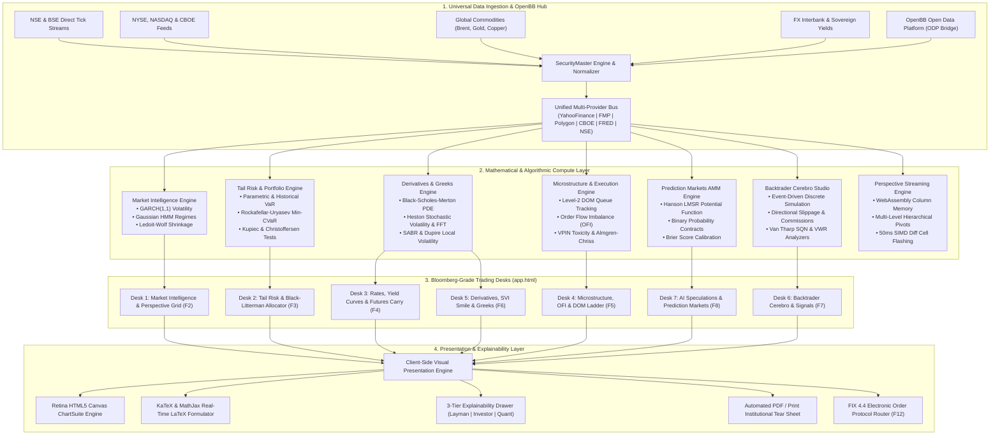

---

## 🏛️ The 7 Bloomberg-Grade Trading Desks

---

### Desk 1: Market Intelligence & Perspective Streaming Grid (`<DESK1>` / F2)

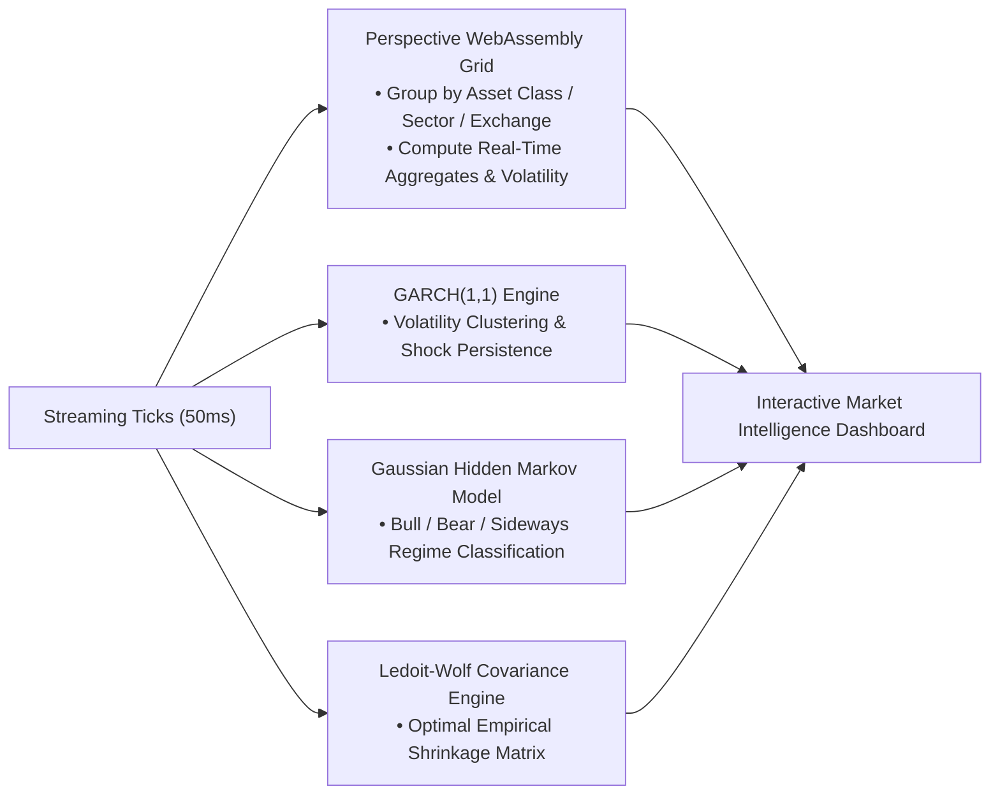

#### 🎓 In Layman Terms
- **Perspective Streaming Grid**: Like an ultra-high-speed Excel spreadsheet powered by video-game technology (WebAssembly). It lets you watch 50+ stock prices flash in real time and instantly regroup them by Sector or Risk Tier without freezing your browser.
- **GARCH(1,1) Volatility**: Measures the "momentum of panic". When stock markets crash, volatility doesn't disappear the next day—it stays stormy for weeks. GARCH measures how long that storm will last.
- **Hidden Markov Model (HMM)**: A weather forecast for financial markets. It analyzes recent returns to tell you whether the market is currently in a sunny **Bull Market**, stormy **Bear Market**, or foggy **Sideways Consolidation**.
- **Ledoit-Wolf Covariance**: When calculating how stocks move together, standard math gets distorted by random noise. Ledoit-Wolf cleans out the noise to give a crystal-clear picture of true correlation.

#### ⚡ Quantitative Formulation
$$\sigma_t^2 = \omega + \alpha \epsilon_{t-1}^2 + \beta \sigma_{t-1}^2, \quad \sigma_{\infty} = \sqrt{\frac{\omega}{1 - \alpha - \beta}}, \quad \kappa = \alpha + \beta < 1$$

$$\mathbf{\Sigma}_{\text{LW}} = (1 - \delta^*) \mathbf{S} + \delta^* \mathbf{F}, \quad \delta^* = \max\left(0, \min\left(1, \frac{\sum \widehat{\text{Var}}(s_{ij})}{\sum (s_{ij} - f_{ij})^2}\right)\right)$$

---

### Desk 2: Portfolio Tail Risk & Black-Litterman Allocator (`<RISK>` / F3)

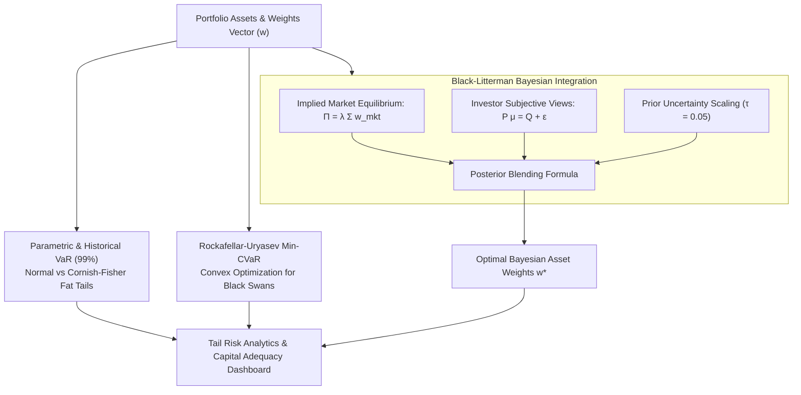

#### 🎓 In Layman Terms
- **Value at Risk (VaR 99%)**: The boundary of normal bad days. If your 1-day 99% VaR is ₹2,50,000, it means that on 99 out of 100 days, your daily loss will not exceed ₹2,50,000.
- **Expected Shortfall (CVaR 99%)**: What happens on that 1 day when catastrophe strikes? CVaR calculates the average damage you will suffer when the worst happens.
- **Black-Litterman Model**: Nobel-prize winning portfolio math. Instead of wildly guessing what stocks will do, it starts with the entire world market as a baseline, and gently tilts your money toward stocks where you have high-confidence research opinions.

#### ⚡ Quantitative Formulation
$$\text{CVaR}_{\alpha}(\mathbf{w}) = \min_{\zeta \in \mathbb{R}} \left\{ \zeta + \frac{1}{1 - \alpha} \mathbb{E}\left[ \left(-\mathbf{w}^T \mathbf{R} - \zeta\right)^+ \right] \right\}$$

$$\boldsymbol{\mu}_{\text{BL}} = \left[ (\tau \mathbf{\Sigma})^{-1} + \mathbf{P}^T \mathbf{\Omega}^{-1} \mathbf{P} \right]^{-1} \left[ (\tau \mathbf{\Sigma})^{-1} \boldsymbol{\Pi} + \mathbf{P}^T \mathbf{\Omega}^{-1} \mathbf{Q} \right]$$

---

### Desk 3: Rates, Yield Curves & Futures Basis Arbitrage (`<YCRV>` / F4)

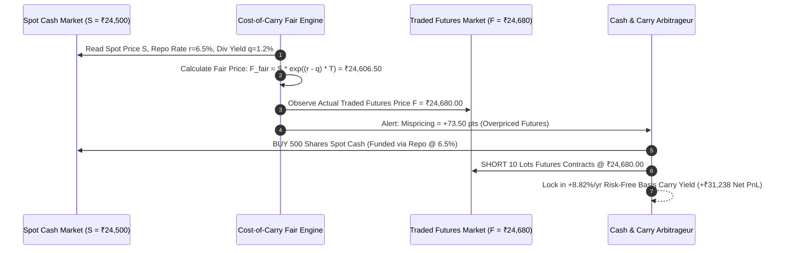

#### 🎓 In Layman Terms
- **Yield Curve (Nelson-Siegel)**: The interest rate that governments pay to borrow money for 1 month versus 10 years or 30 years. When the curve slopes upward, the economy is healthy; when it inverts (short rates higher than long rates), it warns of an oncoming recession.
- **Futures Basis & Cash-and-Carry Arbitrage**: A futures contract lets you buy a stock in 30 days. Because you don't have to pay full cash today, you save interest, but you miss out on dividends. The math calculates the exact fair price down to the rupee. If market hype makes the futures too expensive, you buy the cheap stock, sell the expensive futures, and lock in a 100% risk-free profit higher than bank deposits.

#### ⚡ Quantitative Formulation
$$F(t, T) = S_t e^{(r - q + u)(T - t)}, \quad \text{Basis Yield} = \frac{F_t - S_t}{S_t} \times \frac{365}{\Delta t} \times 100\%$$

$$y(m) = \beta_0 + \beta_1 \left(\frac{1 - e^{-m/\tau}}{m/\tau}\right) + \beta_2 \left(\frac{1 - e^{-m/\tau}}{m/\tau} - e^{-m/\tau}\right)$$

---

### Desk 4: Limit Order Book Microstructure & OFI Execution (`<DOM>` / F5)

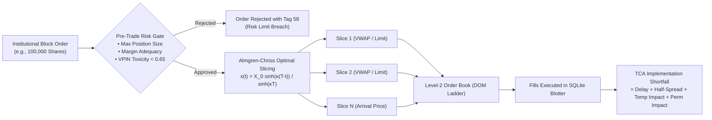

#### 🎓 In Layman Terms
- **Level-2 DOM Ladder**: The live digital waiting line of all buyers (green) and sellers (red) waiting to trade at every price level.
- **Order Flow Imbalance (OFI)**: Who is pushing harder? If buyers are aggressively buying out all available shares on the sell side, OFI is positive, forecasting an upward price tick in milliseconds.
- **VPIN (Toxicity Detector)**: Alerts market makers when "smart money" hedge funds are aggressively dumping or buying an asset based on non-public information, preventing the market maker from losing money on bad trades.
- **Almgren-Chriss Optimal Execution**: If a large pension fund dumps 1,000,000 shares all at once, the price crashes (slippage). If they wait too long, the market might crash overnight. Almgren-Chriss finds the perfect sweet spot to sell smoothly across the day.

#### ⚡ Quantitative Formulation
$$\text{OFI}_k = I_{\{P_k^b \ge P_{k-1}^b\}} q_k^b - I_{\{P_k^b \le P_{k-1}^b\}} q_{k-1}^b - I_{\{P_k^a \le P_{k-1}^a\}} q_k^a + I_{\{P_k^a \ge P_{k-1}^a\}} q_{k-1}^a$$

$$\text{VPIN} = \frac{\sum_{\tau=1}^N |V_{\tau}^B - V_{\tau}^S|}{N \cdot V}, \quad x(t) = X_0 \frac{\sinh(\kappa(T - t))}{\sinh(\kappa T)}, \quad \kappa = \sqrt{\frac{\lambda \sigma^2}{\eta}}$$

---

### Desk 5: Derivatives, Greeks & Local Volatility Surfaces (`<VOL>` / F6)

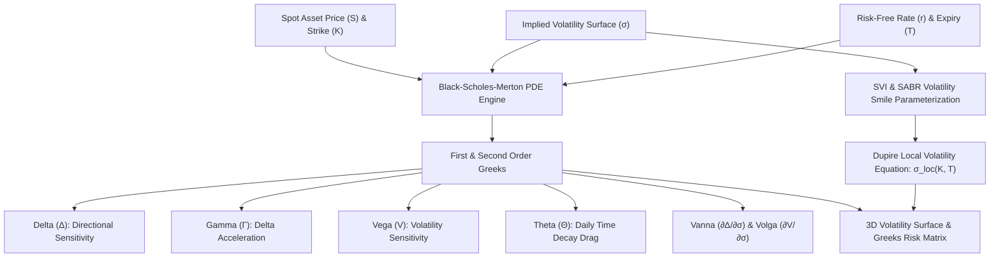

#### 🎓 In Layman Terms
- **Option Greeks**: Like the dashboard instruments of a high-performance jet:
  - **Delta**: How much money you make when the stock moves by $1.
  - **Gamma**: The accelerator pedal—how fast your Delta speeds up as the stock runs.
  - **Vega**: How much you gain or lose when market panic/fear jumps by 1%.
  - **Theta**: The parking fee—the daily cost of holding the option as time ticks away.
  - **Vanna & Volga**: Second-order Greeks that show how your speed and sensitivity change during wild market storms.
- **Dupire Local Volatility**: In the real world, out-of-the-money crash protection options trade at higher prices, creating a curved "smile" in volatility. Dupire's formula converts this smile into the exact volatility at any specific price and date.

#### ⚡ Quantitative Formulation
$$\frac{\partial V}{\partial t} + \frac{1}{2}\sigma^2 S^2 \frac{\partial^2 V}{\partial S^2} + (r - q)S \frac{\partial V}{\partial S} - rV = 0$$

$$\sigma_{\text{loc}}^2(K, T) = \frac{\frac{\partial C}{\partial T} + q C + (r - q) K \frac{\partial C}{\partial K}}{\frac{1}{2} K^2 \frac{\partial^2 C}{\partial K^2}}, \quad \text{Vanna} = \frac{\partial^2 V}{\partial S \partial \sigma}, \quad \text{Volga} = \frac{\partial^2 V}{\partial \sigma^2}$$

---

### Desk 6: Systematic Signals, Kelly Sizing & Backtrader Cerebro (`<SIG>` / F7)

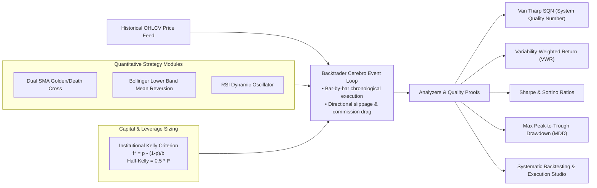

#### 🎓 In Layman Terms
- **Backtrader Cerebro Engine**: A time machine for trading strategies. It steps through past market history day by day, places simulated trades, subtracts real broker fees and slippage, and calculates whether your trading idea is truly profitable or just lucky.
- **Van Tharp SQN (System Quality Number)**: A statistical test that proves whether your strategy is a genuine money-maker (SQN >= 2.0) or just riding random chance.
- **Kelly Criterion**: The mathematical formula used by top hedge funds to calculate the exact percentage of your capital to risk on each trade to maximize compounding wealth without ever going broke.

#### ⚡ Quantitative Formulation
$$\text{SQN} = \sqrt{N} \frac{\bar{P}}{\sigma_P}, \quad \text{VWR} = R_{\text{total}} \cdot \left(1 + \sigma \sqrt{252}\right)^{-1}, \quad f^* = \frac{p(b + 1) - 1}{b}, \quad f_{\text{Half}}^* = 0.5 f^*$$

---

### Desk 7: AI Speculations & Hanson LMSR Prediction Markets (`<AI>` / F8)

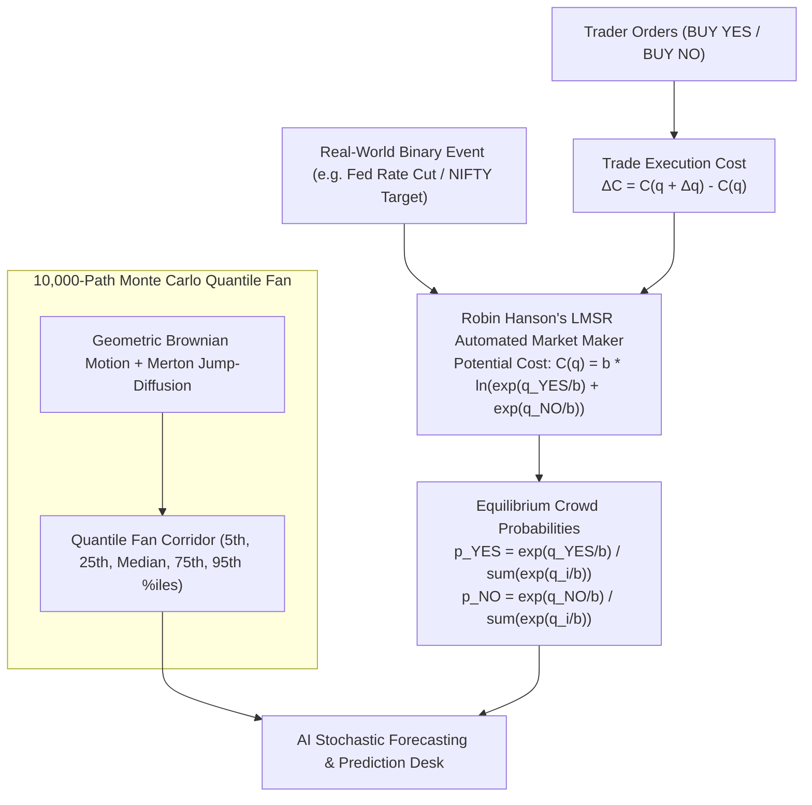

#### 🎓 In Layman Terms
- **Prediction Markets (Polymarket / Kalshi Style)**: Turning real-world events (like "Will the Central Bank cut interest rates?") into tradable binary contracts that pay $1.00 if YES happens and $0.00 if NO happens. The trading price directly reflects the crowd's collective percentage probability.
- **Hanson LMSR Market Maker**: The automated math engine providing instant continuous trading liquidity. It guarantees that someone can always buy or sell contracts with zero bid-ask spread while mathematically capping the maximum possible loss for the market maker.
- **10,000-Path Monte Carlo Fan**: Simulates 10,000 possible futures for a stock price, generating a cone of probability showing the best case (95th percentile bull run), expected case (median), and worst case (5th percentile crash).

#### ⚡ Quantitative Formulation
$$C(\mathbf{q}) = b \ln\left( \sum_{i=1}^n e^{q_i / b} \right), \quad p_i = \frac{\partial C}{\partial q_i} = \frac{e^{q_i / b}}{\sum_{j=1}^n e^{q_j / b}}, \quad \text{Worst-Case Loss} = b \ln(K)$$

$$dS_t = (\mu - \lambda k) S_t dt + \sigma S_t dW_t + (J - 1) S_t dN_t, \quad \ln J \sim \mathcal{N}(\mu_J, \sigma_J^2)$$

---

## 🔬 Master Catalog of 35 Interactive Quantitative Laboratories

All 35 simulation laboratories in [`learn.html`](learn.html) feature dynamic parameter sliders, real-time Chart.js trajectory updates, and full LaTeX proofs:

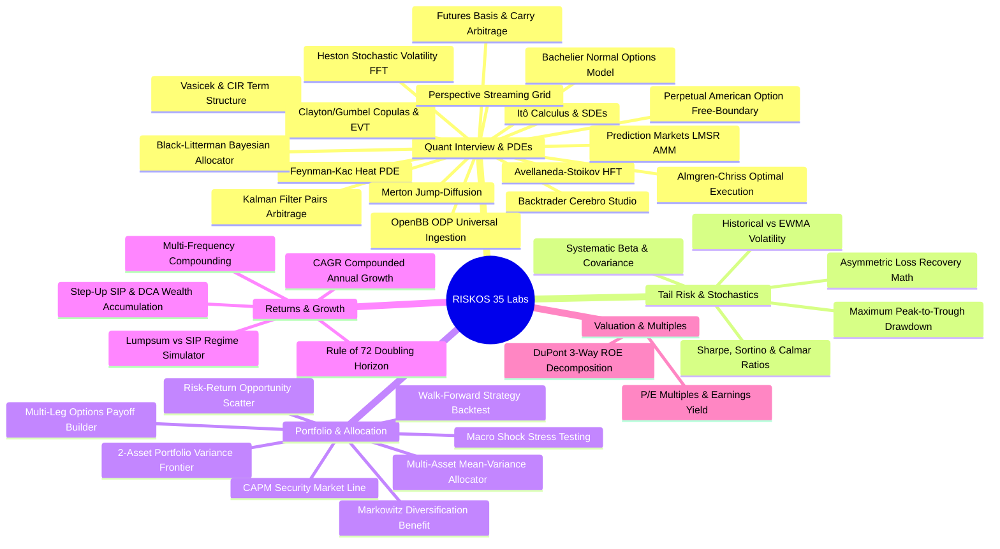

### Detailed Breakdown of All 35 Interactive Modules

| # | Module ID | Title | Layman Terms Analogy | Analytical Equation | Primary Quant Application |
| :-: | :--- | :--- | :--- | :--- | :--- |
| **1** | `ito_calculus` | **Itô's Lemma & SDEs** | In normal calculus, smooth lines have zero thickness. In financial markets, random walks are jagged, causing a continuous $-\frac{1}{2}\sigma^2$ variance drag on wealth. | $df = \left(\partial_t f + \mu S \partial_S f + \frac{1}{2}\sigma^2 S^2 \partial_{SS} f\right)dt + \sigma S \partial_S f dW$ | Derives Black-Scholes PDE and quadratic variation $[W,W]_t = t$. |
| **2** | `feynman_kac` | **Feynman-Kac & Heat PDE** | Converts complicated probability questions into simple heat diffusion physics ($u_\tau = u_{xx}$). | $\partial_t V + r S \partial_S V + \frac{1}{2}\sigma^2 S^2 \partial_{SS} V - r V = 0$ | Proves the equivalence between parabolic PDEs and stochastic expectations. |
| **3** | `heston_fft` | **Heston Stochastic Volatility** | Stock volatility is not constant; it fluctuates like weather, creating volatility smiles that FFT pricing solves in milliseconds. | $dv_t = \kappa(\theta - v_t)dt + \xi\sqrt{v_t} dW_t^v, \quad 2\kappa\theta > \xi^2$ | Fast option pricing across entire strike grids using characteristic functions. |
| **4** | `vasicek_cir` | **Vasicek & CIR Term Structure** | Models how central bank interest rates fluctuate and gravitate back toward economic equilibrium over time. | $dr_t = a(b - r_t)dt + \sigma r_t^\gamma dW_t, \quad P(t,T) = A e^{-B r_t}$ | Generates zero-coupon yield curves and prices interest rate derivatives. |
| **5** | `avellaneda_stoikov` | **Avellaneda-Stoikov HFT** | An algorithmic market maker adjusts its buy/sell quotes higher or lower based on how much inventory it holds. | $r(s,q,t) = s - q \gamma \sigma^2 (T-t)$ | High-frequency market making on limit order books under inventory risk. |
| **6** | `copulas_evt` | **Clayton/Gumbel Copulas & EVT** | Standard correlation breaks down during panic. Copulas model how assets crash together in the extreme left tail. | $C(u,v) = (u^{-\theta} + v^{-\theta} - 1)^{-1/\theta}, \quad \lambda_L = 2^{-1/\theta}$ | Evaluates portfolio systemic contagion and Pareto fat-tail Hill estimates. |
| **7** | `merton_jump_diffusion` | **Merton Jump-Diffusion** | Normal price models assume smooth movements. Merton adds sudden Poisson jump crashes (like surprise earnings or war). | $dS_t = (\mu - \lambda k)S_t dt + \sigma S_t dW_t + (J-1)S_t dN_t$ | Explains out-of-the-money put volatility skew across derivatives desks. |
| **8** | `almgren_chriss` | **Almgren-Chriss Execution** | Balances the cost of dumping shares too fast (slippage) against holding them too long (overnight market risk). | $x(t) = X_0 \frac{\sinh(\kappa(T-t))}{\sinh(\kappa T)}, \quad \kappa = \sqrt{\frac{\lambda\sigma^2}{\eta}}$ | Optimal block order liquidation trajectory for institutional trading desks. |
| **9** | `kalman_pairs` | **Kalman Filter Pairs Arb** | A dynamic radar tracker calculating the exact hedge ratio between two cointegrated stocks tick-by-tick. | $\beta_t = \beta_{t-1} + K_t(y_t - x_t \beta_{t-1})$ | Statistical arbitrage pairs trading without lagging linear regressions. |
| **10** | `black_litterman` | **Black-Litterman Allocator** | Blends the entire global market consensus with your active research views to build stable, balanced portfolios. | $\boldsymbol{\mu}_{BL} = [(\tau \mathbf{\Sigma})^{-1} + \mathbf{P}^T \mathbf{\Omega}^{-1} \mathbf{P}]^{-1} [(\tau \mathbf{\Sigma})^{-1} \boldsymbol{\Pi} + \mathbf{P}^T \mathbf{\Omega}^{-1} \mathbf{Q}]$ | Eliminates extreme Markowitz corner portfolios in institutional asset allocation. |
| **11** | `perpetual_american` | **Perpetual American Put** | Calculates the exact critical price boundary where exercising an American option immediately is mathematically optimal. | $\left. \frac{dV}{dS} \right\|_{S=S^*} = -1 \implies S^* = \frac{\gamma}{\gamma+1} K$ | Solves free-boundary variational inequalities with smooth pasting. |
| **12** | `bachelier_model` | **Bachelier Normal Options** | Prices options on assets that trade into negative territory (like WTI crude oil at -$37.63/bbl in April 2020). | $C = (S-K)\mathcal{N}(d) + \sigma_N \sqrt{T} n(d), \quad d = \frac{S-K}{\sigma_N \sqrt{T}}$ | Mandatory exchange pricing model when Black-Scholes $\ln(S/K)$ fails. |
| **13** | `prediction_markets_lmsr` | **Prediction Markets LMSR** | Turns real-world binary questions into tradable tokens priced between ¢0 and ¢100 reflecting crowd probabilities. | $C(\mathbf{q}) = b \ln\left(\sum e^{q_i/b}\right), \quad p_i = \frac{e^{q_i/b}}{\sum e^{q_j/b}}$ | Hanson automated market maker with bounded worst-case liquidity loss. |
| **14** | `futures_basis_carry` | **Futures Basis & Carry Arb** | Calculates fair forward prices and locks in risk-free arbitrage yields when futures trade above spot cash. | $F(t,T) = S_t e^{(r-q+u)(T-t)}, \quad \text{Basis} = \frac{F-S}{S}\frac{365}{\Delta t}$ | Cash-and-carry basis trading and calendar roll yield harvesting. |
| **15** | `backtrader_cerebro` | **Backtrader Cerebro Studio** | Event-driven historical strategy simulator modeling realistic commissions, slippage, and Van Tharp SQN metrics. | $\text{SQN} = \sqrt{N}\frac{\bar{P}}{\sigma_P}, \quad \text{VWR} = R_{\text{total}} \cdot (1+\sigma\sqrt{252})^{-1}$ | Systematic trading strategy development and out-of-sample verification. |
| **16** | `openbb_odp` | **OpenBB ODP Data Hub** | A universal adapter that ingests and standardizes data from 7 global providers into clean Pydantic dataframes. | $\text{Provider API} \to \text{Schema Standardizer} \to \text{Universal OBB}$ | Enterprise data ingestion for AI copilots, analysts, and Python quants. |
| **17** | `perspective_streaming_grid` | **Perspective Streaming Grid** | High-performance WebAssembly table component that updates 50+ tickers at 50ms intervals with zero DOM lag. | $\text{Throughput} = \frac{1000}{\Delta t} \times N_{\text{inst}}, \quad \text{SIMD Diffing}$ | Real-time multi-asset risk aggregation across institutional trading desks. |
| **18** | `cagr` | **Compounded Growth (CAGR)** | The smooth, annualized growth rate that bridges your starting money to your final portfolio value. | $\text{CAGR} = (V_f / V_i)^{1/T} - 1$ | Long-term performance benchmarking smoothing out interim volatility. |
| **19** | `compounding` | **Compound Interest Multiplier** | Earning interest on your interest. Shows why continuous compounding approaches Euler's constant ($e^{rt}$). | $A = P(1 + r/n)^{nt} \xrightarrow{n \to \infty} P e^{rt}$ | Frequency drag evaluation and continuous reinvestment modeling. |
| **20** | `sip_dca` | **Step-Up SIP & DCA** | Investing fixed amounts monthly while stepping up contributions as your salary increases over your career. | $M \sum_{k=1}^N (1+g)^{\lfloor k/12 \rfloor} (1+r)^{N-k}$ | Realized wealth accumulation under wage growth trajectories. |
| **21** | `lumpsum_vs_sip` | **Lumpsum vs SIP Simulator** | Compares investing all your cash today versus staggering entries to protect against bad timing drawdowns. | $\mathbb{E}[R_{\text{Lump}}] \text{ vs } \mathbb{E}[R_{\text{SIP}}]$ | Quantifies cash drag versus sequence-of-returns risk mitigation. |
| **22** | `compound_interest` | **Rule of 72 Doubling Time** | A quick mental-math rule: divide 72 by your annual interest rate to find out how many years it takes to double your money. | $T_{\text{double}} \approx \frac{\ln 2}{\ln(1+r)} \approx \frac{72}{r}$ | Exponential doubling horizon calculations across investment tiers. |
| **23** | `pe_valuation` | **P/E Multiples & Yield** | The price tag of a company's profits. The inverse ($E/P$) shows the company's real cash earnings yield. | $\text{Earnings Yield} = E/P = 1 / (\text{P/E}) = r - g$ | Gordon growth equity risk premium and multiple compression analysis. |
| **24** | `roe_roce` | **DuPont ROE Decomposition** | Dissects Return on Equity into 3 engines: Profit Margin, Asset Turnover, and Financial Debt Leverage. | $\text{ROE} = \frac{\text{Net Income}}{\text{Sales}} \times \frac{\text{Sales}}{\text{Assets}} \times \frac{\text{Assets}}{\text{Equity}}$ | Fundamental quality screening separating operating skill from debt risk. |
| **25** | `volatility` | **Historical vs EWMA Vol** | Standard volatility treats 100 days ago the same as yesterday. EWMA puts more weight on recent market shocks. | $\sigma_t^2 = (1-\lambda)\sum \lambda^{i-1} r_{t-i}^2, \quad \lambda = 0.94$ | RiskMetrics dynamic volatility responsiveness and clustering detection. |
| **26** | `beta_corr` | **Beta & Correlation** | Beta measures how violently a stock swings compared to the broader index ($\beta > 1$ aggressive, $\beta < 1$ defensive). | $\beta_i = \frac{\operatorname{Cov}(R_i, R_m)}{\operatorname{Var}(R_m)} = \rho_{im} \frac{\sigma_i}{\sigma_m}$ | Decomposes systematic market risk from diversifiable company risk. |
| **27** | `sharpe` | **Sharpe & Sortino Ratios** | Sharpe rewards return per unit of total risk; Sortino only penalizes bad downside losses, ignoring upside volatility. | $\text{Sharpe} = \frac{R_p - R_f}{\sigma_p}, \quad \text{Sortino} = \frac{R_p - R_f}{\sigma_d}$ | Risk-adjusted manager skill evaluation across equity and hedge funds. |
| **28** | `mdd` | **Maximum Drawdown (MDD)** | The worst peak-to-trough drop you would have suffered if you bought at the very top and sold at the bottom. | $\text{MDD} = \min_{t} \left(\frac{V_t - \max_{s \le t} V_s}{\max_{s \le t} V_s}\right)$ | Capital preservation limit and underwater equity duration measurement. |
| **29** | `drawdown_recovery` | **Drawdown Recovery Math** | Losses are asymmetric: if you lose 50% of your portfolio, you need a +100% gain just to get back to even. | $R_{\text{req}} = \frac{L}{1 - L}$ | Demonstrates the critical mathematical necessity of capital preservation. |
| **30** | `diversification` | **Markowitz Diversification** | The only "free lunch" in finance: combining uncorrelated assets lowers portfolio risk without sacrificing returns. | $\sigma_p^2 = \frac{1}{N}\bar{\sigma}^2 + \frac{N-1}{N}\bar{\operatorname{Cov}}$ | Asymptotic risk reduction toward the market systematic covariance floor. |
| **31** | `port_variance` | **2-Asset Variance Frontier** | Shows the curved frontier of risk and return when combining two stocks with different correlations. | $\sigma_p = \sqrt{w_A^2 \sigma_A^2 + w_B^2 \sigma_B^2 + 2 w_A w_B \sigma_A \sigma_B \rho}$ | Calculates the minimum-variance portfolio allocation under negative correlation. |
| **32** | `capm` | **CAPM & Jensen's Alpha** | Prices the fair expected return of an asset and measures whether a fund manager generated true skill ($\alpha$). | $\mathbb{E}[R_i] = R_f + \beta_i (\mathbb{E}[R_m] - R_f)$ | Security Market Line (SML) pricing and factor attribution modeling. |
| **33** | `port_allocator` | **Multi-Asset Allocator** | Quadratic optimization balancing expected returns against covariance risk to build optimal asset mixes. | $\min_{\mathbf{w}} \mathbf{w}^T \mathbf{\Sigma} \mathbf{w} - \lambda \mathbf{w}^T \boldsymbol{\mu}$ | Solves Markowitz mean-variance optimization subject to budget constraints. |
| **34** | `risk_return_scatter` | **Capital Allocation Line** | Plots all candidate assets and identifies the optimal tangency portfolio offering the highest possible Sharpe ratio. | $\mathbb{E}[R_c] = R_f + \left(\frac{\mathbb{E}[R_p] - R_f}{\sigma_p}\right) \sigma_c$ | Visualizes tangency portfolios and investor utility indifference curves. |
| **35** | `scenario_stress` | **Macro Stress Testing** | Replays severe historical crises (2008 Lehman, 2020 COVID, Stagflation) against your current portfolio holdings. | $\Delta V_p = \mathbf{w}^T \mathbf{S} V_0$ | Capital adequacy and solvency verification under catastrophic contagion. |

---

## 🌐 OpenBB Open Data Platform (ODP) Integration

RISKOS implements a universal bridge to the **OpenBB Open Data Platform (`openbbBridge.js` & `backend/engine/openbb_bridge.py`)**:

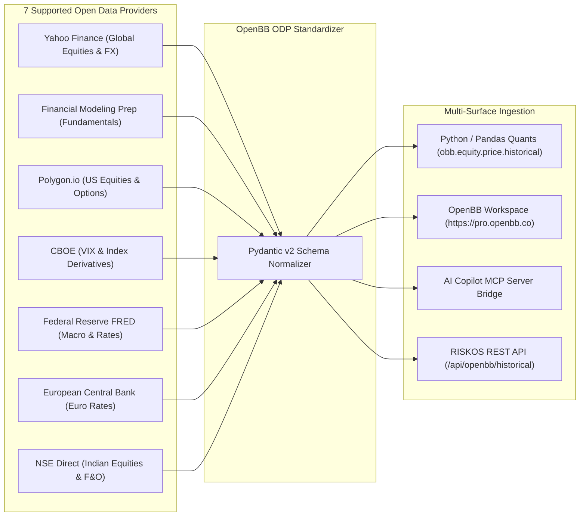

#### 🎓 In Layman Terms
OpenBB is the universal adapter for financial data. Instead of writing separate code for Yahoo, Bloomberg, government central banks, and crypto exchanges, OpenBB provides **one clean command (`obb.equity.price.historical`)** that works across every data source.

---

## 🧠 Backtrader Cerebro Execution Framework

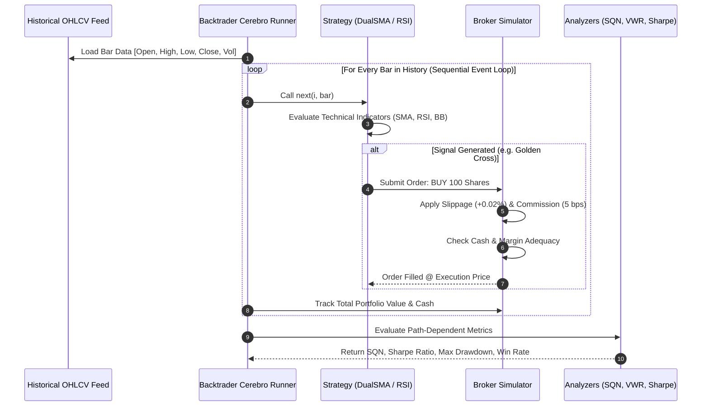

#### 🎓 In Layman Terms
Backtrader's "Cerebro" (the brain) steps through past market history day by day. It places your simulated trades, subtracts real broker fees and slippage, and calculates whether your trading idea makes money or loses money in real market conditions.

---

## ⚡ Perspective WebAssembly Streaming Grid

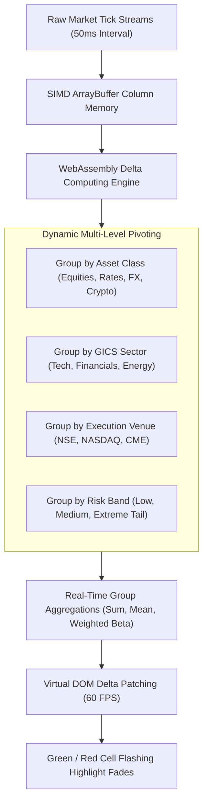

#### 🎓 In Layman Terms
Perspective is high-speed financial table technology created by JPMorgan. It allows traders to watch hundreds of live stocks flashing green and red with sub-millisecond updates without slowing down the web browser.

---

## 📡 Electronic FIX 4.4 Order Protocol Architecture

Accessible via the `<FIX>` / `F12` hotkey on the terminal ribbon, RISKOS embeds a real-time **Financial Information eXchange (FIX 4.4)** protocol router:

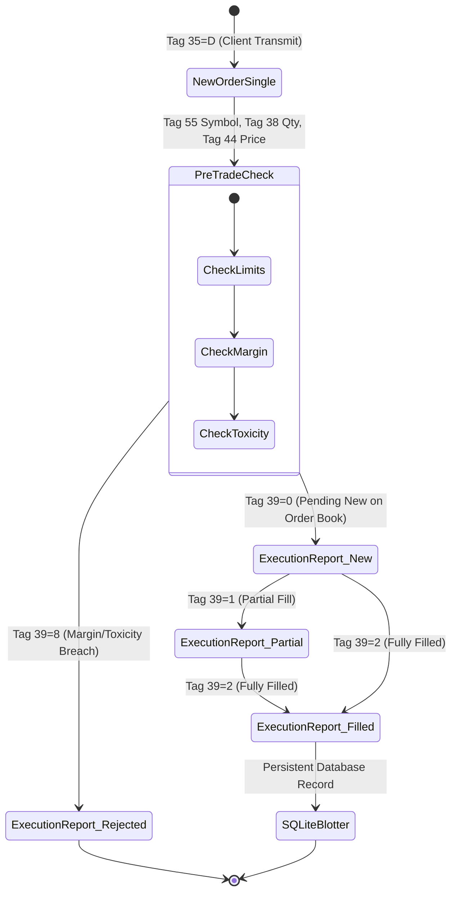

#### 🎓 In Layman Terms
FIX protocol is the global digital language that stock exchanges and institutional trading desks use to send orders to each other. It ensures that every order has an exact timestamp, quantity, price, and security ID so nothing is ever lost or disputed.

---

## 🔭 Market Observatory & Macro Causality Network

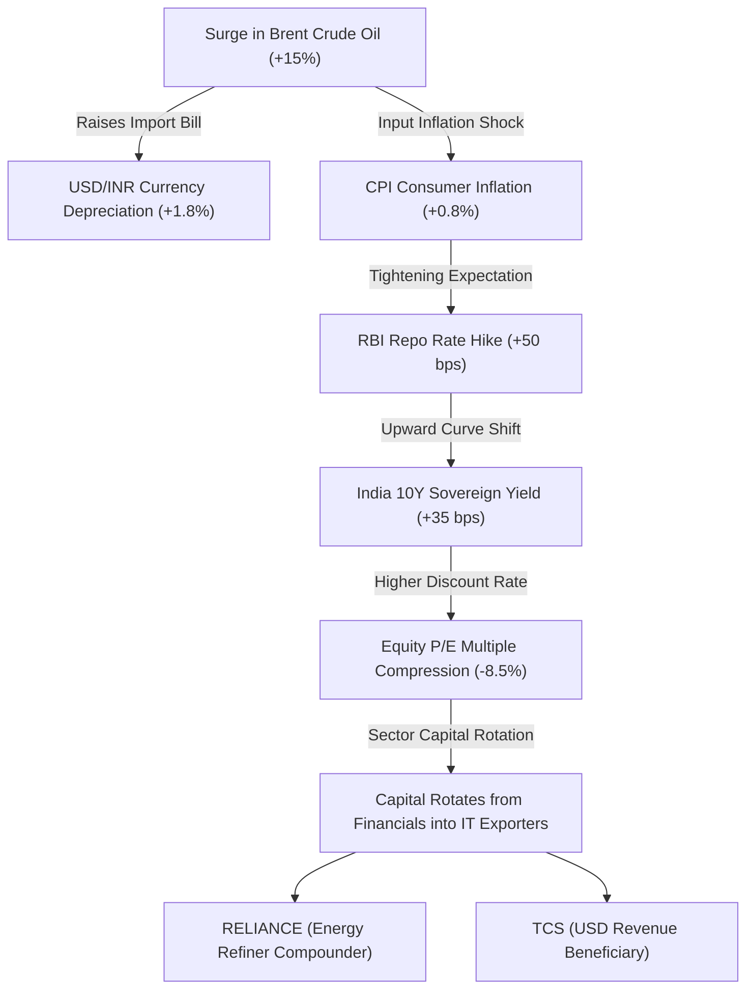

#### 🎓 In Layman Terms
The Market Observatory connects global market dots. When oil prices spike in the Middle East, it shifts currency exchange rates in India, raises interest rates at the central bank, and causes money to rotate from banking stocks into tech exporters.

---

## 🗄️ Database Architecture & ORM Schema

RISKOS embeds a persistent relational database model supporting portfolio tracking, order audit trails, and financial intelligence:

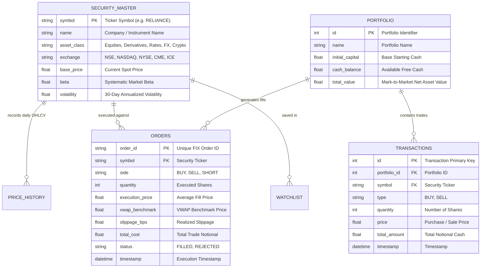

---

## 🔌 REST & Serverless API Reference

| Method | Endpoint Route | Description & Quant Service |
| :--- | :--- | :--- |
| `GET` | `/api/market/quote?symbol=RELIANCE` | Fetches real-time price, 24h change, day high/low, and volume. |
| `GET` | `/api/market/quotes?symbols=AAPL,NVDA,MSFT` | Multi-asset bulk real-time price quotes. |
| `GET` | `/api/market/candles?symbol=TCS&period=1y` | 1Y historical daily OHLCV candlesticks for ChartSuite. |
| `GET` | `/api/market/volatility?symbol=AAPL` | GARCH(1,1) maximum likelihood conditional volatility and persistence. |
| `GET` | `/api/market/regime?symbol=SPY` | Gaussian Hidden Markov Model (HMM) 3-state macro regime detection. |
| `GET` | `/api/market/correlations?symbols=AAPL,MSFT,GOOGL` | Ledoit-Wolf optimal shrinkage cross-asset correlation matrix. |
| `GET` | `/api/risk/var?symbols=AAPL,MSFT&weights=0.5,0.5` | Parametric, Historical, and Monte Carlo VaR / Expected Shortfall (CVaR). |
| `GET` | `/api/risk/optimize?symbols=AAPL,MSFT,GOOGL` | Rockafellar-Uryasev Min-CVaR and Maximum Sharpe portfolio optimizer. |
| `GET` | `/api/openbb/historical?symbol=AAPL&provider=yfinance` | OpenBB Open Data Platform standardized historical query. |
| `GET` | `/api/openbb/indicators` | OpenBB macroeconomic indicators (CPI, Fed Funds, RBI Repo, 10Y Yields). |
| `GET` | `/api/backtrader/simulate?symbol=AAPL&strategy=DualSMA` | Backtrader Cerebro event-driven simulation with SQN and Sharpe analyzers. |
| `POST` | `/api/signals/execute` | Simulates Almgren-Chriss order execution with VWAP benchmark slippage. |

---

## 📄 Institutional Quantitative Tear Sheet Generator

RISKOS features an automated, print-styled factsheet generator accessible via the `<TEAR>` / `F9` key on the Bloomberg function strip:

```
========================================================================================
                      RISKOS INSTITUTIONAL QUANTITATIVE TEAR SHEET
========================================================================================
Universe Analyzed : RELIANCE, TCS, HDFCBANK, INFY, NVDA, AAPL, MSFT, BRENT, USDINR
Base Portfolio    : ₹1,00,00,000 INR ($115,280 USD)           Reporting Date: 2026-09-01
----------------------------------------------------------------------------------------
[PORTFOLIO RISK & EFFICIENCY]               [STRESS SCENARIOS & BASEL III VALIDATION]
Parametric VaR (99% 1D) : ₹2,48,500 (2.48%) | Rate Shock (+300 bps) : -₹10,20,000 (-10.2%)
Expected Shortfall CVaR : ₹3,62,100 (3.62%) | Equity Crash (-40%)   : -₹22,40,000 (-22.4%)
Portfolio Sharpe Ratio  : 1.84              | Volatility Surge (3x) : -₹11,80,000 (-11.8%)
Portfolio Sortino Ratio : 2.45              | Kupiec POF Test       : PASSED (p = 0.48)
Calmar Ratio            : 2.15              | Christoffersen Test   : PASSED (p = 0.62)
Max Historical Drawdown : -11.20%           | Covariance Estimator  : Ledoit-Wolf Optimal
----------------------------------------------------------------------------------------
[CVaR-OPTIMAL ASSET ALLOCATION (Rockafellar-Uryasev Min-CVaR)]
RELIANCE: 14.2% | TCS: 12.8% | HDFCBANK: 16.5% | INFY: 11.0% | NVDA: 15.5% | AAPL: 15.0%
========================================================================================
```

---

## 🚀 Local Quickstart & Edge Deployment

### 1. Clone Repository
```bash
git clone https://github.com/Premchandyadav369/RISKOS.git
cd RISKOS
```

### 2. Launch Local Python Analytics Backend (Optional)
```bash
cd backend
python -m venv venv
# On Windows:
.\venv\Scripts\activate
# On Linux/macOS:
source venv/bin/activate

pip install -r requirements.txt
python run.py
```
*Backend initializes FastAPI with CORS at `http://127.0.0.1:8000`.*

### 3. Launch Web Terminal
Open `index.html` or `app.html` directly in any web browser, or serve with:
```bash
npx serve .
```

### 4. Production Edge Deployment (Vercel)
RISKOS is pre-configured for zero-configuration Vercel deployment with serverless API edge handlers in [`api/`](api). Pushing to `main` triggers automated CI/CD builds.

---

<div align="center">

**RISKOS** • Built with mathematical rigor for the next generation of quantitative finance.

*Licensed under the [MIT License](LICENSE).*

</div>
