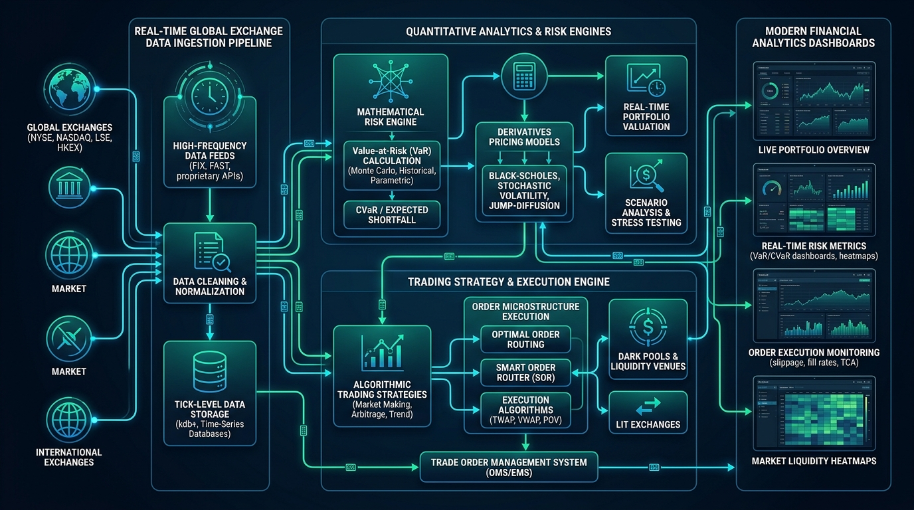
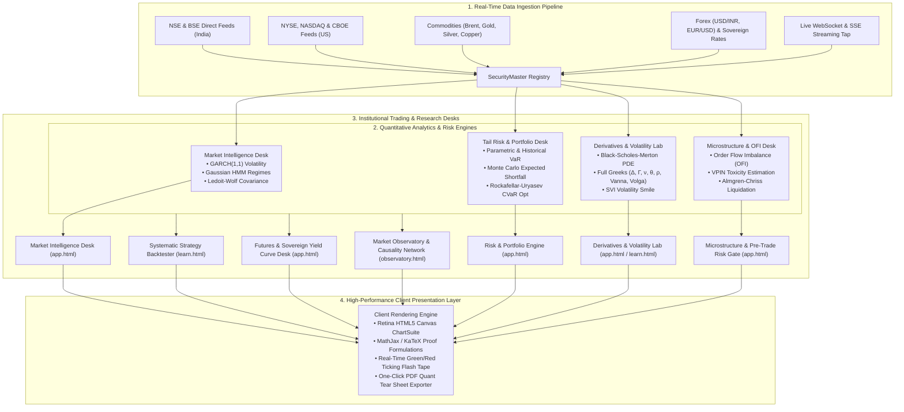
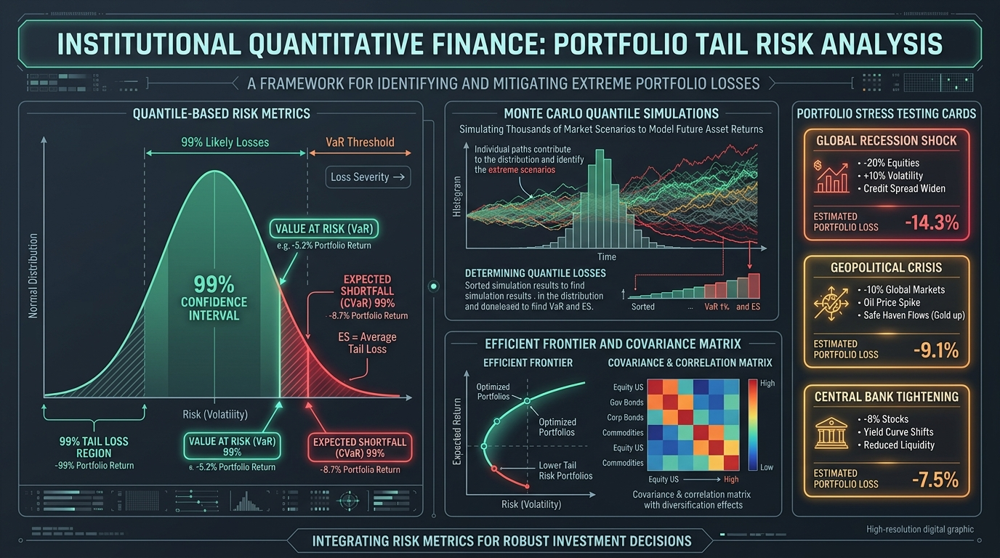
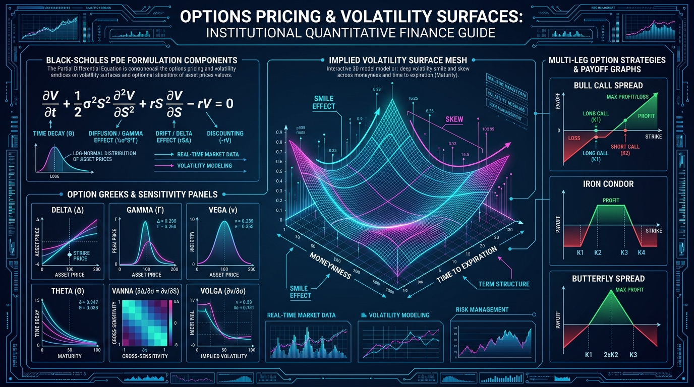
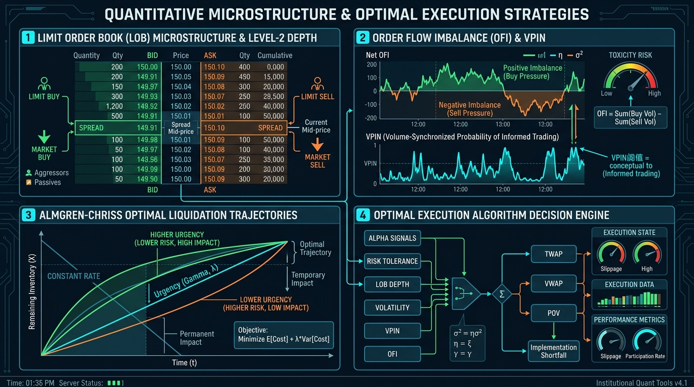
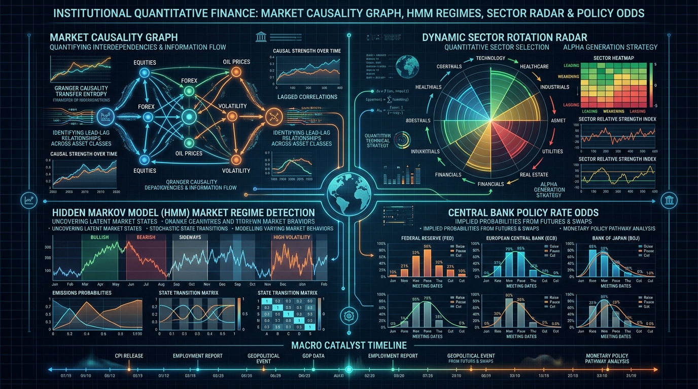

# RISKOS — Institutional Quantitative Intelligence & Risk Analytics Platform


<div align="center">

[](LICENSE)
[](https://riskos-psi.vercel.app)
[](#-mathematical-specifications--formulations)
[](#-live-market-coverage--universal-security-master)
[](https://riskos-psi.vercel.app)

**Turn raw market tick streams into actionable understanding with an AI-native financial intelligence platform built for equity research, event-driven causality, multi-asset risk analytics, options volatility surfaces, order microstructure execution, and deterministic mathematical explainability.**

[Live Production Terminal](https://riskos-psi.vercel.app/app.html) • [Market Observatory](https://riskos-psi.vercel.app/observatory.html) • [Learn & Lab Suite](https://riskos-psi.vercel.app/learn.html) • [Security Master](https://riskos-psi.vercel.app/ticker.html)

</div>

---

## 🏛️ Executive Summary & Core Philosophy

Traditional financial software presents users with a false dichotomy: consumer trading platforms oversimplify market mechanics into naive line charts, while legacy institutional workstations (Bloomberg, FactSet) confront analysts with dense, fragmented interfaces with opaque pricing black boxes.

**RISKOS** bridges this divide by enforcing a tripartite design doctrine:
1. 💡 **Simple by Default**: High-contrast, dark-mode terminal UI presenting executive metrics, key performance ratios, and intuitive health badges at a glance.
2. 🔍 **Deep on Demand**: Expandable deep-dive drawers, cross-market causality graphs, multi-factor trade logs, and scenario stress sliders.
3. 📐 **Mathematical when Requested**: Every metric, risk number, Greek, and signal is accompanied by its underlying **pure LaTeX $\LaTeX$ mathematical proof**, stochastic partial differential equation, and step-by-step numeric calculation trace.

---

## 🏗️ End-to-End System Architecture & Ingestion Pipeline



### 🎓 In Layman Terms
Imagine a modern airport air traffic control tower for financial markets. Thousands of raw data signals (stock prices, currency exchange rates, commodity barrel costs, government interest rates, and trade orders) stream in every second from exchanges in Mumbai, New York, Tokyo, and London. 

RISKOS takes these incoming price streams, cleans and normalizes them in memory, routes them into specialized mathematical calculators (which compute things like probability of market crashes, volatility spikes, and options fair values), and broadcasts live, visual dashboards directly to your web browser within milliseconds.

### ⚡ Technical Quant Specification
RISKOS utilizes a decoupled, event-driven hybrid compute architecture designed for low-latency streaming and high-dimensional deterministic matrix operations:



---

## 📡 Live Market Coverage & Universal Security Master

RISKOS embeds a universal [`SecurityMaster`](securityMaster.js) registry managing global multi-asset instruments, tick conversions, live spread tracking, and real-time currency conversions ($₹\text{ INR} \leftrightarrow \$\text{ USD}$):

| Asset Class | Covered Instruments & Symbols | Primary Exchange / Source | Data Refresh Frequency |
| :--- | :--- | :--- | :--- |
| **Indian Equities** | `RELIANCE`, `TCS`, `HDFCBANK`, `INFY`, `TATAMOTORS`, `ZOMATO`, `SUZLON`, `IRFC` | NSE / BSE India | Live Real-Time (1.5s Poll / WS) |
| **US Equities** | `NVDA`, `AAPL`, `MSFT`, `TSLA`, `GOOGL`, `AMZN`, `META`, `JPM` | NASDAQ / NYSE | Live Real-Time (1.5s Poll / WS) |
| **Benchmark Indices** | `^NSEI` (NIFTY 50), `^BSESN` (SENSEX), `^NSEBANK`, `^CNXIT`, `^GSPC` (S&P 500), `^IXIC` (NASDAQ) | Global Exchanges | Live Real-Time Tick Tape |
| **Commodities & Metals** | `BRENT` (Crude Oil), `CRUDE` (WTI), `GOLD` (XAU/USD), `SILVER` (XAG/USD), `COPPER`, `NATGAS` | NYMEX / ICE / MCX | Live Spot & Continuous Futures |
| **Currencies (FX)** | `USDINR=X` (USD/INR), `EURUSD=X`, `GBPUSD=X`, `USDJPY=X` | Global FX Interbank | Live Streaming (with dynamic multiplier) |
| **Sovereign Yields** | India 10Y Benchmark G-Sec, US 10Y Treasury Note, 2Y/10Y Spread | Central Banks (RBI / Fed) | Real-Time Nelson-Siegel Spline |

---

## 🛡️ Desk 1 & 2: Portfolio Tail Risk & CVaR Optimization



### 🎓 In Layman Terms
- **Value at Risk (VaR 99%)**: Imagine you run an investment fund with \$10,000,000. VaR tells you: *"On 99 out of 100 normal trading days, your worst loss will not exceed \$248,500."*
- **Expected Shortfall (CVaR 99%)**: But what happens on that 1 day when the market experiences a black swan catastrophe? CVaR answers the question: *"When disaster strikes and your VaR threshold is breached, what is the average loss you will suffer?"* (e.g., -\$362,100).
- **Rockafellar-Uryasev CVaR Optimizer**: Traditional portfolio theory (Markowitz) treats upside gains and downside crashes as equal "risk". RISKOS uses modern convex optimization to build portfolios that specifically minimize crash-day losses while maximizing steady compound growth.
- **Kupiec & Christoffersen Tests**: Strict regulatory tests (mandated by the Basel III banking accords) that continuously check whether our risk calculations are statistically accurate and whether losses clump together in dangerous streaks.

---

### ⚡ Technical Quant Specification & Mathematical Formulation

#### 1. Parametric Value-at-Risk (Delta-Normal VaR)
For a portfolio with weight vector $\mathbf{w} \in \mathbb{R}^N$ and shrinkage covariance matrix $\mathbf{\Sigma} \in \mathbb{R}^{N \times N}$:

$$\sigma_p = \sqrt{\mathbf{w}^T \mathbf{\Sigma} \mathbf{w}}$$

$$\text{VaR}_{\alpha} = -(\mathbf{w}^T \boldsymbol{\mu} + \Phi^{-1}(1 - \alpha) \cdot \sigma_p \sqrt{\Delta t})$$

where $\Phi^{-1}(p)$ is the inverse standard normal cumulative distribution function (Acklam's rational approximation), $\boldsymbol{\mu}$ is the expected return vector, and $\alpha = 0.99$.

#### 2. Conditional Value-at-Risk (CVaR / Expected Shortfall)
The Rockafellar-Uryasev continuous formulation defines CVaR at confidence level $\alpha$ over loss function $f(\mathbf{w}, \mathbf{y})$ with probability density $p(\mathbf{y})$:

$$\text{CVaR}_{\alpha}(\mathbf{w}) = \min_{\zeta \in \mathbb{R}} \left\{ \zeta + \frac{1}{1 - \alpha} \int_{\mathbf{y} \in \mathbb{R}^M} [f(\mathbf{w}, \mathbf{y}) - \zeta]^+ p(\mathbf{y}) d\mathbf{y} \right\}$$

where $[x]^+ = \max(x, 0)$. In the empirical discrete simulation across $S = 10,000$ Monte Carlo paths:

$$\text{CVaR}_{\alpha}(\mathbf{w}) \approx \zeta^* + \frac{1}{S(1 - \alpha)} \sum_{s=1}^S d_s$$

$$\text{subject to} \quad d_s \ge -\mathbf{w}^T \mathbf{R}_s - \zeta^*, \quad d_s \ge 0, \quad \sum_{i=1}^N w_i = 1, \quad 0 \le w_i \le w_{\max}$$

#### 3. Ledoit-Wolf Covariance Matrix Shrinkage
To eliminate sample covariance inversion instability in ill-conditioned financial returns matrices, we shrink the sample covariance $\mathbf{S}$ toward an optimal constant correlation target $\mathbf{F}$:

$$\mathbf{\Sigma}_{\text{LW}} = (1 - \delta^*) \mathbf{S} + \delta^* \mathbf{F}$$

where the optimal shrinkage intensity $\delta^* \in [0, 1]$ is computed analytically:

$$\delta^* = \max\left(0, \min\left(1, \frac{\sum_{i=1}^N \sum_{j=1}^N \widehat{\text{Var}}(s_{ij})}{\sum_{i=1}^N \sum_{j=1}^N (s_{ij} - f_{ij})^2}\right)\right)$$

#### 4. GARCH(1,1) Volatility Dynamics
Asset volatility clusters dynamically according to the generalized autoregressive conditional heteroskedasticity model:

$$\sigma_t^2 = \omega + \alpha \cdot \epsilon_{t-1}^2 + \beta \cdot \sigma_{t-1}^2$$

$$\text{Unconditional Long-Term Volatility: } \sigma_{\infty} = \sqrt{\frac{\omega}{1 - \alpha - \beta}}, \quad \text{Persistence: } \kappa = \alpha + \beta < 1$$

#### 5. Kupiec Proportion of Failures (POF) Likelihood Ratio Test
Tests the null hypothesis $H_0: p = p_0 = 1 - \alpha$ against the alternative $H_1: p \ne p_0$ over $N$ observations with $x$ empirical tail violations:

$$\text{LR}_{\text{POF}} = -2 \ln \left[ \frac{p_0^x (1 - p_0)^{N-x}}{\left(\frac{x}{N}\right)^x \left(1 - \frac{x}{N}\right)^{N-x}} \right] \sim \chi^2(1)$$

---

## 📈 Desk 3: Derivatives & Volatility Lab



### 🎓 In Layman Terms
- **Options Contracts**: Financial contracts giving you the right (but not the obligation) to buy (Call) or sell (Put) an underlying stock at an agreed strike price before a deadline.
- **Option Greeks**: Sensitivity gauges that tell you how your option position changes when market variables move:
  - $\Delta$ (**Delta**): How much your option price changes when the stock moves by \$1.
  - $\Gamma$ (**Gamma**): How fast Delta speeds up as the stock moves (the accelerator pedal).
  - $\mathcal{V}$ (**Vega**): How much you gain or lose when market uncertainty/fear (volatility) shifts by 1%.
  - $\Theta$ (**Theta**): The daily time-decay cost of holding the option (the ticking clock).
  - $\text{Vanna}$ & $\text{Volga}$: Second-order institutional Greeks measuring how Delta changes with volatility, and how Vega changes with volatility.
- **Volatility Smile & Surface**: In reality, deep out-of-the-money crash protection options are priced higher by market makers than simple Black-Scholes predicts, creating a 3D curved "smile" surface across strike prices and expiration dates.
- **Multi-Leg Payoff Builder**: Visual simulator for complex multi-asset spreads (Bull Call Spread, Iron Condor, Long Straddle) computing exact breakeven points and maximum profit/loss boundaries.

---

### ⚡ Technical Quant Specification & Mathematical Formulation

#### 1. Black-Scholes-Merton Partial Differential Equation (PDE)
Under risk-neutral measure $\mathbb{Q}$ with Geometric Brownian Motion $dS_t = (r - q) S_t dt + \sigma S_t dW_t$:

$$\frac{\partial V}{\partial t} + \frac{1}{2}\sigma^2 S^2 \frac{\partial^2 V}{\partial S^2} + (r - q)S \frac{\partial V}{\partial S} - rV = 0$$

Analytical European Call ($C$) and Put ($P$) closed-form solutions:

$$C(S, K, T, r, q, \sigma) = S e^{-qT} \Phi(d_1) - K e^{-rT} \Phi(d_2)$$

$$P(S, K, T, r, q, \sigma) = K e^{-rT} \Phi(-d_2) - S e^{-qT} \Phi(-d_1)$$

where the standardized log-moneyness forward coordinates are:

$$d_1 = \frac{\ln(S / K) + \left(r - q + \frac{1}{2}\sigma^2\right)T}{\sigma \sqrt{T}}, \qquad d_2 = d_1 - \sigma \sqrt{T}$$

#### 2. First, Second, and Third-Order Analytical Greeks

$$\text{Delta } (\Delta_{\text{Call}}) = \frac{\partial C}{\partial S} = e^{-qT} \Phi(d_1), \qquad \Delta_{\text{Put}} = -e^{-qT} \Phi(-d_1)$$

$$\text{Gamma } (\Gamma) = \frac{\partial^2 V}{\partial S^2} = \frac{e^{-qT} \phi(d_1)}{S \sigma \sqrt{T}}$$

$$\text{Vega } (\mathcal{V}) = \frac{\partial V}{\partial \sigma} = S e^{-qT} \sqrt{T} \phi(d_1)$$

$$\text{Theta } (\Theta_{\text{Call}}) = \frac{\partial C}{\partial t} = -\frac{S e^{-qT} \phi(d_1) \sigma}{2 \sqrt{T}} + q S e^{-qT} \Phi(d_1) - r K e^{-rT} \Phi(d_2)$$

$$\text{Rho } (\rho_{\text{Call}}) = \frac{\partial C}{\partial r} = K T e^{-rT} \Phi(d_2), \qquad \rho_{\text{Put}} = -K T e^{-rT} \Phi(-d_2)$$

$$\text{Vanna} = \frac{\partial^2 V}{\partial S \partial \sigma} = -\frac{e^{-qT} d_2}{\sigma} \phi(d_1), \qquad \text{Volga} = \frac{\partial^2 V}{\partial \sigma^2} = \frac{\mathcal{V} d_1 d_2}{\sigma}, \qquad \text{Charm} = -\frac{\partial \Delta}{\partial T}$$

---

## ⚡ Desk 4: Limit Order Book Microstructure & Optimal Execution



### 🎓 In Layman Terms
- **Limit Order Book (Level-2 DOM)**: The real-time queue of all buyers and sellers waiting at different prices.
- **Order Flow Imbalance (OFI)**: Measures who is aggressively pushing prices—are buyers rapidly hitting the ask, or are sellers dumping into the bid?
- **VPIN (Toxicity Detector)**: Gauges whether informed institutional players (like hedge funds with non-public models) are trading heavily in one direction, alerting market makers to widen spreads to avoid getting run over.
- **Almgren-Chriss Optimal Execution**: When a large institution needs to liquidate \$50,000,000 of stock, dumping it all at once causes severe market crash impact (slippage). Waiting too long exposes the fund to overnight market risk. Almgren-Chriss calculates the exact mathematical trajectory to sell shares smoothly across time to minimize total trading cost.

---

### ⚡ Technical Quant Specification & Mathematical Formulation

#### 1. Order Flow Imbalance (OFI) Metric
Given consecutive Level-1 Limit Order Book states at time $t_{k-1}$ and $t_k$:

$$\text{OFI}_k = I_{\{P_k^b \ge P_{k-1}^b\}} q_k^b - I_{\{P_k^b \le P_{k-1}^b\}} q_{k-1}^b - I_{\{P_k^a \le P_{k-1}^a\}} q_k^a + I_{\{P_k^a \ge P_{k-1}^a\}} q_{k-1}^a$$

$$\text{Micro-Price: } P_t^{\text{micro}} = \frac{q_t^b P_t^a + q_t^a P_t^b}{q_t^b + q_t^a}$$

#### 2. Volume-Synchronized Probability of Toxicity (VPIN)
Partitioning continuous order flow into constant volume buckets of size $V$:

$$\text{VPIN} = \frac{\sum_{\tau=1}^N |V_{\tau}^B - V_{\tau}^S|}{N \cdot V}$$

where $V_{\tau}^B$ and $V_{\tau}^S$ are the buyer and seller-initiated volumes in bucket $\tau$ estimated via the BVC (Bulk Volume Classification) normal CDF kernel.

#### 3. Almgren-Chriss Optimal Execution Framework
To liquidate $X_0$ shares across $N$ discrete intervals over horizon $T$, with trading trajectory $x_k = x(t_k)$ and trade sizes $n_k = x_{k-1} - x_k$:

$$\min_{\{n_k\}} \mathbb{E}[x] + \lambda \mathbb{V}[x]$$

$$\mathbb{E}[x] = \frac{1}{2}\gamma X_0^2 + \epsilon \sum_{k=1}^N |n_k| + \frac{\eta}{\tau} \sum_{k=1}^N n_k^2, \qquad \mathbb{V}[x] = \sigma^2 \tau \sum_{k=1}^N x_k^2$$

The Euler-Lagrange calculus of variations yields the optimal hyperbolic inventory decay trajectory:

$$x_j = \frac{\sinh(\kappa (T - t_j))}{\sinh(\kappa T)} X_0, \qquad \kappa \approx \sqrt{\frac{\lambda \sigma^2}{\eta}}$$

where $\kappa$ represents the **urgency parameter**, $\eta$ is temporary market impact, $\gamma$ is permanent market impact, and $\lambda$ is institutional risk aversion.

---

## 🔭 Desk 5 & 6: Macroeconomic Intelligence & Market Observatory



### 🎓 In Layman Terms
- **Market Causality Network**: Understands how global events ripple across asset classes—e.g., how a surge in Brent Crude Oil shifts the USD/INR currency exchange rate, raises Indian 10Y bond yields, and triggers capital rotation from Financials into IT compounders.
- **Hidden Markov Model (HMM)**: Unsupervised machine learning that acts as a market weather detector—automatically categorizing current market conditions into **Bullish** (low vol, steady uptrend), **Bearish** (high vol, sharp downswings), or **Sideways Consolidation** (mean-reverting).
- **Central Bank Policy & Shock Simulator**: Live probability tracker for US Federal Reserve (FOMC) and Reserve Bank of India (RBI MPC) policy rate decisions, with an interactive slider allowing analysts to simulate what happens to equity P/E valuations and bond yields during a $+100\text{ bps}$ interest rate shock.

---

### ⚡ Technical Quant Specification & Mathematical Formulation

#### 1. Gaussian Hidden Markov Model (HMM) Regime Detection
For unobserved latent market regime state $S_t \in \{1, 2, 3\}$ (Bull, Sideways, Bear) and observed log-returns $y_t$:

$$P(S_t = j \mid S_{t-1} = i) = A_{ij}$$

$$y_t \mid (S_t = k) \sim \mathcal{N}(\mu_k, \sigma_k^2)$$

The optimal hidden state sequence is decoded via the **Viterbi Algorithm**:

$$V_{t,k} = \max_{j} \left( V_{t-1, j} \cdot A_{jk} \right) \cdot \frac{1}{\sqrt{2\pi\sigma_k^2}} \exp\left(-\frac{(y_t - \mu_k)^2}{2\sigma_k^2}\right)$$

#### 2. Ornstein-Uhlenbeck Mean-Reverting Spread SDE
For cointegrated pair spreads $X_t = S_{1,t} - \beta S_{2,t}$:

$$dX_t = \theta (\mu - X_t) dt + \sigma dW_t$$

$$\text{Estimated Half-Life of Mean Reversion: } \tau_{1/2} = \frac{\ln(2)}{\theta}$$

#### 3. Nelson-Siegel-Svensson Zero-Coupon Yield Curve Spline
Sovereign bond spot yield $y(m)$ at maturity $m$ is modeled continuously as:

$$y(m) = \beta_0 + \beta_1 \left( \frac{1 - e^{-m/\tau_1}}{m/\tau_1} \right) + \beta_2 \left( \frac{1 - e^{-m/\tau_1}}{m/\tau_1} - e^{-m/\tau_1} \right) + \beta_3 \left( \frac{1 - e^{-m/\tau_2}}{m/\tau_2} - e^{-m/\tau_2} \right)$$

where $\beta_0$ represents the **Level (long-term yield)**, $\beta_1$ governs the **Slope (short-term rate differential)**, $\beta_2$ controls **Curvature (medium-term belly)**, and $\beta_3$ fits the **second curvature hump**.

---

## 🧪 Learn & Lab Mathematical Suite (20 In-Browser Labs)

RISKOS embeds a high-performance, deterministic computational laboratory in [`learnMathEngine.js`](learnMathEngine.js) powering 20 interactive modules with zero backend lag:

| ID | Quantitative Module | Core Mathematical Formula | Interactive Sliders & Presets |
| :--- | :--- | :--- | :--- |
| `cagr` | Compound Annual Growth Rate | $\text{CAGR} = (V_{\text{final}} / V_{\text{initial}})^{1/T} - 1$ | Initial Capital, Final Capital, Years |
| `compounding` | Multi-Frequency Compound Interest | $A = P (1 + r/n)^{nt}$ | Principal, Annual Rate %, Compounding Freq |
| `sip_dca` | Systematic Dollar-Cost Averaging | $M = P \cdot \frac{(1+i)^n - 1}{i} \cdot (1+i)$ | Monthly SIP, Expected Return %, Horizon |
| `lumpsum_vs_sip` | Capital Deployment Comparison | Opportunity Cost & Volatility Drag Spline | Lump Sum Capital vs Staggered SIP |
| `compound_interest`| Rule of 72 & Doubling Horizon | $T_{\text{double}} \approx \frac{\ln(2)}{\ln(1+r)} \approx \frac{72}{r}$ | Return Rate %, Target Multiplier |
| `pe_valuation` | Earnings Multiple & Yield | $\text{Earnings Yield} = E/P = 1 / (\text{P/E})$ | EPS, Share Price, Growth Rate |
| `roe_roce` | DuPont 3-Way ROE Decomposition | $\text{ROE} = \frac{\text{Net Income}}{\text{Sales}} \times \frac{\text{Sales}}{\text{Assets}} \times \frac{\text{Assets}}{\text{Equity}}$ | Net Margin, Asset Turnover, Equity Multiplier |
| `volatility` | Annualized Sample Standard Deviation| $\sigma_{\text{ann}} = \sqrt{\frac{\sum (R_t - \bar{R})^2}{N-1}} \cdot \sqrt{252}$ | Daily Returns Volatility, Trading Days |
| `beta_corr` | Capital Asset Pricing Beta & Corr | $\beta = \frac{\text{Cov}(R_i, R_m)}{\text{Var}(R_m)} = \rho_{im} \frac{\sigma_i}{\sigma_m}$ | Benchmark Vol, Asset Vol, Correlation $\rho$ |
| `sharpe` | Sharpe & Sortino Risk-Adjusted Return| $\text{Sharpe} = \frac{R_p - R_f}{\sigma_p}, \; \text{Sortino} = \frac{R_p - R_f}{\sigma_{\text{down}}}$ | Expected Return, Risk-Free Rate, Volatility |
| `mdd` | Maximum Peak-to-Trough Drawdown | $\text{MDD}_t = \max_{\tau \in [0, t]} \left( \frac{P_{\tau} - P_t}{P_{\tau}} \right)$ | Price Peak, Trough Low, Recovery Target |
| `drawdown_recovery`| Asymmetric Loss Recovery Hurdle | $R_{\text{req}} = \frac{1}{1 - L} - 1$ | Drawdown Loss %, Target Recovery Timeline |
| `diversification` | Markowitz 2-Asset Volatility Benefit | $\sigma_p = \sqrt{w_1^2 \sigma_1^2 + w_2^2 \sigma_2^2 + 2w_1 w_2 \sigma_1 \sigma_2 \rho}$ | Asset Weights, Asset 1/2 Vol, Correlation |
| `port_variance` | $N$-Asset Matrix Portfolio Risk | $\sigma_p^2 = \mathbf{w}^T \mathbf{\Sigma} \mathbf{w}$ | Weight Vector, Covariance Matrix Sliders |
| `capm` | Security Market Line Expected Return| $\mathbb{E}[R_i] = R_f + \beta_i (\mathbb{E}[R_m] - R_f)$ | Risk-Free Rate, Market Risk Premium, Beta |
| `port_allocator` | Rockafellar-Uryasev Mean-Variance| $\min_{\mathbf{w}} \mathbf{w}^T \mathbf{\Sigma} \mathbf{w} - \lambda \mathbf{w}^T \boldsymbol{\mu}$ | Risk Tolerance $\lambda$, Target Return % |
| `risk_return_scatter`| Capital Allocation Line (CAL) | Efficient Frontier Hyperbolic Envelope | Asset Scatter Points, Optimal Tangency Point |
| `scenario_stress` | Macro Scenario Tail Impact Engine | Stress Matrix: Rates, Equity Crash, Stagflation | Scenario Selector, Position Sizes |
| `options_payoff` | Multi-Leg Options Strategy Payoff | Spreads, Straddles, Condors Terminal PnL | Strikes $K_1, K_2$, Premium $C$, Spot $S_0$ |
| `quant_backtest` | Systematic Strategy Walk-Forward | Trend SMA 20/50, RSI Reversion, Breakout | Lookback Window, Stop-Loss %, Leverage |

---

## 📄 Institutional Quantitative Tear Sheet Exporter

RISKOS incorporates an automated, client-ready **Institutional Quantitative Factsheet Generator** accessible in the Quant Terminal:

```
========================================================================================
                      RISKOS INSTITUTIONAL QUANTITATIVE TEAR SHEET
========================================================================================
Universe Analyzed : RELIANCE, TCS, HDFCBANK, INFY, NVDA, AAPL, MSFT, BRENT, USDINR
Base Portfolio    : ₹1,00,00,000 INR ($115,280 USD)           Reporting Date: 2026-08-29
----------------------------------------------------------------------------------------
[PORTFOLIO RISK & EFFICIENCY]               [STRESS SCENARIOS & BASEL III VALIDATION]
Parametric VaR (99% 1D) : ₹2,48,500 (2.48%) | Rate Shock (+300 bps) : -₹10,20,000 (-10.2%)
Expected Shortfall CVaR : ₹3,62,100 (3.62%) | Equity Crash (-40%)   : -₹22,40,000 (-22.4%)
Portfolio Sharpe Ratio  : 1.84              | Volatility Surge (3x) : -₹11,80,000 (-11.8%)
Portfolio Sortino Ratio : 2.45              | Kupiec POF Test       : PASSED (p = 0.48)
Calmar Ratio            : 2.15              | Christoffersen Test   : PASSED (p = 0.62)
Max Historical Drawdown : -11.20%           | Covariance Estimator  : Ledoit-Wolf Optimal
----------------------------------------------------------------------------------------
[CVaR-OPTIMAL ASSET ALLOCATION (Rockafellar-Uryasev Min-CVaR)]
RELIANCE: 14.2% | TCS: 12.8% | HDFCBANK: 16.5% | INFY: 11.0% | NVDA: 15.5% | AAPL: 15.0%
========================================================================================
```

- **One-Click PDF Export**: Clean, print-styled CSS stylesheet triggering `window.print()` formatted for A4 institutional investor factsheet reports.
- **Machine-Readable JSON**: One-click JSON data download for quantitative model risk management audits.

---

## 💻 Tech Stack & Deployment

### Backend Services (Python & Serverless Node.js)
- **FastAPI / Uvicorn**: Asynchronous high-throughput REST API with CORS headers.
- **NumPy, SciPy & Pandas**: High-dimensional vector arithmetic and SLSQP convex optimization.
- **arch & hmmlearn**: GARCH(1,1) maximum likelihood estimation and Gaussian Hidden Markov Models.
- **scikit-learn**: Ledoit-Wolf covariance shrinkage matrix estimation.
- **Serverless API Routes**: `/api/market/quote`, `/api/market/quotes`, `/api/market/candles`, `/api/market/breadth` for real-time edge execution on Vercel.

### Frontend Presentation Layer
- **Pure Modern JavaScript**: Zero heavy framework overhead; blazing sub-5ms DOM re-renders.
- **ChartSuite Engine**: Retina-scaled HTML5 Canvas rendering candlestick bars, SMA/EMA overlays, Bollinger Bands, and Monte Carlo quantile fans.
- **MathJax & KaTeX**: In-browser client LaTeX typesetting for genuine mathematical formulas.
- **Font Awesome 6 & Google Inter**: Crisp dark-mode financial terminal typography.

---

## 🚀 Quickstart & Local Setup

### 1. Clone Repository
```bash
git clone https://github.com/Premchandyadav369/RISKOS.git
cd RISKOS
```

### 2. Run Local Python Analytics Backend (Optional)
```bash
cd backend
python -m venv venv
# Windows:
.\venv\Scripts\activate
# Linux/macOS:
source venv/bin/activate

pip install -r requirements.txt
python run.py
```

### 3. Launch Frontend
Simply open `index.html` or `app.html` in any modern web browser or serve with:
```bash
npx serve .
```

### 4. Production Deployment (Vercel)
The repository is preconfigured for zero-configuration Vercel deployment with serverless API functions located in [`api/`](api). Push directly to `main` branch to trigger automated continuous deployment.

---

<div align="center">

**RISKOS** • Built with mathematical rigor for the next generation of quantitative finance.

*Licensed under the [MIT License](LICENSE).*

</div>
