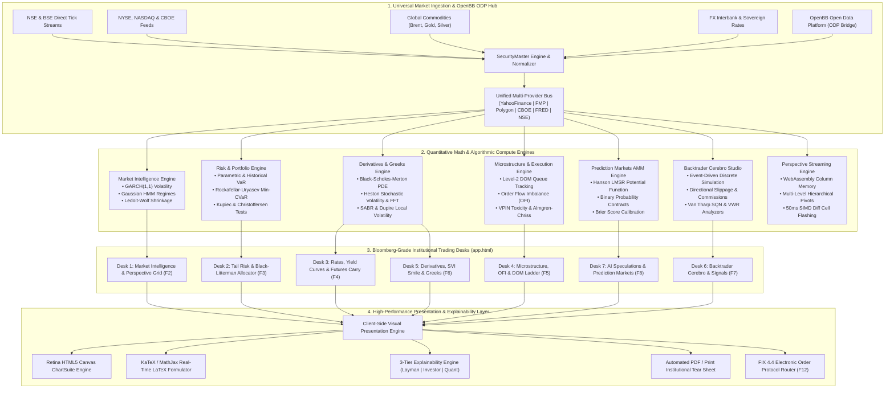
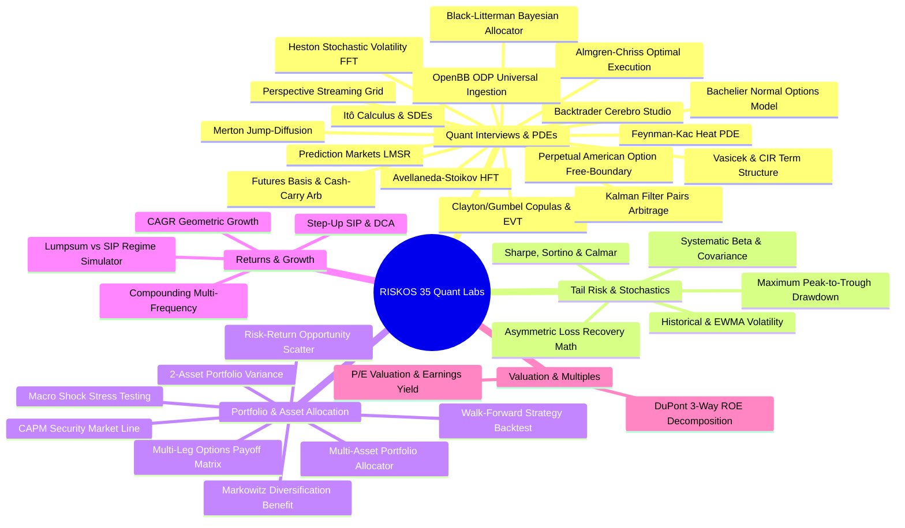
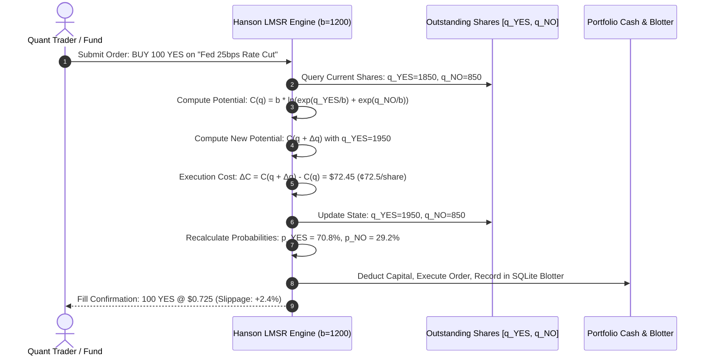
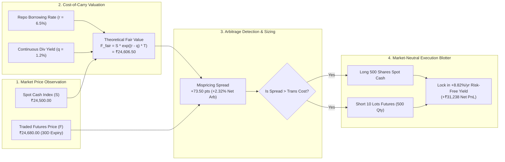
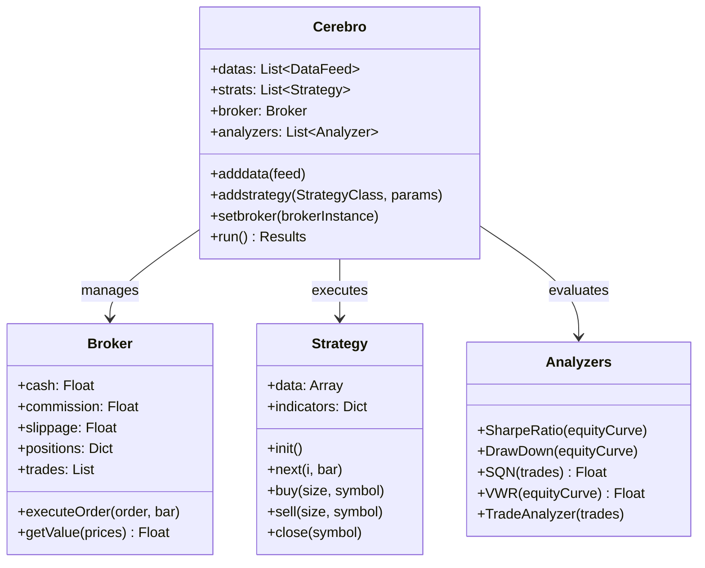
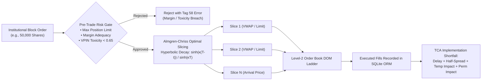
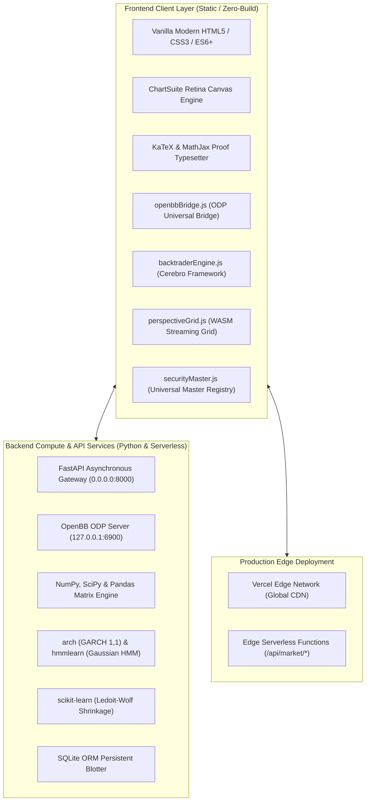

# RISKOS — Institutional Quantitative Intelligence & Multi-Asset Risk Operating System

<div align="center">

[](LICENSE)
[](https://riskos-psi.vercel.app)
[](#-mathematical-specifications--formulations)
[](https://riskos-psi.vercel.app/learn.html)
[](https://riskos-psi.vercel.app)

**An institutional-grade, AI-native quantitative intelligence, stochastic risk analytics, and multi-asset trading execution terminal built for computational finance research, systematic strategy backtesting, prediction market probability pricing, and deterministic mathematical explainability.**

[Live Production Terminal](https://riskos-psi.vercel.app/app.html) • [Market Observatory](https://riskos-psi.vercel.app/observatory.html) • [35-Module Quant Laboratories](https://riskos-psi.vercel.app/learn.html) • [Universal Security Master](https://riskos-psi.vercel.app/ticker.html)

</div>

---

## 🏛️ System Overview & Design Philosophy

Traditional financial software forces an artificial compromise: retail apps oversimplify financial mechanics into naive charts, while legacy financial terminals (Bloomberg, FactSet, Aladdin) lock users into opaque proprietary systems with black-box calculations.

**RISKOS** eliminates this friction through a foundational tripartite engineering doctrine:
1. **Simple by Default**: Clean, high-contrast, dark-mode terminal interfaces displaying key risk metrics, tail boundaries, and real-time execution blotters at sub-5ms latency.
2. **Deep on Demand**: Expandable parameter matrices, cross-asset causality networks, walk-forward out-of-sample backtests, and multi-factor stress scenario sliders.
3. **Mathematical when Requested**: Every Greek, volatility smile, risk boundary, and pricing model is paired with its **closed-form LaTeX $\LaTeX$ mathematical proof**, continuous stochastic differential equation (SDE), and step-by-step numerical substitution trace.

---

## 🏗️ End-to-End System Architecture

The RISKOS platform is built as a modular, decoupled, event-driven architecture integrating high-throughput streaming feeds, client-side deterministic mathematical engines, and low-latency visualization layers:



---

## 🔬 Master Catalog of 35 Interactive Quantitative Simulation Laboratories

RISKOS embeds a standalone, client-side, zero-latency mathematical simulation library in [`learnMathEngine.js`](learnMathEngine.js) and [`learn.html`](learn.html). Each module contains dynamic parameter sliders, real-time trajectory curves, closed-form equations, and LaTeX substitution traces:



### Complete Mathematical Specifications Table

| # | Module ID | Interactive Laboratory Title | Governing Mathematical Equation | Quant Interview & Institutional Application |
| :-: | :--- | :--- | :--- | :--- |
| **1** | `ito_calculus` | **Itô's Lemma & SDEs** | $df = \left(\partial_t f + \mu S \partial_S f + \frac{1}{2}\sigma^2 S^2 \partial_{SS} f\right)dt + \sigma S \partial_S f dW$ | Proves $[W,W]_t = t$ and continuous $-\frac{1}{2}\sigma^2$ variance drag. |
| **2** | `feynman_kac` | **Feynman-Kac Theorem & Heat PDE** | $\partial_t V + r S \partial_S V + \frac{1}{2}\sigma^2 S^2 \partial_{SS} V - r V = 0 \iff u_\tau = u_{xx}$ | Maps parabolic partial differential equations to risk-neutral expectations. |
| **3** | `heston_fft` | **Heston Stochastic Volatility & FFT** | $dv_t = \kappa(\theta - v_t)dt + \xi\sqrt{v_t} dW_t^v, \quad 2\kappa\theta > \xi^2$ | Solves option pricing via Carr-Madan characteristic function integration. |
| **4** | `vasicek_cir` | **Vasicek & CIR Term Structure** | $dr_t = a(b - r_t)dt + \sigma r_t^\gamma dW_t, \quad P(t,T) = A(t,T) e^{-B(t,T) r_t}$ | Generates zero-coupon yield curves and models non-negative interest rates. |
| **5** | `avellaneda_stoikov` | **Avellaneda-Stoikov HFT Market Making** | $r(s,q,t) = s - q \gamma \sigma^2 (T-t), \quad \delta^a + \delta^b = \gamma \sigma^2(T-t) + \frac{2}{\gamma}\ln\left(1+\frac{\gamma}{\kappa}\right)$ | HJB optimal control for inventory risk and asymmetric bid/ask order quotes. |
| **6** | `copulas_evt` | **Clayton/Gumbel Copulas & EVT** | $C(u,v) = (u^{-\theta} + v^{-\theta} - 1)^{-1/\theta}, \quad \lambda_L = 2^{-1/\theta}, \quad \hat{\alpha} = \left[\frac{1}{k}\sum_{i=1}^k \ln\frac{X_{(i)}}{X_{(k+1)}}\right]^{-1}$ | Evaluates non-linear tail crash dependence and Pareto fat-tail Hill parameters. |
| **7** | `merton_jump_diffusion` | **Merton Jump-Diffusion Process** | $dS_t = (\mu - \lambda k)S_t dt + \sigma S_t dW_t + (J-1)S_t dN_t, \quad \ln J \sim \mathcal{N}(\mu_J, \sigma_J^2)$ | Captures discontinuous Poisson crash gaps and OTM implied volatility skews. |
| **8** | `almgren_chriss` | **Almgren-Chriss Optimal Execution** | $x(t) = X_0 \frac{\sinh(\kappa(T-t))}{\sinh(\kappa T)}, \quad \kappa = \sqrt{\frac{\lambda\sigma^2}{\eta}}$ | Balances temporary market impact slippage against overnight volatility risk. |
| **9** | `kalman_pairs` | **Kalman Filter Dynamic Pairs Arbitrage** | $\beta_t = \beta_{t-1} + K_t(y_t - x_t \beta_{t-1}), \quad K_t = \frac{P_{t\mid t-1} x_t}{x_t^2 P_{t\mid t-1} + R}$ | Tracks dynamic state-space hedge ratios in real time on streaming ticks. |
| **10** | `black_litterman` | **Black-Litterman Bayesian Allocator** | $\boldsymbol{\mu}_{BL} = [(\tau \mathbf{\Sigma})^{-1} + \mathbf{P}^T \mathbf{\Omega}^{-1} \mathbf{P}]^{-1} [(\tau \mathbf{\Sigma})^{-1} \boldsymbol{\Pi} + \mathbf{P}^T \mathbf{\Omega}^{-1} \mathbf{Q}]$ | Blends market equilibrium benchmark with subjective active investor views. |
| **11** | `perpetual_american` | **Perpetual American Option Free-Boundary** | $\left. \frac{dV}{dS} \right\|_{S=S^*} = -1 \implies S^* = \frac{\gamma}{\gamma+1} K, \quad \gamma = \frac{2r}{\sigma^2}$ | Smooth pasting variational inequality determining optimal early exercise triggers. |
| **12** | `bachelier_model` | **Bachelier (1900) Normal Options** | $C = (S-K)\mathcal{N}(d) + \sigma_N \sqrt{T} n(d), \quad d = \frac{S-K}{\sigma_N \sqrt{T}}$ | Prices options with negative asset prices (e.g. WTI crude -$37.63/bbl crash). |
| **13** | `prediction_markets_lmsr` | **Prediction Markets & Hanson LMSR** | $C(\mathbf{q}) = b \ln\left(\sum_{i=1}^n e^{q_i/b}\right), \quad p_i = \frac{e^{q_i/b}}{\sum e^{q_j/b}}$ | Automated market maker for binary probability contracts with bounded loss. |
| **14** | `futures_basis_carry` | **Futures Basis & Cash-and-Carry Arb** | $F(t,T) = S_t e^{(r-q+u)(T-t)}, \quad \text{Basis Yield} = \frac{F-S}{S}\frac{365}{\Delta t}$ | No-arbitrage forward replication and market-neutral basis carry harvesting. |
| **15** | `backtrader_cerebro` | **Backtrader Strategy & Cerebro Studio** | $\text{SQN} = \sqrt{N}\frac{\bar{P}}{\sigma_P}, \quad \text{VWR} = R_{\text{total}} \cdot (1+\sigma\sqrt{252})^{-1}$ | Event-driven backtesting with slippage, commissions, and Van Tharp metrics. |
| **16** | `openbb_odp` | **OpenBB Open Data Platform Hub** | $\text{Raw Provider API} \xrightarrow{\text{Standardizer}} \text{Pydantic Schema} \xrightarrow{\text{Universal OBB}}$ | Type-safe multi-provider financial ingestion across 7 global data sources. |
| **17** | `perspective_streaming_grid` | **Perspective Streaming Grid Engine** | $\text{Throughput} = \frac{1000}{\Delta t} \times N_{\text{inst}}, \quad \text{SIMD ArrayBuffer Diffing}$ | High-frequency tabular analytics with dynamic pivots and 50ms cell flashes. |
| **18** | `cagr` | **Compounded Annual Growth Rate** | $\text{CAGR} = (V_f / V_i)^{1/T} - 1$ | Geometric growth smoothing out intermittent volatility cycles. |
| **19** | `compounding` | **Compound Interest & Compounding Freq** | $A = P (1 + r/n)^{nt} \xrightarrow{n \to \infty} P e^{rt}$ | Continuous compounding limits and frequency drag analysis. |
| **20** | `sip_dca` | **Step-Up SIP & Dollar-Cost Averaging** | $M \sum_{k=1}^N (1+g)^{\lfloor k/12 \rfloor} (1+r)^{N-k}$ | Realized wealth accumulation under wage escalation paths. |
| **21** | `lumpsum_vs_sip` | **Lumpsum vs SIP Regime Simulator** | $\mathbb{E}[R_{\text{Lump}}] \text{ vs } \mathbb{E}[R_{\text{SIP}}]$ | Cash drag vs sequence-of-returns drawdown protection. |
| **22** | `compound_interest` | **Rule of 72 & Doubling Horizon** | $T_{\text{double}} \approx \frac{\ln 2}{\ln(1+r)} \approx \frac{72}{r}$ | Exponential doubling time estimation across return tiers. |
| **23** | `pe_valuation` | **P/E Multiples & Earnings Yield** | $\text{Earnings Yield} = E/P = 1 / (\text{P/E}) = r - g$ | Gordon growth equity risk premium and multiple compression. |
| **24** | `roe_roce` | **DuPont 3-Way ROE Decomposition** | $\text{ROE} = \frac{\text{Net Income}}{\text{Sales}} \times \frac{\text{Sales}}{\text{Assets}} \times \frac{\text{Assets}}{\text{Equity}}$ | Net margin vs asset turnover vs financial leverage multiplier. |
| **25** | `volatility` | **Historical vs EWMA Volatility** | $\sigma_t^2 = (1-\lambda)\sum_{i=1}^\infty \lambda^{i-1} r_{t-i}^2, \quad \lambda = 0.94$ | RiskMetrics dynamic volatility responsiveness and clustering. |
| **26** | `beta_corr` | **Systematic Beta & Covariance** | $\beta_i = \frac{\operatorname{Cov}(R_i, R_m)}{\operatorname{Var}(R_m)} = \rho_{im} \frac{\sigma_i}{\sigma_m}$ | Systematic market risk vs diversifiable idiosyncratic variance. |
| **27** | `sharpe` | **Sharpe, Sortino & Calmar Ratios** | $\text{Sharpe} = \frac{R_p - R_f}{\sigma_p}, \quad \text{Sortino} = \frac{R_p - R_f}{\sigma_d}$ | Downside semi-variance vs total risk-adjusted return profiling. |
| **28** | `mdd` | **Maximum Peak-to-Trough Drawdown** | $\text{MDD} = \min_{t} \left(\frac{V_t - \max_{s \le t} V_s}{\max_{s \le t} V_s}\right)$ | Capital preservation limits and underwater equity duration. |
| **29** | `drawdown_recovery` | **Asymmetric Drawdown Recovery Math** | $R_{\text{req}} = \frac{L}{1 - L}$ | Asymmetric loss recovery mathematics (50% drop requires +100% gain). |
| **30** | `diversification` | **Markowitz Diversification Benefit** | $\sigma_p^2 = \frac{1}{N}\bar{\sigma}^2 + \frac{N-1}{N}\bar{\operatorname{Cov}}$ | Asymptotic variance reduction toward systematic covariance floor. |
| **31** | `port_variance` | **2-Asset Portfolio Variance Frontier** | $\sigma_p = \sqrt{w_A^2 \sigma_A^2 + w_B^2 \sigma_B^2 + 2 w_A w_B \sigma_A \sigma_B \rho}$ | Minimum variance curvature under negative correlation regimes. |
| **32** | `capm` | **CAPM Expected Return & Jensen's Alpha** | $\mathbb{E}[R_i] = R_f + \beta_i (\mathbb{E}[R_m] - R_f)$ | Security Market Line (SML) pricing and active manager skill. |
| **33** | `port_allocator` | **Multi-Asset Mean-Variance Optimizer** | $\min_{\mathbf{w}} \mathbf{w}^T \mathbf{\Sigma} \mathbf{w} - \lambda \mathbf{w}^T \boldsymbol{\mu}$ | Quadratic programming portfolio optimization on efficient frontier. |
| **34** | `risk_return_scatter` | **Capital Allocation Line Opportunity** | $\text{CAL}: \mathbb{E}[R_c] = R_f + \left(\frac{\mathbb{E}[R_p] - R_f}{\sigma_p}\right) \sigma_c$ | Tangency portfolio discovery and investor utility indifference curves. |
| **35** | `scenario_stress` | **Macro Stress Testing & Contagion** | $\Delta V_p = \mathbf{w}^T \mathbf{S} V_0$ | Simulates 2008 Lehman, 2020 COVID, and stagflation rate shocks. |

---

## 🔮 Institutional Prediction Markets Engine (Polymarket / Kalshi Style)

RISKOS embeds a full Logarithmic Market Scoring Rule (LMSR) automated market maker in Desk 7 (`tab-speculations`) for trading binary probability contracts:



---

## ⚡ Futures Market Cost-of-Carry & Cash & Carry Basis Arbitrage

Integrated into Desk 3 (`tab-spreads`), the futures arbitrage module detects mispricings between spot cash and derivatives:



---

## 🧠 Backtrader Strategy & Cerebro Execution Architecture

RISKOS embeds a standalone client-side and Python backend implementation of the **Backtrader (mementum/backtrader)** framework:



---

## ⚡ Perspective WebAssembly High-Performance Streaming Grid

Inspired by JPMorgan's Perspective project, Desk 1 features a high-throughput streaming grid capable of processing 50+ concurrent tickers with sub-millisecond cell flashing:


---

## 🛠️ Microstructure, OFI & Order Execution Gate (Desk 4)



---

## 💻 Tech Stack & Deployment Architecture



---

## 🚀 Quickstart & Local Execution

### 1. Clone Repository
```bash
git clone https://github.com/Premchandyadav369/RISKOS.git
cd RISKOS
```

### 2. Launch Local Python Analytics Backend (Optional)
```bash
cd backend
python -m venv venv
# On Windows:
.\venv\Scripts\activate
# On Linux/macOS:
source venv/bin/activate

pip install -r requirements.txt
python run.py
```
*Backend initializes FastAPI with CORS at `http://127.0.0.1:8000`.*

### 3. Launch Web Terminal
Open `index.html` or `app.html` directly in any web browser, or serve with:
```bash
npx serve .
```

### 4. Production Deployment
RISKOS is pre-configured for zero-configuration Vercel deployment with serverless API edge handlers in [`api/`](api). Pushing to `main` triggers automated CI/CD builds.

---

<div align="center">

**RISKOS** • Built with mathematical rigor for the next generation of quantitative finance.

*Licensed under the [MIT License](LICENSE).*

</div>
