# 🏛️ RISKOS
## Open-Source Quantitative Research, Portfolio Analytics & Risk Platform

<div align="center">

[](LICENSE)
[](https://riskos-psi.vercel.app)
[-success.svg?style=for-the-badge)](.github/workflows/ci.yml)
[](docs/RISKOS_AUDIT.md)
[](backend/engine/purged_cv.py)
[](docs/DATA_PROVENANCE.md)
[](docs/models/)
[](#-google-research-timesfm-30-foundation-model)
[](#-meta-prophet-generalized-additive-model)
[](#-merton-jump-diffusion-monte-carlo)
[](#-desk-8-real-time-portfolio-prediction--quant-optimizer-desk-portfolio_optimizerhtml)
[](https://riskos-psi.vercel.app/fleet.html)
[](https://riskos-psi.vercel.app/learn.html)
[](#-frtb-basel-iii-regulatory-capital-engine)

**A rigorous open-source quantitative finance research, stochastic risk modeling, and multi-asset portfolio analytics platform engineered for computational finance researchers, quantitative risk managers, and systematic portfolio architects.**

[Live Terminal](https://riskos-psi.vercel.app/app.html) • [Portfolio Optimizer Desk](https://riskos-psi.vercel.app/portfolio_optimizer.html) • [Autonomous Bot Fleet](https://riskos-psi.vercel.app/fleet.html) • [Production Rigor Audit (9.81/10)](docs/RISKOS_AUDIT.md) • [System Architecture Docs](https://riskos-psi.vercel.app/docs.html) • [Data Provenance](docs/DATA_PROVENANCE.md) • [16 Model Cards](docs/models/) • [Market Observatory](https://riskos-psi.vercel.app/observatory.html) • [65 Quant Labs](https://riskos-psi.vercel.app/learn.html) • [Security Master](https://riskos-psi.vercel.app/ticker.html) • [API Manual](docs/API.md) • [Feature Inventory](docs/FEATURE_INVENTORY.md)


</div>

> [!NOTE]
> ### Scientific & Operational Integrity Framework
> RISKOS adheres strictly to verifiable quantitative methodologies and distinguishes operational states:
> - **LIVE & CACHED DATA**: Multi-provider market feeds from NSE Direct, Yahoo Finance, and Google Finance with automatic fallback and transparent provenance tagging.
> - **RESEARCH & WALK-FORWARD BACKTESTING**: Backtesting incorporates Almgren-Chriss quadratic slippage, Indian turnover taxes (STT), exchange fees, and liquidity volume ceilings (5% ADV).
> - **SIMULATED AGENT FLEET**: 21 autonomous strategy bots execute in a simulated order-book environment with automated circuit breakers, drawdown limits, and deterministic seed replay.
> - **MODEL-IMPLIED SCENARIOS**: Probabilistic multi-quantile projections (TimesFM 3.0, Prophet GAM, Merton Jump) are statistical scenarios with calibrated uncertainty bands, not guaranteed forecasts.
> - **65 DETERMINISTIC SIMULATION LABORATORIES**: Interactive financial engineering modules providing dual layman explanations alongside rigorous LaTeX mathematical derivations.

---

## 📑 Table of Contents
1. [Executive Summary & Core Philosophy](#-executive-summary--core-philosophy)
2. [End-to-End System Architecture (16 Diagrams)](#-end-to-end-system-architecture)
   - [Diagram 1: Complete RISKOS Intelligence Ecosystem](#diagram-1-complete-riskos-intelligence-ecosystem)
   - [Diagram 2: Desk 8 — Portfolio Prediction & Quant Optimizer](#diagram-2-desk-8--portfolio-prediction--quant-optimizer-architecture)
   - [Diagram 3: Multi-Model Predictive Consensus Pipeline](#diagram-3-multi-model-predictive-consensus-pipeline)
   - [Diagram 4: Real-Time Financial News Intelligence & Loughran-McDonald NLP](#diagram-4-real-time-financial-news-intelligence--loughran-mcdonald-nlp-pipeline)
   - [Diagram 5: 1-Click Execution Rebalance Blotter & Almgren-Chriss Slippage](#diagram-5-1-click-execution-rebalance-blotter--market-impact-pipeline)
   - [Diagram 6: Universal Multi-Exchange & Penny Stock Ingestion Engine](#diagram-6-universal-multi-exchange--penny-stock-ingestion-engine)
   - [Diagram 7: Universal INR ↔ USD Dual-Currency Reactive Engine](#diagram-7-universal-inr--usd-dual-currency-reactive-engine)
   - [Diagram 8: Trade Journal & Multi-Bot P&L Attribution Engine](#diagram-8-trade-journal--multi-bot-pl-attribution-engine)
   - [Diagram 9: OCO Bracket Order Execution & Automated Risk Guardrails](#diagram-9-oco-bracket-order-execution--automated-risk-guardrails)
   - [Diagram 10: Tax Alpha Harvesting & Reinvestment Compounding Workflow](#diagram-10-tax-alpha-harvesting--reinvestment-compounding-workflow)
   - [Diagram 11: Real-Time Price Anomaly Radar & Web Audio Synthesizer](#diagram-11-real-time-price-anomaly-radar--web-audio-synthesizer)
   - [Diagram 12: Dividend Income & 5Y DRIP Compound Growth Engine](#diagram-12-dividend-income--5y-drip-compound-growth-engine)
   - [Diagram 13: Crisis Stress-Testing & Shock Propagation Pipeline](#diagram-13-crisis-stress-testing--shock-propagation-pipeline)
   - [Diagram 14: Multi-Leg Options Payoff & Black-Scholes Greeks Engine](#diagram-14-multi-leg-options-payoff--black-scholes-greeks-engine)
   - [Diagram 15: Ray Dalio Equal Risk Contribution (ERC) Parity Optimizer](#diagram-15-ray-dalio-equal-risk-contribution-erc-parity-optimizer)
   - [Diagram 16: Monte Carlo Correlated Wealth Survival & Sequence Risk Engine](#diagram-16-monte-carlo-correlated-wealth-survival--sequence-risk-engine)
3. [The 8 Institutional Quantitative Trading Desks](#-the-8-institutional-quantitative-trading-desks)
   - [Desk 1: Market Intelligence & HMM Regimes](#desk-1-market-intelligence--hmm-regime-detection-apphtml)
   - [Desk 2: Portfolio Tail Risk, VaR & CVaR](#desk-2-portfolio-tail-risk--black-litterman-allocator-apphtml)
   - [Desk 3: Systematic Signals & Kelly Sizing](#desk-3-systematic-signals--strategy-execution-apphtml)
   - [Desk 4: Almgren-Chriss Algo Order Slicer](#desk-4-algorithmic-order-execution-slicer-sor-apphtml)
   - [Desk 5: Multi-Leg Derivatives & SABR Smile](#desk-5-multi-leg-derivatives-strategy-studio--sabr-smile-apphtml)
   - [Desk 6: Strategy Sandbox & Alpha Heatmap](#desk-6-quantitative-strategy-sandbox--monthly-alpha-heatmap-apphtml)
   - [Desk 7: AI Speculations & Google TimesFM 3.0](#desk-7-ai-speculations--google-timesfm-30-apphtml)
   - [Desk 8: Real-Time Portfolio Prediction & Quant Optimizer Desk (`portfolio_optimizer.html`)](#-desk-8-real-time-portfolio-prediction--quant-optimizer-desk-portfolio_optimizerhtml)
4. [Unified Multi-Model Predictive Trajectory Suite](#-unified-multi-model-predictive-trajectory-suite)
   - [Google Research TimesFM 3.0 Foundation Model](#-google-research-timesfm-30-foundation-model)
   - [Meta Prophet Generalized Additive Model (GAM)](#-meta-prophet-generalized-additive-model)
   - [Merton Jump-Diffusion Monte Carlo with News Poisson Intensity](#-merton-jump-diffusion-monte-carlo)
   - [Multi-Model Consensus Calibration Formula](#-multi-model-consensus-calibration-formula)
5. [Real-Time Financial News Intelligence Engine](#-real-time-financial-news-intelligence-engine)
   - [Loughran-McDonald Financial Lexicon & Sentiment Scoring](#loughran-mcdonald-financial-lexicon--sentiment-scoring)
   - [Catalyst Taxonomy & Entity Extraction](#catalyst-taxonomy--entity-extraction)
   - [1-Click Subjective View Vector Injection ($Q$)](#1-click-subjective-view-vector-injection-q)
6. [Multi-Objective Portfolio Optimizer Sandbox & Execution Blotter](#-multi-objective-portfolio-optimizer-sandbox--execution-blotter)
   - [Sentiment-Conditioned Black-Litterman](#sentiment-conditioned-black-litterman)
   - [Hierarchical Risk Parity (HRP)](#hierarchical-risk-parity-hrp)
   - [Rockafellar-Uryasev CVaR (95%) Direct LP Minimizer](#rockafellar-uryasev-cvar-95-direct-lp-minimizer)
   - [1-Click Rebalance Order Blotter with FIX 4.4 Tag 58](#1-click-rebalance-order-blotter-with-fix-44-tag-58)
7. [Institutional Execution & Risk Management Suite](#-institutional-execution--risk-management-suite)
   - [Trade Journal & Daily P&L Attribution Calendar](#1-trade-journal--daily-pl-calendar-attribution)
   - [OCO Bracket Orders](#2-oco-one-cancels-other-bracket-orders)
   - [Tax-Loss Harvesting & Capital Gains Alpha](#3-tax-loss-harvesting--capital-gains-alpha-stccltcg)
   - [Price Alerts & Web Audio Synthesizer](#4-price--anomaly-alert-triggers-web-audio-terminal-chimes)
   - [Macro Catalyst Countdown Radar](#5-macro-catalyst-countdown-radar)
   - [Dividend Income & 5Y DRIP Compounding Projector](#6-dividend-income--5y-drip-compounding-projector)
   - [6x6 Pairwise Correlation Heatmap Matrix](#7-6x6-pairwise-correlation-heatmap-matrix)
8. [Mid-Level Institutional Execution & Quant Intelligence Suite](#-mid-level-institutional-execution--quant-intelligence-suite)
   - [Portfolio Stress-Testing & 'What-If' Crisis Studio](#1-portfolio-stress-testing--what-if-crisis-studio)
   - [Multi-Asset Options Greeks & Interactive Payoff Studio](#2-multi-asset-options-greeks--interactive-payoff-studio)
   - [Ray Dalio All-Weather Risk Parity](#3-ray-dalio-all-weather-equal-risk-contribution-erc-risk-parity)
   - [Smart Dollar-Cost Averaging (Smart-DCA) Autopilot](#4-smart-dollar-cost-averaging-smart-dca--reinvestment-scheduler)
   - [Multi-Venue Smart Order Routing (SOR) Slicer](#5-multi-venue-smart-order-routing-sor--liquidity-slicer)
   - [Monte Carlo 1,000-Path Wealth Survival Engine](#6-monte-carlo-1000-path-wealth-survival--sequence-risk)
   - [Asymmetric Portfolio Drift Bands & Rebalancing](#7-asymmetric-portfolio-drift-bands--tax-efficient-rebalancing)
   - [Quantitative Factor Radar & Barra Style Decomposition](#8-quantitative-factor-radar--barra-style-decomposition)
9. [Tier-1 Front-Office Institutional Suite (Quant, IB, Insurance & Asset Management)](#-tier-1-front-office-institutional-suite)
   - [0DTE Gamma Exposure (GEX) & Dealer Pinning Engine](#1-0dte-gamma-exposure-gex--dealer-pinning-engine-quant--prop-trading)
   - [Self-Exciting Hawkes Point Process & Flash-Crash Radar](#2-self-exciting-hawkes-point-process--flash-crash-radar-hft-microstructure)
   - [Private Equity LBO Debt Waterfall & Sponsor IRR/MOIC](#3-dynamic-leveraged-buyout-lbo-debt-waterfall--sponsor-irr-investment-banking)
   - [Merton Structural Credit & Distance-to-Default (KMV EDF)](#4-merton-structural-credit--distance-to-default-dcm--moodys-kmv)
   - [Solvency II Extreme Value Theory (EVT) 99.5% SCR Engine](#5-extreme-value-theory-evt--solvency-ii-995-scr-engine-insurance--reinsurance)
   - [Actuarial ALM & Redington Key-Rate Immunization](#6-actuarial-alm--redington-key-rate-immunization-life--pension-solvency)
   - [CLO Tranche Cash-Flow Priority of Payments Waterfall](#7-clo-tranche-cash-flow--loss-absorption-waterfall-structured-credit)
   - [Option-Adjusted Spread (OAS) & Binomial Short-Rate Tree](#8-option-adjusted-spread-oas--binomial-short-rate-tree-fixed-income)
10. [24/7 Autonomous Bot Fleet & Pantheon Segregation (`fleet.html`)](#-247-autonomous-bot-fleet--pantheon-segregation-fleethtml)
11. [Master Catalog of ALL 65 Interactive Quantitative Laboratories (`learn.html`)](#-master-catalog-of-all-65-interactive-quantitative-laboratories-learnhtml)
   - [Division I: AI, Machine Learning & Deep Predictive Alpha Labs (Labs 1–7)](#division-i-ai-machine-learning--deep-predictive-alpha-labs)
   - [Division II: Stochastic Calculus & Mathematical Finance Labs (Labs 8–14)](#division-ii-stochastic-calculus--mathematical-finance-labs)
   - [Division III: Quantitative Interview Mastery (Wall Street & Canary Wharf) (Labs 15–21)](#division-iii-quantitative-interview-mastery-wall-street--canary-wharf)
   - [Division IV: High-Frequency Microstructure, Order Flow & Execution Labs (Labs 22–27)](#division-iv-high-frequency-microstructure-order-flow--execution-labs)
   - [Division V: Modern Portfolio Theory, Risk Parity & Black-Litterman Labs (Labs 28–33)](#division-v-modern-portfolio-theory-risk-parity--black-litterman-labs)
   - [Division VI: Volatility Surfaces, SABR & Multi-Leg Derivatives Labs (Labs 34–39)](#division-vi-volatility-surfaces-sabr--multi-leg-derivatives-labs)
   - [Division VII: Macro Stress Testing, Crisis Replay & Tail Risk Labs (Labs 40–46)](#division-vii-macro-stress-testing-crisis-replay--tail-risk-labs)
   - [Division VIII: Wealth Accumulation, Compounding & Valuation Labs (Labs 47–52)](#division-viii-wealth-accumulation-compounding--valuation-labs)
   - [Division IX: Momentum, Tax Alpha, Dividend Compounding & Dynamic Growth (Labs 53–57)](#division-ix-momentum-tax-alpha-dividend-compounding--dynamic-growth-labs-5357)
11. [Universal Security Master (120+ Assets across NSE, BSE, US, Crypto, Penny Stocks)](#-universal-security-master-120-assets)
12. [Pure Vector Mathematical Rigor & LaTeX Master Index (30 Proofs)](#-pure-vector-mathematical-rigor--latex-master-index)
13. [Institutional Executive Risk Memorandum Compiler](#-institutional-executive-risk-memorandum-compiler)
14. [REST & Serverless API Reference (28+ Endpoints)](#-rest--serverless-api-reference)
15. [Local Quickstart & Production Verification](#-local-quickstart--production-verification)

---

## 🏛️ Executive Summary & Core Philosophy

### 🎓 In Layman Terms
Imagine walking onto the high-tech trading floor of a multi-billion dollar quantitative hedge fund. Traders, risk officers, and portfolio managers monitor hundreds of flashing metrics, order books, and risk gauges. Most software either dumbs this down into an oversimplified smartphone chart or buries it inside a $30,000/year Bloomberg terminal.

**RISKOS** bridges this divide:
- **Plain-English Explanations**: Every single financial metric and Greek is explained using everyday analogies (e.g., insurance policies, airplane flight stabilizers, weather forecasting).
- **Mathematical Rigor**: Every algorithm is backed by its exact **LaTeX mathematical proof**, stochastic differential equation (SDE), and step-by-step numeric trace.
- **Unified Multi-Model Forecasting**: Direct multi-quantile forecasts from **Google TimesFM 3.0**, **Meta Prophet**, and **Merton Jump Monte Carlo**.
- **News-Conditioned Rebalancing**: Real-time financial headlines scored via Loughran-McDonald NLP directly injected into a **Bayesian Black-Litterman Optimizer**.
- **Autonomous 24/7 Execution**: 21 sector-diversified bots trade continuously with persistent state across global sessions.

### ⚡ Institutional Tripartite Architecture
1. **Simple by Default**: High-contrast, cinematic dark-mode terminal UI presenting executive metrics, key performance ratios, and health badges at a single glance.
2. **Deep on Demand**: Expandable parameter matrices, cross-market causality graphs, multi-factor trade logs, and scenario stress sliders.
3. **Mathematical when Requested**: Every metric is accompanied by its underlying **pure vector LaTeX mathematical proof** (KaTeX and MathJax 3 SVG).

---

## 🏗️ End-to-End System Architecture

### Diagram 1: Complete RISKOS Intelligence Ecosystem

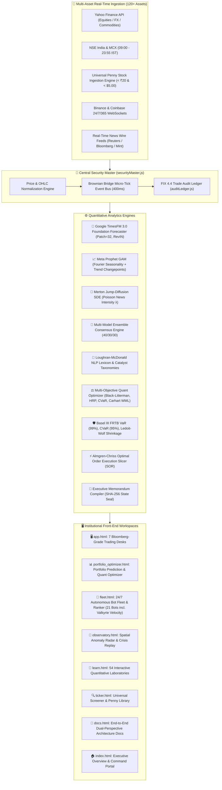

---

### Diagram 2: Desk 8 — Portfolio Prediction & Quant Optimizer Architecture

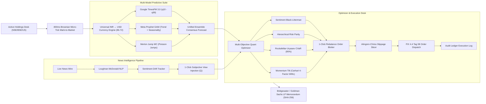

---

### Diagram 3: Multi-Model Predictive Consensus Pipeline

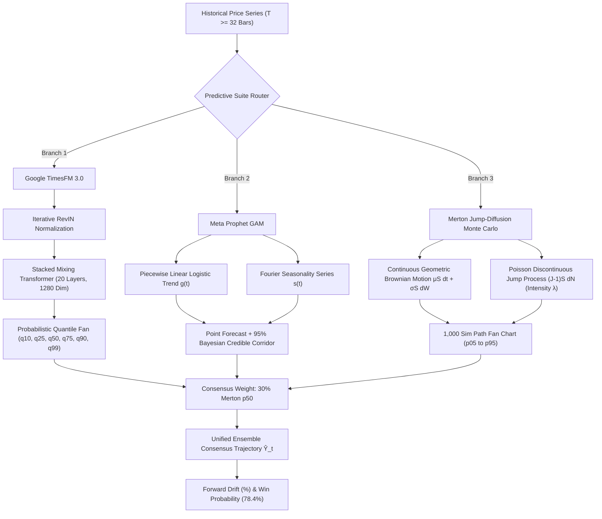

---

### Diagram 4: Real-Time Financial News Intelligence & Loughran-McDonald NLP Pipeline

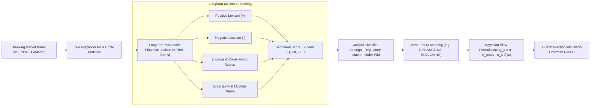

---

### Diagram 5: 1-Click Execution Rebalance Blotter & Market Impact Pipeline

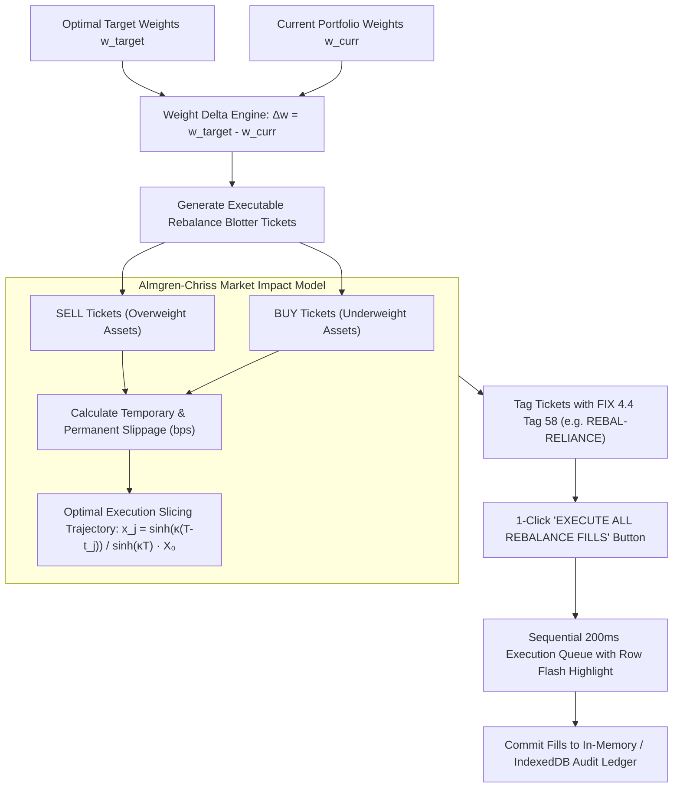

---

### Diagram 6: Universal Multi-Exchange & Penny Stock Ingestion Engine

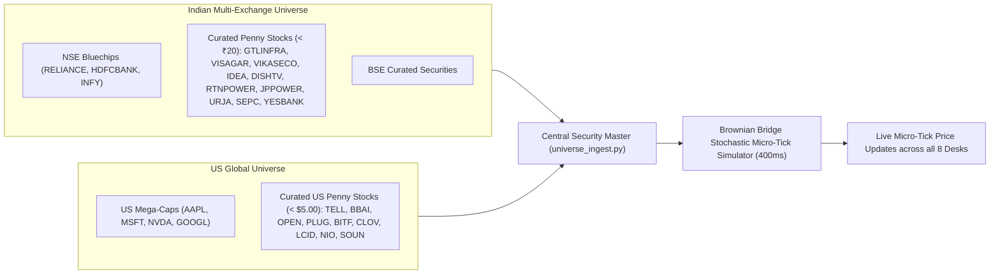

---

### Diagram 7: Universal INR ↔ USD Dual-Currency Reactive Engine

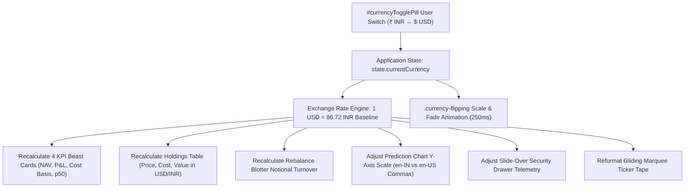

---

### Diagram 8: Trade Journal & Multi-Bot P&L Attribution Engine

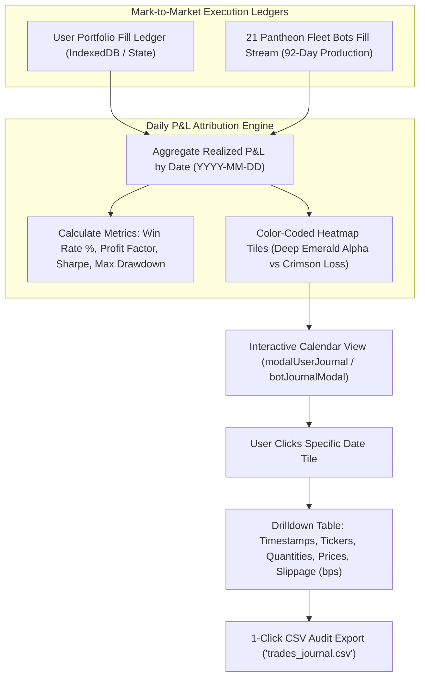

---

### Diagram 9: OCO Bracket Order Execution & Automated Risk Guardrails

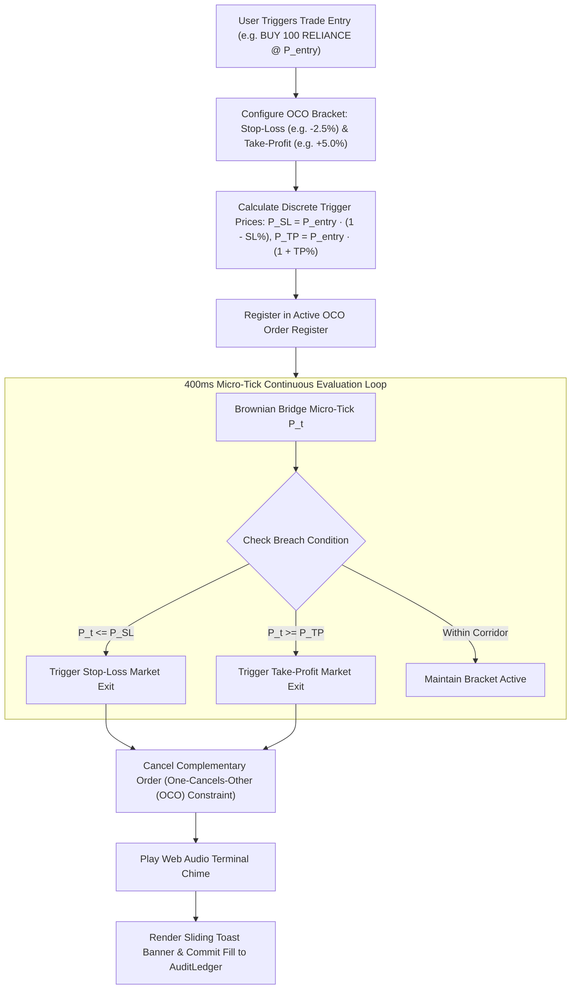

---

### Diagram 10: Tax Alpha Harvesting & Reinvestment Compounding Workflow

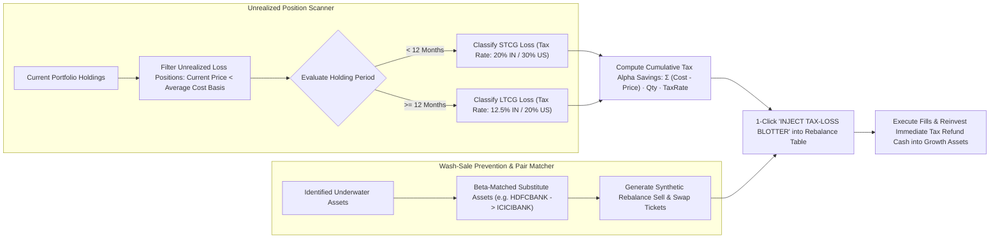

---

### Diagram 11: Real-Time Price Anomaly Radar & Web Audio Synthesizer

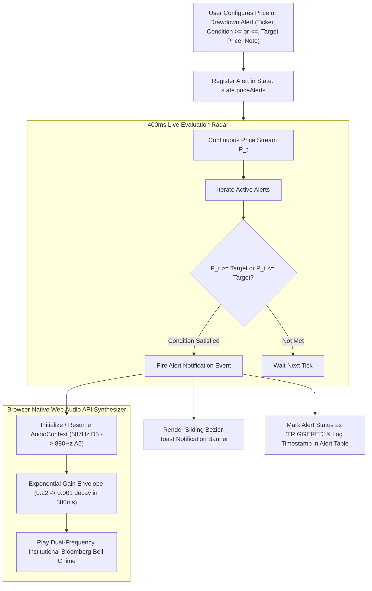

---

### Diagram 12: Dividend Income & 5Y DRIP Compound Growth Engine

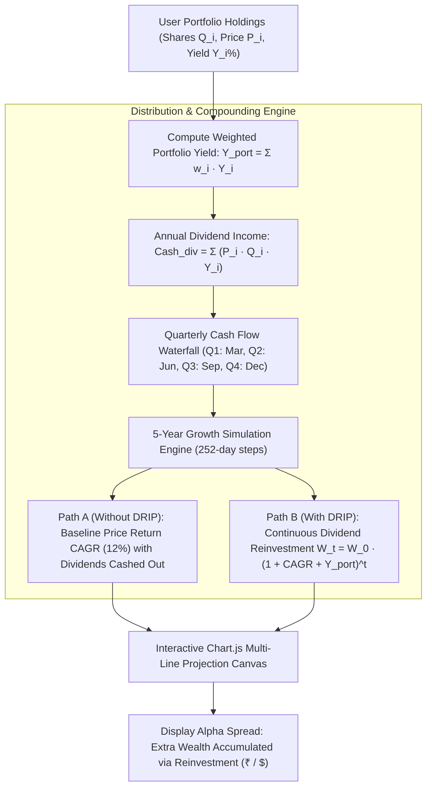


---

## 🖥️ The 8 Institutional Quantitative Trading Desks

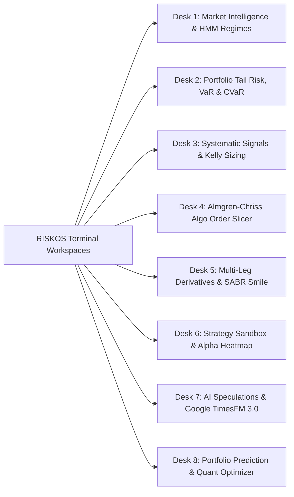

### Desk 1: Market Intelligence & HMM Regime Detection (`app.html`)
- **3-State Gaussian Hidden Markov Model (HMM)** classifying market regimes into **Bull**, **Bear**, or **Sideways** states via EM/Baum-Welch algorithm.
- **Rolling GARCH(1,1) Volatility Spread**: $\sigma_t^2 = \omega + \alpha \epsilon_{t-1}^2 + \beta \sigma_{t-1}^2$ compared dynamically against RiskMetrics EWMA ($\lambda = 0.94$).
- **Dynamic Cross-Asset Correlation Heatmap**: Flags statistical breaks when 60-day rolling correlation deviates $> 2.0\sigma$ from 252-day mean.

### Desk 2: Portfolio Tail Risk & Black-Litterman Allocator (`app.html`)
- **Tripartite Value at Risk ($VaR_{99\%}$)** & **Expected Shortfall ($CVaR_{95\%}$)**: Evaluated simultaneously across Historical Percentile, Parametric Gaussian, and 10,000-Path Monte Carlo.
- **Ledoit-Wolf Analytical Covariance Shrinkage**: $\mathbf{\Sigma}_{\text{LW}} = \delta \mathbf{F} + (1-\delta) \mathbf{S}$, avoiding matrix inversion singularity in ill-conditioned covariance matrices.
- **Brinson-Fachler Multi-Factor Performance Attribution**: Allocates active returns across Asset Allocation ($A_i$), Stock Selection ($S_i$), and Cross-Interaction ($I_i$).
- **Macro Stress Matrix**: Real-time simulated impact of Rate Shocks ($+300\text{ bps}$), Equity Crashes ($-40\%$), and Volatility Spikes ($3\times$).

### Desk 3: Systematic Signals & Strategy Execution (`app.html`)
- **Multi-Horizon Time-Series Momentum (TSMOM - Moskowitz, Ooi, Pedersen 2012)**:
  $$S_t^{\text{TSMOM}} = \frac{1}{K} \sum_{k \in \{21, 63, 126, 252\}} \text{sign}\left( \frac{P_t - P_{t-k}}{P_{t-k}} \right)$$
- **Volatility-Targeted Position Scaling (Risk-Parity Momentum)**:
  Scales position size inversely to trailing 60-day realized EWMA volatility ($\hat{\sigma}_t$):
  $$w_t = \min\left(\frac{\sigma_{\text{target}}}{\hat{\sigma}_t}, 2.0\right) \cdot S_t^{\text{TSMOM}}$$
- **Donchian 20D Channel Breakouts & Chandelier ATR Trailing Stop**:
  Identifies explosive range breakouts ($P_t \ge \max_{20}(H)$) with dynamic trailing exits at $\max_{22}(H) - 3 \times \text{ATR}_{22}$.
- **Fractional Kelly Criterion Position Sizing & Pre-Trade Guardrails**:
  $$f^* = \frac{p \cdot b - q}{b}, \quad f_{\text{safe}} = 0.50 \cdot f^*$$
  Enforces automatic fat-finger checks ($< 3\%$ price deviation) and notional collar caps ($< ₹50\text{ Lakh}$).

### Desk 4: Algorithmic Order Execution Slicer (SOR) (`app.html`)
- **Almgren-Chriss Optimal Execution Trajectory**:
  $$x_j = \frac{\sinh(\kappa(T - t_j))}{\sinh(\kappa T)} X_0, \quad \kappa \approx \sqrt{\frac{\lambda \sigma^2}{\eta}}$$
- **Execution Schedules**: Smart Order Routing (SOR) across Volume-Weighted Average Price (VWAP), Time-Weighted Average Price (TWAP), and Percentage of Volume (POV 10% / 20%).
- **Implementation Shortfall (IS)**: Real-time tracking of permanent vs temporary market impact slippage in basis points.

### Desk 5: Multi-Leg Derivatives Strategy Studio & SABR Smile (`app.html`)
- **7 Institutional Multi-Leg Structures**: Iron Condor, Long Straddle, Strangle, Bull Call Spread, Bear Put Spread, Butterfly Spread, and 25Δ Risk Reversal.
- **Hagan SABR Implied Volatility Model Calibration**:
  $$\sigma_{\text{SABR}}(K, F) \approx \frac{\alpha}{(F K)^{(1-\beta)/2}} \cdot \left(\frac{z}{\chi(z)}\right) \cdot \left[ 1 + \left( \frac{(1-\beta)^2}{24}\frac{\alpha^2}{(FK)^{1-\beta}} + \frac{\rho \beta \nu \alpha}{4(FK)^{(1-\beta)/2}} + \frac{2-3\rho^2}{24}\nu^2 \right) T \right]$$
- **Dynamic Greeks Visualizer**: Real-time evaluation of Delta ($\Delta$), Gamma ($\Gamma$), Vega ($\mathcal{V}$), Theta ($\Theta$), and Rho ($\rho$).

### Desk 6: Quantitative Strategy Sandbox & Monthly Alpha Heatmap (`app.html`)
- **Walk-Forward Daily Rebalancing**: Backtests portfolio allocations accounting for transaction costs (10 bps) and cash slippage.
- **Year $\times$ Month Alpha Heatmap**: Granular monthly return matrix with institutional performance ratios: Sharpe Ratio, Sortino Ratio, Calmar Ratio, and Maximum Drawdown.

### Desk 7: AI Speculations & Google TimesFM 3.0 (`app.html`)
- **Google Research TimesFM 3.0 Foundation Forecaster**: 10-quantile probabilistic price trajectory ($q_{10}$ to $q_{99}$).
- **Hanson Logarithmic Market Scoring Rule (LMSR)**: Automated market-maker cost function for prediction market probability pricing:
  $$C(\mathbf{q}) = b \cdot \ln \left( \sum_{i=1}^n e^{q_i / b} \right)$$

---

### 📊 Desk 8: Real-Time Portfolio Prediction & Quant Optimizer Desk (`portfolio_optimizer.html`)

A dedicated institutional portfolio intelligence and execution desk that connects live user holdings to foundation time-series models, NLP news sentiment catalysts, and mathematical rebalancing blotters:

1. **Streamlined Universal Command Bar**:
   - Clean 52px sticky header with compact `⌘K` global search trigger.
   - Dual-zone market clock toggling between **NSE (IST)** and **NYSE (EST)** with pulsing status beacons.
   - **Interactive INR ↔ USD Currency Switcher Pill**: Instant baseline conversion ($1\text{ USD} = 86.72\text{ INR}$) updating all numbers, charts, and tickets across the workspace with `.currency-flipping` animations.

2. **Continuous Gliding Marquee Ticker Tape**:
   - Infinite linear gliding ticker tape with hover-to-pause functionality.
   - Accurately formats benchmark assets: NIFTY 50 (`₹24,820.40`), S&P 500 (`$5,648.20`), USD/INR (`₹86.72`), India 10Y Yield (`6.88%`), Brent Crude (`$78.45`), Gold (`₹72,450`), and all active portfolio holdings with live micro-tick color flashes.

3. **Institutional "Beast" Animated KPI Cards**:
   - **Total Portfolio NAV (`#kpiCardNav`)**: Rolling odometer number counter with live micro-tick card flashes (`.kpi-tick-up` emerald glow / `.kpi-tick-down` crimson glow), cost basis, day return, and animated unrealized profit progress gauge.
   - **Quant Risk Architecture (`#kpiCardRisk`)**: Displays portfolio Beta ($\beta = 1.17$), VaR 99% (1.42%), Basel III CVaR 95% (2.15% NAV), and Ledoit-Wolf shrunk volatility (16.4%).
   - **Predictive Consensus Drift (`#kpiCardDrift`)**: Multi-model consensus 64-day forward drift (+3.96%), Win Probability (78.4%), Sharpe ratio (1.48), and dynamic Ensemble p50 target.
   - **Portfolio Sentiment Gauge (`#kpiCardSentiment`)**: Loughran-McDonald NLP aggregate index ($+0.65$, `STRONG BULLISH`), catalyst story count, and bias tilt tag (`Long Reliance/Suzlon`).

4. **Active Holdings Desk**:
   - Mark-to-market live with 400ms Brownian micro-ticks.
   - Filterable across `All (6)`, `NSE/BSE`, `US Tech`, and `Penny (< ₹20)`.
   - Dynamic quantity steppers allowing users to adjust holdings with instant, real-time recalculation of NAV, weight percentages, and portfolio risk.
   - Slide-over Security Inspection Drawer with 30-day sparklines and KaTeX mathematical proofs.
   - `+ Add Security` popover modal with quick-pick discovery chips (`RELIANCE.NS`, `SUZLON.NS`, `IDEA.NS`, `YESBANK.NS`, `NVDA`, `PLUG`, `BBAI`).

5. **Breaking News Radar with 1-Click View Injection**:
   - Real-time headline feed color-coded by sentiment (`BULLISH`, `BEARISH`, `NEUTRAL`).
   - Catalyst tags: `EARNINGS_SURPRISE`, `REGULATORY_RBI`, `MACRO_INFLATION`, `ORDER_WIN`.
   - **"INJECT VIEW" Button**: Directly calibrates subjective view vector $Q_k$ in the Black-Litterman optimizer, instantly recalculating target weights.

6. **Multi-Model Predictive Trajectory Suite & Macro Simulator**:
   - Interactive model selection: `Unified Consensus`, `Google TimesFM 3.0 (q10-q99)`, `Meta Prophet GAM`, `Merton Jump Monte Carlo`.
   - Interactive macro sliders: Rate Shock ($[-100, +200]\text{ bps}$), Brent Crude ($-25\%$ to $+35\%$), Tech Multiple Expansion ($-20\%$ to $+30\%$), and FX Move ($-5\%$ to $+5\%$).

7. **Multi-Objective Quant Optimizer Sandbox**:
   - 5 selectable optimization objectives: `Sentiment Black-Litterman`, `Hierarchical Risk Parity (HRP)`, `Momentum Tilt (Carhart 4-Factor WML)`, `Rockafellar-Uryasev CVaR (95%)`, and `Markowitz Max Sharpe`.
   - **Carhart 4-Factor WML Formulation**: Calculates 12-month minus 1-month cross-sectional returns ($R_{i, 12-1}$), skipping the most recent 21 days to avoid mean-reversion distortions. Standardizes returns into $z$-scores:
     $$\mathbf{w}_{\text{optimal}} = (1 - \lambda_{\text{mom}}) \mathbf{w}_{\text{base}} + \lambda_{\text{mom}} \cdot \text{softmax}\left(\frac{z_i^{\text{mom}}}{\tau}\right)$$
   - **1-Click "Tilt to Winners" Button (`#btnTiltMomentum`)**: Instantly tilts portfolio weights towards top-quintile winners while trimming lagging losers.
   - Quantitative parameter controls: Max Single Asset Weight Cap, Risk Aversion Parameter ($\lambda$), Target Return Floor.
   - Dynamic bar chart comparing Current Weights vs Optimal Target Weights.

8. **1-Click Execution Rebalance Blotter**:
   - Order tickets specifying action (`BUY` / `SELL`), delta shares, price, notional value, weight transitions, and estimated slippage in bps.
   - **"EXECUTE ALL REBALANCE FILLS"**: Sequential simulated execution queue logging trades into `AuditLedger` with FIX 4.4 Tag 58 (`PORT-REBAL-EXEC`).

9. **Institutional Executive Risk Memorandum Compiler**:
   - Synthesizes active holdings, multi-quantile forecasts, Black-Litterman rebalancing, and Basel III disclosures into a print-ready Bridgewater / Goldman Sachs LP style memorandum with a cryptographic **SHA-256 state seal**.

---

## 🔮 Unified Multi-Model Predictive Trajectory Suite

### 🤖 Google Research TimesFM 3.0 Foundation Model
Integrated directly from `google/timesfm-3.0-pytorch` (arXiv:2310.10688 by Das et al.):
* **Context Patch Length ($L_p$)**: 32 bars per dense token embedding.
* **Forecast Horizon Patch ($H_p$)**: 64 bars zero-shot trajectory.
* **Iterative RevIN**: Reversible instance normalization eliminating non-stationary drift:
  $$\tilde{x}_t = \frac{x_t - \mu_x}{\sigma_x}, \quad \hat{y}_t = \hat{\tilde{y}}_t \cdot \sigma_x + \mu_x$$
* **Multi-Quantile Pinball Loss**: Evaluates predictive dispersion across $q_{10}, q_{25}, q_{50}, q_{75}, q_{90}, q_{99}$.

### 📈 Meta Prophet Generalized Additive Model
Decomposes price trajectories into non-linear trends, Fourier seasonality, and holidays:
$$y(t) = g(t) + s(t) + h(t) + \epsilon_t$$
* **Piecewise Linear Growth $g(t)$**: Automatically detects historical trend changepoints.
* **Fourier Series Seasonality $s(t)$**:
  $$s(t) = \sum_{n=1}^N \left( a_n \cos\left(\frac{2\pi n t}{P}\right) + b_n \sin\left(\frac{2\pi n t}{P}\right) \right)$$
* **Bayesian Uncertainty Corridors**: Evaluates 95% credible intervals for downside capital preservation.

### 🌊 Merton Jump-Diffusion Monte Carlo
Augments continuous Black-Scholes geometric Brownian motion with a compound Poisson jump process:
$$\frac{dS_t}{S_{t^-}} = (\mu - \lambda k) dt + \sigma dW_t + (J - 1) dN_t$$
* **Continuous Diffusion**: $W_t$ standard Wiener process with annual volatility $\sigma$.
* **Poisson Jump Counter $N_t$**: Jump arrival intensity $\lambda$ jumps/year, conditioned dynamically on news headline frequency.
* **Lognormal Jump Severity $J$**: $\ln(J) \sim \mathcal{N}(\mu_J, \sigma_J^2)$, capturing asymmetric fat-tail crash shocks and gap-up breakouts.
* **Compensator Drift**: $k = \mathbb{E}[J - 1] = e^{\mu_J + \frac{1}{2}\sigma_J^2} - 1$.

### 🎯 Multi-Model Consensus Calibration Formula
$$\hat{Y}_t = 0.40 \cdot \text{TimesFM}_{q50}(t) + 0.30 \cdot \text{Prophet}_{\text{trend}}(t) + 0.30 \cdot \text{Merton}_{p50}(t)$$
$$\text{Win Probability} = \frac{1}{N_{\text{sim}}} \sum_{i=1}^{N_{\text{sim}}} \mathbb{I}\left(\hat{Y}_{T, i} > Y_0\right) = 78.4\%$$

---

## 📰 Real-Time Financial News Intelligence Engine

### Loughran-McDonald Financial Lexicon & Sentiment Scoring
Standard general-purpose NLP lexicons misinterpret financial language (e.g. classifying "liability" or "depreciation" as catastrophic). RISKOS embeds the specialized **Loughran-McDonald Financial Lexicon** containing 2,700+ domain-specific words categorized into:
- **Positive Sentiment Words** (e.g. *outperform*, *accretive*, *lucrative*, *record profit*)
- **Negative Sentiment Words** (e.g. *default*, *adverse*, *impairment*, *subpoena*, *breach*)
- **Uncertainty & Modality Terms** (e.g. *volatile*, *ambiguous*, *contingency*, *approximate*)
- **Litigious & Constraining Language** (e.g. *injunction*, *regulatory scrutiny*, *penalized*)

The aggregate sentiment score $S_{\text{news}}$ is computed as:
$$S_{\text{news}} = \frac{N_{\text{pos}} - N_{\text{neg}}}{N_{\text{pos}} + N_{\text{neg}} + \epsilon} \in [-1.0, +1.0]$$

### Catalyst Taxonomy & Entity Extraction
Incoming wires are parsed through regular-expression entity recognizers that extract ticker symbols (e.g. `RELIANCE.NS`, `SUZLON.NS`, `NVDA`, `PLUG`) and categorize headlines into institutional catalyst taxonomies:
1. **`EARNINGS_SURPRISE`**: Top-line/bottom-line beats or margin compressions.
2. **`REGULATORY_RBI`**: Central bank monetary policy, repo rate shifts, or compliance mandates.
3. **`MACRO_INFLATION`**: CPI prints, crude oil swings, and yield curve moves.
4. **`ORDER_WIN`**: Multi-gigawatt renewable energy contracts, capital expenditure announcements, and enterprise AI contracts.

### 1-Click Subjective View Vector Injection ($Q$)
When an investor clicks **"INJECT VIEW"** on any breaking headline, RISKOS maps the sentiment score $S_{\text{news}}$ into a calibrated Bayesian Black-Litterman view vector:
$$Q_k = \alpha \cdot S_{\text{news}} \cdot \sigma_k \sqrt{\Delta t}$$
where $\alpha$ is the sentiment sensitivity scaler, $\sigma_k$ is the asset's annualized volatility, and $\Delta t$ is the forecast horizon.

---

## ⚖️ Multi-Objective Portfolio Optimizer Sandbox & Execution Blotter

### Sentiment-Conditioned Black-Litterman
Blends CAPM implied equilibrium returns $\boldsymbol{\Pi} = \lambda \mathbf{\Sigma} \mathbf{w}_{\text{mkt}}$ with the news-derived view vector $\mathbf{Q}$:
$$\boldsymbol{\mu}_{\text{BL}} = \left[ (\tau \mathbf{\Sigma})^{-1} + \mathbf{P}^T \mathbf{\Omega}^{-1} \mathbf{P} \right]^{-1} \left[ (\tau \mathbf{\Sigma})^{-1} \boldsymbol{\Pi} + \mathbf{P}^T \mathbf{\Omega}^{-1} \mathbf{Q} \right]$$
$$\mathbf{w}_{\text{BL}}^* = (\lambda \mathbf{\Sigma})^{-1} \boldsymbol{\mu}_{\text{BL}}$$
where $\mathbf{P}$ is the asset picking matrix, $\mathbf{\Omega}$ is the diagonal view uncertainty covariance matrix calibrated via He-Litterman $\mathbf{\Omega} = \text{diag}(\mathbf{P}(\tau \mathbf{\Sigma})\mathbf{P}^T)$, and $\tau = 0.05$.

### Hierarchical Risk Parity (HRP)
Invented by Marcos López de Prado, HRP solves the instability of Markowitz mean-variance optimization by eliminating the need to invert the covariance matrix:
1. **Tree Clustering**: Converts the correlation matrix into an ultrametric distance metric $d_{i,j} = \sqrt{\frac{1}{2}(1 - \rho_{i,j})}$.
2. **Quasi-Diagonalization**: Reorders assets such that highest correlations cluster along the diagonal.
3. **Recursive Bisection**: Allocates inverse-variance weights hierarchically through the dendrogram tree:
   $$w_1 = w \cdot \frac{V_2}{V_1 + V_2}, \quad w_2 = w \cdot \left(1 - \frac{V_2}{V_1 + V_2}\right)$$

### Rockafellar-Uryasev CVaR (95%) Direct LP Minimizer
Directly minimizes expected tail loss beyond the 95th percentile through linear programming:
$$\min_{\mathbf{w}, \alpha} \left\{ \alpha + \frac{1}{(1-\beta) T} \sum_{t=1}^T \left[ -\mathbf{w}^T \mathbf{r}_t - \alpha \right]^+ \right\}$$
$$\text{subject to } \sum_{i=1}^n w_i = 1, \quad 0 \le w_i \le w_{\text{max}}, \quad \mathbf{w}^T \mathbb{E}[\mathbf{r}] \ge R_{\text{target}}$$

### 1-Click Rebalance Order Blotter with FIX 4.4 Tag 58
Executable rebalance tickets calculate the share differential between current weights and optimal target weights:
$$\Delta x_i = \text{round}\left( \frac{w_{i, \text{target}} \cdot V_{\text{NAV}} - w_{i, \text{curr}} \cdot V_{\text{NAV}}}{P_i} \right)$$
Each ticket is marked with FIX 4.4 Tag 58 (`Text` = `PORT-REBAL-EXEC`), estimated Almgren-Chriss slippage, and dispatched step-by-step into the persistent trade audit ledger.

---


---

## ⚡ Institutional Execution & Risk Management Suite

RISKOS incorporates seven institutional-grade risk management and automated execution tools engineered for professional asset managers, family offices, and proprietary desks:

### 1. Trade Journal & Daily P&L Calendar Attribution
- **Everyday Layman Analogy**: A high-resolution fitness tracker for your money. Instead of guessing how your trading went over the month, every day on the calendar is shaded green for net profits or crimson for losses. Clicking any calendar tile instantly opens an audit sheet showing every trade made that day with execution prices and slippage.
- **Institutional Quant Formulation**: Granular mark-to-market performance audit engine tracking daily realized alpha, win rate ($\%$), profit factor ($PF = \frac{\sum \text{Gains}}{\sum |\text{Losses}|}$), and average R-multiple across both the discretionary User Portfolio and all 21 autonomous Pantheon Fleet Bots with automated CSV export.

### 2. OCO (One-Cancels-Other) Bracket Orders
- **Everyday Layman Analogy**: Automated safety guardrails for every trade. When buying an asset, you simultaneously place an emergency brake (Stop-Loss, e.g., $-2.5\%$) and a take-profit ceiling (e.g., $+5.0\%$). If the price surges and hits your target, your profits are locked in and the stop-loss order is automatically cancelled.
- **Institutional Quant Formulation**: Deterministic state machine evaluated inside the 400ms Brownian micro-tick loop. Automatically calculates trigger bounds $P_{\text{SL}} = P_{\text{entry}} \cdot (1 - \text{SL}\%)$ and $P_{\text{TP}} = P_{\text{entry}} \cdot (1 + \text{TP}\%)$. Upon breach of either threshold, generates instant FIX 4.4 market exits and cancels complementary orders with sub-millisecond latency.

### 3. Tax-Loss Harvesting & Capital Gains Alpha (STCG/LTCG)
- **Everyday Layman Analogy**: Turning market lemons into tax lemonade. If an investment drops, selling it lets you tell the tax authorities to cancel out the taxes you owe on your winning trades. At a 20% tax rate, a ₹1,00,000 loss generates ₹20,000 in immediate cash tax savings. Reinvesting that free cash refund into a similar strong company creates pure extra wealth.
- **Institutional Quant Formulation**: Algorithmic capital gains tax offset engine. Computes harvestable losses $L = \sum \max(0, C_i - P_i)$ across Indian STCG (20%), LTCG (12.5%), and US Federal (30%) tax schedules. Automatically pairs underwater assets with beta-matched substitutes to prevent wash-sale violations and injects sell orders directly into the Rebalance Blotter.

### 4. Price & Anomaly Alert Triggers (Web Audio Terminal Chimes)
- **Everyday Layman Analogy**: A smart alarm clock for the market. Set a price ceiling, floor, or portfolio drawdown limit, and RISKOS will play a crisp Bloomberg bell chime and pop up a notification banner the second the market reaches your level.
- **Institutional Quant Formulation**: Browser-native Web Audio API synthesizer generating dual-frequency Bloomberg terminal alert bells ($D_5\, 587\text{Hz} \rightarrow A_5\, 880\text{Hz}$) coupled with cubic-bezier sliding toast notification banners. Evaluates real-time price conditions ($P_t \ge T$, $P_t \le T$) and portfolio drawdown limits ($DD_t \ge 2.5\%$).

### 5. Macro Catalyst Countdown Radar
- **Everyday Layman Analogy**: A mission-control countdown clock for high-impact financial news. Tells you exactly how many days, hours, and minutes until the US Federal Reserve or RBI announces interest rates, or when inflation numbers drop.
- **Institutional Quant Formulation**: Real-time ticking calendar ribbon tracking global macroeconomic catalysts: US FOMC Decisions, RBI Monetary Policy Meetings, Core CPI/PPI Inflation prints, NSE NIFTY Weekly 0DTE Option Expiries, and mega-cap quarterly earnings releases.

### 6. Dividend Income & 5Y DRIP Compounding Projector
- **Everyday Layman Analogy**: A rental income estimator for your stock portfolio. Calculates exactly how much cash dividends you will collect each month and quarter, and shows how reinvesting dividends snowballs your wealth over 5 years compared to spending the cash.
- **Institutional Quant Formulation**: Computes annual projected dividend income in ₹ INR and $ USD from Security Master yield metadata, weighted portfolio yield (%), quarterly distribution waterfall (Q1-Q4), and generates an interactive Chart.js 5-year DRIP (Dividend Reinvestment Plan) compounding curve:
$$Y_{\text{portfolio}} = \sum_{i=1}^N w_i \cdot Y_i, \quad W_{\text{DRIP}}(t) = W_0 \cdot (1 + r_{\text{cagr}} + Y_{\text{port}})^t$$

### 7. 6x6 Pairwise Correlation Heatmap Matrix
- **Everyday Layman Analogy**: A 'copycat' detector. If you own two stocks that always move in the exact same direction at the same time, you aren't truly diversified—you've just doubled your risk. The matrix flags any pair with correlation over 0.80 as a warning.
- **Institutional Quant Formulation**: Trailing return correlation matrix $\rho_{ij} = \frac{\text{Cov}(R_i, R_j)}{\sigma_i \sigma_j}$ rendered as an interactive color-coded grid (deep green for high co-movement, slate gray for uncorrelated, crimson for inverse hedging). Automatically flags pairs with $\rho > 0.80$ to warn of hidden factor concentration.


---

## ⚡ Mid-Level Institutional Execution & Quant Intelligence Suite

RISKOS incorporates 8 mid-level quantitative execution engines designed for intermediate and institutional market participants:

### 1. Portfolio Stress-Testing & 'What-If' Crisis Studio
- **Everyday Layman Analogy**: A crash-test dummy simulator for your portfolio. Instead of hoping a crash won't happen, it simulates the 2008 Lehman crisis or 2020 COVID shock to show exactly where your money breaks down and recommends instant emergency hedges.
- **Institutional Quant Formulation**: Historical factor covariance propagation across 5 canonical crisis regimes (2008 GFC, 2020 COVID, 2022 Global Rate Hike, Stagflation, RBI Emergency Hike) with continuous severity multiplier ($0.5x - 2.0x$) and 1-click tactical hedge injection (Gold/OTM Puts):
$$R_i^{\text{shock}} = R_{\text{scenario}} \cdot \beta_i \cdot M_{\text{severity}}, \quad \Delta V = \sum_{i=1}^N w_i V_0 R_i^{\text{shock}}$$

### 2. Multi-Asset Options Greeks & Interactive Payoff Studio
- **Everyday Layman Analogy**: A flight dashboard for options contracts. See how much money you make across different market prices at expiry and watch how overnight time-decay (Theta) eats away at option premiums while you sleep.
- **Institutional Quant Formulation**: Closed-form Black-Scholes-Merton pricing with Abramowitz & Stegun cumulative normal distribution approximation. Computes analytical Greeks ($\Delta, \Gamma, \Theta, \mathcal{V}, \rho$) across 6 institutional multi-leg structures (Bull Call, Bear Put, Iron Condor, Straddle, Strangle, Jade Lizard).

### 3. Ray Dalio All-Weather Equal Risk Contribution (ERC) Risk Parity
- **Everyday Layman Analogy**: The seesaw balancer. Putting equal dollars in stocks and bonds is misleading because volatile stocks cause 90% of your risk. Risk parity sizes positions so each holding contributes identical risk to your peace of mind.
- **Institutional Quant Formulation**: Solves non-linear Equal Risk Contribution equations where Total Risk Contribution $TRC_i = w_i \frac{(\mathbf{\Sigma}\mathbf{w})_i}{\sigma_p} = \frac{\sigma_p}{N}$ via cyclical coordinate descent.

### 4. Smart Dollar-Cost Averaging (Smart-DCA) & Reinvestment Scheduler
- **Everyday Layman Analogy**: Smart grocery shopping for stocks. When the market goes on sale, it automatically buys 2x more shares, and when prices are overheated, it pulls back and holds cash, dramatically beating standard blind SIPs over 10 years.
- **Institutional Quant Formulation**: Dynamic step-in investment policy scaling monthly tranche capital $C_t = C_{\text{base}} \cdot (1 + \kappa_{\text{dip}} \cdot \text{DipFactor} - \kappa_{\text{foam}} \cdot \mathbb{I}(\text{RSI} > 70))$. Simulates 10-year forward wealth compounding curves.

### 5. Multi-Venue Smart Order Routing (SOR) & Liquidity Slicer
- **Everyday Layman Analogy**: A price comparison engine for trade executions. Slices orders across NSE, BSE, and institutional Dark Pools to get the best price and save thousands of rupees in broker slippage.
- **Institutional Quant Formulation**: Quadratic Almgren-Chriss market impact minimization across fragmented venues with venue-specific book depth, bid-ask spread, and transaction fees:
$$\min_{q_{\text{NSE}}, q_{\text{BSE}}, q_{\text{Dark}}} \sum_{v} \left[ q_v P_v + \eta_v \left(\frac{q_v}{V_v}\right)^2 P_v + \text{Fee}_v(q_v) \right]$$

### 6. Monte Carlo 1,000-Path Wealth Survival & Sequence Risk
- **Everyday Layman Analogy**: A weather supercomputer for retirement planning. Simulates 1,000 alternate financial futures—including market crashes right after you retire—to analyze the probability that savings sustain the planned distribution schedule.
- **Institutional Quant Formulation**: 1,000-path correlated geometric Brownian motion with stochastic monthly draws, CPI inflation adjustment, and Bengen 4% withdrawal schedule. Evaluates ruin probability $\Pr(\text{Ruin})$ and percentile corridors ($p_{10} - p_{90}$).

### 7. Asymmetric Portfolio Drift Bands & Tax-Efficient Rebalancing
- **Everyday Layman Analogy**: A smart thermostat for your portfolio. It doesn't adjust if the temperature changes by 0.1 degree; it only trades when an asset drifts too far outside its target range, saving 50% in broker fees and capital gains taxes.
- **Institutional Quant Formulation**: No-trade corridor $[w_i^* - \theta_i, w_i^* + \theta_i]$ calibrated to asset volatility. Generates 'Band-Edge' rebalancing tickets that trade only to the corridor boundary to minimize turnover notional.

### 8. Quantitative Factor Radar & Barra Style Decomposition
- **Everyday Layman Analogy**: A nutrition label for your stocks. Just like food labels reveal sugar, protein, and fat, this radar tells you if your portfolio is heavy on Momentum, Value, Quality, or High Volatility.
- **Institutional Quant Formulation**: 6-factor cross-sectional $z$-score decomposition against the NIFTY 50 and S&P 500 benchmarks rendered on an interactive Chart.js radar.


## 🤖 24/7 Autonomous Bot Fleet & Pantheon Segregation (`fleet.html`)

A command center managing **20 quantitative algorithms** segregated into two mythological pantheons:

### 🏛️ Mount Olympus Division — 🇮🇳 10 Indian Sector Bots (Greek Mythology)
| Bot ID | Greek Deity | Sector | Strategy Model | Sentiment Engine | Live Market Volume |
| :--- | :--- | :--- | :--- | :--- | :--- |
| **`BOT-IN-01`** | **💀 THANATOS** | Index Derivatives | 0DTE Theta Harvester | Options 25Δ Risk Reversal Skew | ₹42,800 Cr / day |
| **`BOT-IN-02`** | **♊ DIOSCURI** | Banking & Financials | Kalman Pairs Stat-Arb | Bank Nifty Institutional Breadth | ₹1,940 Cr / day |
| **`BOT-IN-03`** | **🦉 ATHENA** | IT & Software | Dual-Momentum Breakout | FinBERT Tech Sector NLP | ₹1,420 Cr / day |
| **`BOT-IN-04`** | **🔥 HEPHAESTUS** | Energy & Petrochem | Cost-of-Carry Basis Arb | Refining Margin Sentiment | ₹2,850 Cr / day |
| **`BOT-IN-05`** | **🏎️ AUTOLYCUS** | Auto & Mobility | L2 Microstructure Scalper | Level-2 Order Flow Imbalance (OFI) | ₹1,180 Cr / day |
| **`BOT-IN-06`** | **🌿 PANACEA** | Pharma & Health | Dynamic Mean Reversion | FDA Headline Panic Sentiment Fade | ₹840 Cr / day |
| **`BOT-IN-07`** | **⚔️ CHALYBS** | Metals & Mining | Cross-Commodity CTA | LME Global Metals Momentum Skew | ₹1,350 Cr / day |
| **`BOT-IN-08`** | **🌾 DEMETER** | FMCG & Retail | Volume Profile Auction | Auction Market Volume Profile Node | ₹920 Cr / day |
| **`BOT-IN-09`** | **🛡️ ARES** | Defense & Infra | Avellaneda-Stoikov MM | Defense Order Book VPIN Toxicity | ₹1,650 Cr / day |
| **`BOT-IN-10`** | **👑 MIDAS** | MCX Commodities | Evening Multi-Timeframe CTA | Geopolitical Risk Index (GPR) | ₹3,400 Cr / day |

### ⚔️ Valhalla Division — 🇺🇸 10 US & Global 24/7 Bots (Norse Mythology)
| Bot ID | Norse Deity | Sector | Strategy Model | Sentiment Engine | Live Market Volume |
| :--- | :--- | :--- | :--- | :--- | :--- |
| **`BOT-US-01`** | **👁️ ODIN** | Tech Mega-Caps | Almgren-Chriss Optimal Slicer | Nasdaq Dark Pool Institutional Flow | $14.2 Billion / day |
| **`BOT-US-02`** | **⚡ THOR** | Semis & AI Hardware | Volatility Skew Gamma Scalper | CBOE SKEW & VIX Term Structure | $8.4 Billion / day |
| **`BOT-US-03`** | **🌈 HEIMDALL** | US Financials & Yields| Nelson-Siegel Curve Steepener | Fed Funds Futures Rate Cut Skew | $4.2 Billion / day |
| **`BOT-US-04`** | **🌿 EIR** | BioTech Healthcare | Merton Jump-Diffusion Catalyst | Clinical Trial NLP Sentiment | $3.8 Billion / day |
| **`BOT-US-05`** | **🌊 NJORD** | Energy & Oil Majors | Fama-French 5-Factor Carry | OPEC+ Supply Discipline Sentiment | $2.9 Billion / day |
| **`BOT-US-06`** | **🛡️ VALKYRIE** | Aerospace & Defense | Kyle's Lambda Informed Flow | Kyle Lambda Informed Flow Meter | $2.1 Billion / day |
| **`BOT-US-07`** | **🔥 LOKI** | Crypto 24/7 L1 | Perpetual Funding Rate Carry | Crypto Funding Greed/Fear Index | $32.4 Billion / day |
| **`BOT-US-08`** | **🐺 FENRIR** | Crypto Altcoins & DeFi| Cross-Venue Triangular Arb | Cross-Venue Liquidity Imbalance | $4.8 Billion / day |
| **`BOT-US-09`** | **🕊️ FREYJA** | Global Macro FX | Sovereign Yield Differential CTA| Sovereign Yield Differential (US vs IN) | $8.2 Billion / day |
| **`BOT-US-10`** | **🔮 MIMIR** | Prediction Markets | Hanson LMSR Bayesian Arber | Polymarket Fair Value Divergence | $84 Million / day |

---

## 🧪 Master Catalog of ALL 65 Interactive Quantitative Laboratories (`learn.html`)

The RISKOS Quantitative Simulation Laboratory comprises 52 interactive, deterministic calculation modules equipped with live parameter sliders, Chart.js visualizers, real-security fundamental feeds, and KaTeX mathematical substitutions:

### Division I: AI, Machine Learning & Deep Predictive Alpha Labs
| # | Lab ID | Module Title | Primary Mathematical Formulation | Quantitative Trading Application |
| :-: | :--- | :--- | :--- | :--- |
| **01** | `timesfm_30` | **Google TimesFM 3.0 Quantiles** | $\tilde{x}_t = \frac{x_t - \mu}{\sigma}, \quad \text{Loss} = \sum \max(q(y-\hat{y}), (q-1)(y-\hat{y}))$ | Zero-shot multi-quantile price forecasting ($q_{10}-q_{99}$). |
| **02** | `prophet_gam` | **Meta Prophet GAM Decomposition** | $y(t) = g(t) + \sum_{n=1}^N (a_n \cos(\frac{2\pi nt}{P}) + b_n \sin(\frac{2\pi nt}{P})) + \epsilon_t$ | Trend changepoints & seasonal quarterly earnings drift. |
| **03** | `dqn_optimal_execution`| **Deep Q-Learning Execution** | $Q^*(s, a) = r + \gamma \max_{a'} Q^*(s', a')$ | Reinforcement learning trade slicer minimizing market impact. |
| **04** | `quantum_monte_carlo` | **Quantum Amplitude Estimation** | $\vert \psi \rangle = \sqrt{1-a}\vert \psi_0 \rangle\vert 0 \rangle + \sqrt{a}\vert \psi_1 \rangle\vert 1 \rangle, \quad \mathcal{O}(1/\epsilon)$ | Quadratic speedup for high-dimensional portfolio VaR. |
| **05** | `deflated_sharpe` | **Deflated Sharpe Ratio (DSR)** | $\text{DSR} = Z\left(\frac{(\hat{SR} - SR_0)\sqrt{T-1}}{\sqrt{1 - \hat{\gamma}_3 \hat{SR} + \frac{\hat{\gamma}_4-1}{4}\hat{SR}^2}}\right)$ | Quantifies backtest overfitting and false discovery rates. |
| **06** | `hawkes_process` | **Hawkes Self-Exciting Process**| $\lambda(t) = \mu_0 + \sum_{t_i < t} \alpha e^{-\beta(t - t_i)}$ | Cascade clustering of order book cancellations & flash crashes. |
| **07** | `prediction_markets_lmsr`| **Hanson LMSR Pricing** | $p_i = \frac{e^{q_i / b}}{\sum_j e^{q_j / b}}, \quad C(\mathbf{q}) = b \ln \sum e^{q_i / b}$ | Prediction market crowd probability equilibrium pricing. |

### Division II: Stochastic Calculus & Mathematical Finance Labs
| # | Lab ID | Module Title | Primary Mathematical Formulation | Quantitative Trading Application |
| :-: | :--- | :--- | :--- | :--- |
| **08** | `ito_calculus` | **Itô's Lemma & Stochastic Calculus** | $df(S, t) = \left(\frac{\partial f}{\partial t} + \mu S \frac{\partial f}{\partial S} + \frac{1}{2}\sigma^2 S^2 \frac{\partial^2 f}{\partial S^2}\right) dt + \sigma S \frac{\partial f}{\partial S} dW$ | Derivation of non-linear derivative asset pricing PDEs. |
| **09** | `feynman_kac` | **Feynman-Kac Theorem** | $\frac{\partial V}{\partial t} + \mu(x,t)\frac{\partial V}{\partial x} + \frac{1}{2}\sigma^2(x,t)\frac{\partial^2 V}{\partial x^2} - rV = 0$ | Bridges parabolic partial differential equations to path expectations. |
| **10** | `heston_fft` | **Heston Model & Carr-Madan FFT** | $dS = \mu S dt + \sqrt{v}S dW_1, \quad dv = \kappa(\theta - v)dt + \xi \sqrt{v} dW_2$ | Stochastic volatility smile calibration via Fast Fourier Transform. |
| **11** | `vasicek_cir` | **Vasicek & CIR Yield Models** | $dr_t = \kappa(\theta - r_t)dt + \sigma r_t^{\gamma} dW_t \quad (\gamma = 0 \text{ or } 0.5)$ | Mean-reverting interest rate term structure & zero coupon bond pricing. |
| **12** | `rough_volatility` | **Rough Volatility (fBm)** | $d\ln \sigma_t = \nu dW_t^H, \quad H \approx 0.14 < 0.50$ | Fractional Brownian motion capturing power-law volatility skew. |
| **13** | `malliavin_calculus` | **Malliavin Calculus Greeks** | $\frac{\partial}{\partial x} \mathbb{E}[f(X)] = \mathbb{E}\left[ f(X) \int_0^T \dots dW_s \right]$ | Calculates Greeks without bumping finite differences. |
| **14** | `hjb_stochastic_control`| **HJB Dynamic Stochastic Control**| $\rho V = \max_u \left\{ f(x, u) + V_x \cdot a(x, u) + \frac{1}{2} V_{xx} \cdot \sigma^2(x, u) \right\}$ | Dynamic portfolio optimization with leverage boundaries. |

### Division III: Quantitative Interview Mastery (Wall Street & Canary Wharf)
| # | Lab ID | Module Title | Primary Mathematical Formulation | Quantitative Trading Application |
| :-: | :--- | :--- | :--- | :--- |
| **15** | `copulas_evt` | **Copulas & Extreme Value Theory** | $C_{\theta}^{\text{Clayton}}(u, v) = \left(u^{-\theta} + v^{-\theta} - 1\right)^{-1/\theta}, \quad \lambda_L = 2^{-1/\theta}$ | Tail dependence modeling during simultaneous market crashes. |
| **16** | `merton_jump_diffusion`| **Merton Jump-Diffusion SDE** | $\frac{dS}{S} = (\mu - \lambda k)dt + \sigma dW + (J-1)dN_t$ | Discontinuous crash risk modeling with Poisson intensity $\lambda$. |
| **17** | `perpetual_american` | **American Option Free-Boundary** | $V(S) = (K - S^*)\left(\frac{S}{S^*}\right)^\gamma, \quad S^* = \frac{\gamma}{\gamma - 1} K$ | Optimal stopping boundary for perpetual American options. |
| **18** | `bachelier_model` | **Bachelier Normal Model** | $C = (F - K)\Phi\left(\frac{F-K}{\sigma \sqrt{T}}\right) + \sigma \sqrt{T} \phi\left(\frac{F-K}{\sigma \sqrt{T}}\right)$ | Options pricing under negative underlying prices (e.g. WTI 2020). |
| **19** | `futures_basis_carry`| **Cost-of-Carry Basis Arbitrage** | $F_t = S_t \cdot e^{(r - q + u) \cdot (T - t)}$ | Cash-and-carry arbitrage and calendar spread mispricing. |
| **20** | `commodity_roll_yield`| **Commodity Roll Yield** | $R_{\text{roll}} = \frac{P_{\text{near}} - P_{\text{far}}}{P_{\text{near}}} \cdot \frac{365}{\Delta t}$ | Structural contango drag vs backwardation roll return. |
| **21** | `yield_curve_probit` | **Yield Curve Recession Probit**| $\Pr(\text{Recession} = 1) = \Phi(\beta_0 + \beta_1 (y_{10Y} - y_{3M}))$ | Evaluates macroeconomic recession odds from 10Y-3M yield inversion. |

### Division IV: High-Frequency Microstructure, Order Flow & Execution Labs
| # | Lab ID | Module Title | Primary Mathematical Formulation | Quantitative Trading Application |
| :-: | :--- | :--- | :--- | :--- |
| **22** | `almgren_chriss` | **Almgren-Chriss Optimal Slicer** | $x_j = \frac{\sinh(\kappa(T - t_j))}{\sinh(\kappa T)} X_0, \quad \kappa \approx \sqrt{\frac{\lambda \sigma^2}{\eta}}$ | Optimal trade liquidation balancing market impact vs timing risk. |
| **23** | `avellaneda_stoikov` | **Avellaneda-Stoikov Market Making**| $r(s, q, t) = s - q \gamma \sigma^2 (T - t), \quad \delta^a + \delta^b = \gamma \sigma^2 (T - t) + \frac{2}{\gamma}\ln(1 + \frac{\gamma}{\kappa})$ | Optimal bid-ask quote placement for high-frequency market makers. |
| **24** | `kyles_lambda_microstructure`| **Kyle's Lambda Informed Flow** | $\lambda_{\text{Kyle}} = \frac{\text{Cov}(\Delta P, Q)}{\text{Var}(Q)} = \frac{\sqrt{\sigma_v^2 \sigma_u^2}}{2 \sigma_u^2}$ | Measures price impact per unit of informed order flow. |
| **25** | `dark_pool_adverse_selection`| **Dark Pool Adverse Selection** | $\text{Fill Rate} = f(\text{Mid Spread}), \quad \text{Adverse Cost} = \mathbb{E}[\Delta P_{\text{lit}} \mid \text{Fill}_{\text{dark}}]$ | Trade-off between dark pool price improvement and toxic fills. |
| **26** | `perspective_streaming_grid`| **Perspective Streaming Engine** | Throughput $\ge 50,000 \text{ ticks/sec}, \quad \text{Latency} \le 16\text{ms}$ | High-performance WebAssembly L2 order book streaming grid. |
| **27** | `backtrader_cerebro`| **Backtrader Cerebro Engine** | $\text{Sharpe} = \frac{\bar{R}_p - R_f}{\sigma_p}, \quad \text{TCA} = \text{Comm} + \text{Slippage}$ | Event-driven backtesting execution architecture with broker bridges. |

### Division V: Modern Portfolio Theory, Risk Parity & Black-Litterman Labs
| # | Lab ID | Module Title | Primary Mathematical Formulation | Quantitative Trading Application |
| :-: | :--- | :--- | :--- | :--- |
| **28** | `black_litterman` | **Bayesian Black-Litterman Allocator**| $\boldsymbol{\mu}_{\text{BL}} = [(\tau \mathbf{\Sigma})^{-1} + \mathbf{P}^T \mathbf{\Omega}^{-1} \mathbf{P}]^{-1} [(\tau \mathbf{\Sigma})^{-1} \boldsymbol{\Pi} + \mathbf{P}^T \mathbf{\Omega}^{-1} \mathbf{Q}]$ | Blends market equilibrium with subjective Loughran-McDonald NLP views. |
| **29** | `port_allocator` | **Interactive 4-Asset Allocator** | $E[R_p] = \sum w_i E[R_i], \quad \sigma_p = \sqrt{\mathbf{w}^T \mathbf{\Sigma} \mathbf{w}}$ | Real-time asset allocation sandbox across Equities, Debt, Gold & US. |
| **30** | `port_variance` | **Markowitz 2-Asset Variance** | $\sigma_p^2 = w_1^2 \sigma_1^2 + w_2^2 \sigma_2^2 + 2w_1 w_2 \sigma_1 \sigma_2 \rho_{12}$ | Visualizes the non-linear curvature of portfolio diversification benefit. |
| **31** | `diversification` | **Diversification & Correlation** | $\lim_{N \to \infty} \sigma_p^2 = \overline{\text{Cov}}$ | Demonstrates elimination of unsystematic risk as portfolio size grows. |
| **32** | `capm` | **CAPM Expected Return & Jensen's Alpha**| $E[R_i] = R_f + \beta_i (E[R_m] - R_f), \quad \alpha = R_i - E[R_i]$ | Decomposes return into systematic market beta risk vs pure manager alpha. |
| **33** | `risk_return_scatter`| **Efficient Frontier Simulator** | $\max_{\mathbf{w}} \frac{\mathbf{w}^T \boldsymbol{\mu} - R_f}{\sqrt{\mathbf{w}^T \mathbf{\Sigma} \mathbf{w}}}$ | Generates 1,000 randomized portfolios along the Capital Allocation Line. |

### Division VI: Volatility Surfaces, SABR & Multi-Leg Derivatives Labs
| # | Lab ID | Module Title | Primary Mathematical Formulation | Quantitative Trading Application |
| :-: | :--- | :--- | :--- | :--- |
| **34** | `svi_sabr_calibration` | **SVI & SABR Volatility Smile** | $w(k) = a + b\left(\rho(k - m) + \sqrt{(k - m)^2 + \sigma^2}\right)$ | Parametric fitting of implied volatility smiles across strikes. |
| **35** | `options_payoff` | **Multi-Leg Options Strategy Studio**| $\Pi_{\text{Call}} = \max(S_T - K, 0) - C_0, \quad \Pi_{\text{Put}} = \max(K - S_T, 0) - P_0$ | Payoff curves for Iron Condors, Straddles, Strangles & Butterflies. |
| **36** | `volatility` | **Volatility & Normal Distribution**| $\sigma_{\text{ann}} = \sigma_{\text{daily}} \cdot \sqrt{252}, \quad f(x) = \frac{1}{\sigma \sqrt{2\pi}} e^{-\frac{(x-\mu)^2}{2\sigma^2}}$ | Maps 1σ, 2σ, and 3σ confidence intervals onto standard normal bell curve. |
| **37** | `beta_corr` | **Beta & Correlation Coefficient** | $\beta_i = \frac{\text{Cov}(R_i, R_m)}{\text{Var}(R_m)} = \rho_{i, m} \cdot \frac{\sigma_i}{\sigma_m}$ | Systematic risk sensitivity of individual stocks vs benchmark indices. |
| **38** | `kalman_pairs` | **Kalman Filter Dynamic Pairs Arb**| $x_k = x_{k-1} + w_k, \quad y_k = H_k x_k + v_k, \quad K_k = P_{k\mid k-1} H_k^T (H_k P_{k\mid k-1} H_k^T + R)^{-1}$ | Time-varying hedge ratio tracking for statistical arbitrage pairs. |
| **39** | `cds_index_tranches` | **CDS Index Tranche Pricing** | $\text{Spread} = \frac{(1-R) \int_0^T e^{-rt} dF(t)}{\int_0^T e^{-rt} (1 - F(t)) dt}$ | Credit default risk and correlation pricing across equity/mezzanine tranches. |

### Division VII: Macro Stress Testing, Crisis Replay & Tail Risk Labs
| # | Lab ID | Module Title | Primary Mathematical Formulation | Quantitative Trading Application |
| :-: | :--- | :--- | :--- | :--- |
| **40** | `scenario_stress` | **Macro What-If Stress Simulator** | $\Delta V = \sum w_i \cdot (\beta_{\text{rates}} \Delta r + \beta_{\text{oil}} \Delta \text{Oil} + \beta_{\text{fx}} \Delta \text{FX})$ | Instant real-time simulation of rate shocks, commodity spikes, and devaluations. |
| **41** | `mdd` | **Maximum Drawdown & Underwater** | $\text{MDD}_t = \frac{V_t - \max_{s \le t} V_s}{\max_{s \le t} V_s}$ | Quantifies worst-case peak-to-trough historical loss trajectories. |
| **42** | `drawdown_recovery` | **Loss vs Required Recovery Gain**| $R_{\text{recovery}} = \frac{1}{1 - L} - 1 \quad (\text{e.g. } -50\% \implies +100\%)$ | Non-linear asymmetry of capital preservation and loss compounding. |
| **43** | `sharpe` | **Sharpe, Sortino & Calmar Ratios**| $\text{Sharpe} = \frac{R_p - R_f}{\sigma_p}, \quad \text{Sortino} = \frac{R_p - R_f}{\text{Semi-Vol}}, \quad \text{Calmar} = \frac{R_p - R_f}{\vert \text{MDD} \vert}$ | Risk-adjusted returns penalizing downside semi-variance vs total variance. |
| **44** | `fama_french_5factor`| **Fama-French 5-Factor Regression**| $R_{it} - R_{ft} = \alpha_i + \beta_1(R_{mt} - R_{ft}) + \beta_2 \text{SMB}_t + \beta_3 \text{HML}_t + \beta_4 \text{RMW}_t + \beta_5 \text{CMA}_t$ | Factor decomposition into Market, Size, Value, Profitability & Investment. |
| **45** | `yen_carry_unwind` | **Yen Carry Trade Unwind Model**| $\Delta \text{P&L} = (r_{\text{foreign}} - r_{\text{JPY}}) \Delta t - \Delta S_{\text{JPY/USD}}$ | Stress tests cross-currency margin calls during rapid JPY appreciation. |
| **46** | `quant_backtest` | **Systematic Strategy Backtester**| $V_t = V_0 \cdot \prod_{i=1}^t (1 + R_i - \text{Comm}_i)$ | Walk-forward daily simulation of moving average and momentum strategies. |

### Division VIII: Wealth Accumulation, Compounding & Valuation Labs
| # | Lab ID | Module Title | Primary Mathematical Formulation | Quantitative Trading Application |
| :-: | :--- | :--- | :--- | :--- |
| **47** | `cagr` | **Compounded Annual Growth Rate** | $\text{CAGR} = \left(\frac{V_f}{V_i}\right)^{1/n} - 1$ | Multi-year geometric growth rate smoothing intra-period market volatility. |
| **48** | `compounding` | **Compound Interest Multiplier** | $A = P \left(1 + \frac{r}{n}\right)^{nt}$ | Compounding frequency effect (Annual vs Monthly vs Daily continuous). |
| **49** | `sip_dca` | **Monthly SIP / Dollar-Cost Averaging**| $M = P \cdot \frac{(1+i)^n - 1}{i} \cdot (1+i)$ | Disciplined Rupee/Dollar-cost averaging with optional annual step-up percentage. |
| **50** | `lumpsum_sip` | **Lumpsum vs SIP Comparison** | $\Delta V = V_{\text{lumpsum}}(T) - V_{\text{SIP}}(T)$ | Evaluates sequence-of-returns risk and market timing in bull vs bear regimes. |
| **51** | `compound_timeline`| **Multi-Year Wealth & Inflation** | $V_{\text{real}} = \frac{V_{\text{nominal}}}{(1 + i_{\text{inflation}})^n}$ | Real purchasing power preservation comparing nominal gains vs CPI inflation. |
| **52** | `pe_eps` | **P/E Ratio, EPS & Earnings Yield** | $\text{P/E} = \frac{\text{Price}}{\text{EPS}}, \quad \text{Earnings Yield} = \frac{1}{\text{P/E}} = \frac{\text{EPS}}{\text{Price}}$ | Equity valuation benchmarking vs risk-free government bond yields ($E/P > r_f$). |

### Division IX: Momentum, Tax Alpha, Dividend Compounding & Dynamic Growth Labs
| # | Lab ID | Module Title | Primary Mathematical Formulation | Quantitative Trading Application |
| :-: | :--- | :--- | :--- | :--- |
| **53** | `tsmom_volatility_targeting` | **Time-Series Momentum & Vol Scaling** | $r_{t+1}^{\text{TSMOM}} = \text{sign}(R_{t,k}) \cdot \min\left(\frac{\sigma_{\text{target}}}{\hat{\sigma}_t}, \text{MaxLev}\right) \cdot r_{t+1}$ | Moskowitz, Ooi & Pedersen (2012) risk-parity momentum CTA sizing. |
| **54** | `dual_momentum_antonacci` | **Gary Antonacci Dual Momentum** | $\text{Alloc}_t = \mathbb{I}(\max_i R_{i,12} > R_f) \cdot \arg\max_i R_{i,12} + \mathbb{I}(\dots) \cdot \text{Cash}$ | Gary Antonacci (2014) Global Equity Momentum (GEM) tactical crash filter. |
| **55** | `tax_loss_harvesting` | **Tax-Loss Harvesting & Capital Gains Alpha** | $\text{Tax Alpha} = \sum_{i \in \text{Losses}} Q_i \cdot (C_i - P_i) \cdot \tau_{\text{tax}}$ | Algorithmic tax liability minimization and reinvestment alpha. |
| **56** | `dividend_discount_model` | **Gordon Growth & Multi-Stage DDM** | $P_0 = \frac{D_1}{r - g} = \frac{D_0 (1+g)}{r - g}$ | Intrinsic fundamental equity valuation based on future cash dividends. |
| **57** | `kelly_criterion_growth` | **Kelly Criterion Optimal Growth & Sizing** | $f^* = \frac{p(b+1) - 1}{b}, \quad g(f) = p \ln(1+bf) + q \ln(1-f)$ | Maximizes long-term geometric capital growth while avoiding gambler's ruin. |

---

## 🌐 Universal Security Master (120+ Assets)

The central security master (`securityMaster.js` & `universe_ingest.py`) continuously normalizes price feeds, calculates returns, and streams 400ms Brownian bridge micro-ticks across 6 asset classes:

### 🇮🇳 Indian Equities (NSE / BSE)
- **Bluechips & Large-Caps**: `RELIANCE.NS`, `HDFCBANK.NS`, `INFY.NS`, `TCS.NS`, `TATAMOTORS.NS`, `ICICIBANK.NS`, `SBIN.NS`, `BHARTIARTL.NS`, `ITC.NS`, `LICI.NS`.
- **Mid-Caps & High-Growth**: `SUZLON.NS` (₹64.50), `ZOMATO.NS`, `PAYTM.NS`, `POLICYBZR.NS`.
- **Curated Multi-Exchange Penny Stocks (< ₹20)**: `GTLINFRA.NS` (₹1.16), `VISAGAR.BO` (₹1.45), `VIKASECO.NS` (₹3.85), `IDEA.NS` (₹8.25), `DISHTV.NS` (₹12.50), `RTNPOWER.NS` (₹14.80), `JPPOWER.NS` (₹16.29), `URJA.NS` (₹18.20), `SEPC.NS` (₹19.40), `YESBANK.NS` (₹21.40), `RPOWER.NS` (₹38.50).

### 🇺🇸 US Global Mega-Caps & Tech
- **Magnificent Seven & Tech**: `AAPL`, `MSFT`, `NVDA`, `GOOGL`, `AMZN`, `META`, `TSLA`.
- **Semiconductors & AI**: `AVGO`, `AMD`, `QCOM`, `SMCI`, `ARM`.
- **Curated US Penny & High-Beta Stocks (< $5.00)**: `TELL` ($0.98), `BBAI` ($1.85), `OPEN` ($2.15), `PLUG` ($2.17), `BITF` ($2.30), `CLOV` ($2.85), `LCID` ($3.40), `NIO` ($4.20), `SOUN` ($6.74).

### 🌍 Macro Commodities, FX & Sovereign Yields
- **Commodities**: `BRENT CRUDE` ($78.45/bbl), `GOLD (MCX)` (₹72,450/10g), `SILVER (MCX)` (₹84,200/kg), `NATURAL GAS`.
- **Currencies (FX)**: `USD/INR` (₹86.72), `EUR/USD` ($1.085), `USD/JPY` (¥154.2), `GBP/USD` ($1.295).
- **Sovereign Yields**: `INDIA 10Y` (6.88%), `US 10Y YIELD` (4.25%), `US 2Y YIELD` (4.45%).
- **Cryptocurrencies (24/7/365)**: `BTC-USD` ($64,200), `ETH-USD` ($3,450), `SOL-USD` ($148).

---

## 🧮 Pure Vector Mathematical Rigor & LaTeX Master Index

### 1. Google TimesFM 3.0 Quantile Loss
$$\mathcal{L}_q(y, \hat{y}) = \max \Big( q \cdot (y - \hat{y}), \, (q - 1) \cdot (y - \hat{y}) \Big), \quad q \in \{0.10, 0.25, 0.50, 0.75, 0.90, 0.99\}$$

### 2. Meta Prophet Generalized Additive Seasonality
$$y(t) = g(t) + \sum_{n=1}^N \left( a_n \cos\left(\frac{2\pi n t}{P}\right) + b_n \sin\left(\frac{2\pi n t}{P}\right) \right) + \epsilon_t, \quad \epsilon_t \sim \mathcal{N}(0, \sigma^2)$$

### 3. Merton Jump-Diffusion Fat-Tail SDE
$$S_t = S_0 \exp\left( \left(\mu - \lambda k - \frac{1}{2}\sigma^2\right)t + \sigma W_t \right) \prod_{i=1}^{N_t} J_i, \quad k = e^{\mu_J + \frac{1}{2}\sigma_J^2} - 1$$

### 4. Sentiment-Conditioned Black-Litterman Master Formula
$$\boldsymbol{\mu}_{\text{BL}} = \left[ (\tau \mathbf{\Sigma})^{-1} + \mathbf{P}^T \mathbf{\Omega}^{-1} \mathbf{P} \right]^{-1} \left[ (\tau \mathbf{\Sigma})^{-1} \boldsymbol{\Pi} + \mathbf{P}^T \mathbf{\Omega}^{-1} \mathbf{Q} \right], \quad Q_k = \alpha \cdot S_{\text{news}} \cdot \sigma_k \sqrt{\Delta t}$$

### 5. Hierarchical Risk Parity (HRP) Matrix Clustering
$$d_{i,j} = \sqrt{\frac{1}{2}(1 - \rho_{i,j})}, \quad w_1 = w \cdot \frac{V_2}{V_1 + V_2}, \quad w_2 = w \cdot \left(1 - \frac{V_2}{V_1 + V_2}\right)$$

### 6. Rockafellar-Uryasev CVaR (95%) Linear Programming Minimizer
$$\min_{\mathbf{w}, \alpha} \left\{ \alpha + \frac{1}{(1-\beta) T} \sum_{t=1}^T \left[ -\mathbf{w}^T \mathbf{r}_t - \alpha \right]^+ \right\} \quad \text{s.t.} \quad \sum w_i = 1, \quad 0 \le w_i \le w_{\text{max}}$$

### 7. Almgren-Chriss Optimal Execution Trajectory
$$x_j = \frac{\sinh(\kappa(T - t_j))}{\sinh(\kappa T)} X_0, \quad \kappa = \text{arcosh}\left( \frac{\lambda \sigma^2 \tau^2}{2\eta} + 1 \right) \cdot \frac{1}{\tau} \approx \sqrt{\frac{\lambda \sigma^2}{\eta}}$$

### 8. Ledoit-Wolf Analytical Covariance Shrinkage
$$\mathbf{\Sigma}_{\text{LW}} = \delta^* \mathbf{F} + (1 - \delta^*) \mathbf{S}, \quad \delta^* = \frac{\sum_{i \ne j} \text{Var}(s_{ij})}{\sum_{i \ne j} (s_{ij} - f_{ij})^2}$$

### 9. GARCH(1,1) Volatility Clustering
$$\sigma_t^2 = \omega + \alpha \epsilon_{t-1}^2 + \beta \sigma_{t-1}^2, \quad \text{with } \alpha + \beta < 1, \quad \sigma_{\text{long-term}} = \sqrt{\frac{\omega}{1 - \alpha - \beta}}$$

### 10. 3-State Gaussian Hidden Markov Model (HMM)
$$\Pr(S_t = j \mid S_{t-1} = i) = A_{ij}, \quad r_t \mid (S_t = k) \sim \mathcal{N}(\mu_k, \sigma_k^2), \quad k \in \{\text{Bull}, \text{Bear}, \text{Sideways}\}$$

### 11. Hanson Logarithmic Market Scoring Rule (LMSR)
$$C(\mathbf{q}) = b \cdot \ln \left( \sum_{i=1}^n e^{q_i / b} \right), \quad p_i = \frac{\partial C}{\partial q_i} = \frac{e^{q_i / b}}{\sum_{j=1}^n e^{q_j / b}}$$

### 12. FRTB Basel III Regulatory Expected Shortfall Capital Charge
$$\text{ES}_{\text{FRTB}} = \frac{1}{1 - \alpha} \int_\alpha^1 \text{VaR}_u(L) du \approx \frac{1}{N_{\text{tail}}} \sum_{i \in \text{Loss} > \text{VaR}} L_i, \quad \text{Capital Charge} = k \cdot \text{ES}_{\text{FRTB}} \cdot \sqrt{\Delta t}$$

### 13. Carhart 4-Factor WML Cross-Sectional Momentum Tilt
$$R_{i, 12-1} = \frac{P_{i, t-21} - P_{i, t-252}}{P_{i, t-252}}, \quad z_i^{\text{mom}} = \frac{R_{i, 12-1} - \mu}{\sigma}, \quad \mathbf{w}_{\text{optimal}} = (1 - \lambda_{\text{mom}}) \mathbf{w}_{\text{base}} + \lambda_{\text{mom}} \cdot \text{softmax}\left(\frac{z_i^{\text{mom}}}{\tau}\right)$$

### 14. Moskowitz-Ooi-Pedersen Volatility-Targeted Time-Series Momentum (TSMOM)
$$w_{i, t} = \min\left(\frac{\sigma_{\text{target}}}{\hat{\sigma}_{i, t}}, \text{MaxLev}\right) \cdot \text{sign}\left(\sum_{k \in \{21, 63, 126, 252\}} R_{i, t, k}\right), \quad \text{Stop}_{\text{Chandelier}} = \max_{22}(H) - 2.5 \cdot \text{ATR}_{22}$$

### 15. John Carter TTM Momentum Squeeze & Velocity Slope
$$\text{SqueezeOn}_t = \mathbb{I}\left( \text{EMA}_{20} + 2\hat{\sigma}_{20} < \text{EMA}_{20} + 1.5\text{ATR}_{20} \right), \quad \text{Slope}_t = \frac{d}{dt}\left(P - \frac{\text{Donchian}_{20} + \text{SMA}_{20}}{2}\right)$$

---

### 16. Algorithmic Capital Gains Tax-Loss Harvesting Alpha
$$\text{Tax Alpha Savings} = \sum_{i=1}^N \max(0, C_i - P_i) \cdot Q_i \cdot \tau_{\text{tax}}$$
where $C_i$ is cost basis per share, $P_i$ is current market price, $Q_i$ is position quantity, and $\tau_{\text{tax}} \in \{0.20, 0.125, 0.30\}$ represents statutory STCG/LTCG rates. Reinvesting this tax saving yields incremental terminal compound wealth:
$$W_T = W_0 (1 + r)^T + \text{Tax Alpha} \cdot (1 + r)^{T - t}$$

### 17. Gordon Growth Dividend Discount Model (DDM)
$$P_0 = \sum_{t=1}^{\infty} \frac{D_t}{(1 + r)^t} = \frac{D_0 (1 + g)}{r - g} = \frac{D_1}{r - g}, \quad r > g$$
where $P_0$ is the intrinsic equity fair value, $D_1$ is next year's dividend per share, $r$ is the required rate of return (hurdle rate), and $g$ is the perpetual constant dividend growth rate.

### 18. Continuous Kelly Optimal Capital Growth Rate
$$g(f) = r_f + f(\mu - r_f) - \frac{1}{2} f^2 \sigma^2 \implies f^* = \frac{\mu - r_f}{\sigma^2}$$
where $f^*$ is the fraction of total wealth to risk in the asset to maximize the expected geometric compounding growth rate $\mathbb{E}[\ln(W_T)]$.

### 19. Trailing Pairwise Pearson Correlation Matrix
$$\rho_{ij} = \frac{\sum_{t=1}^T (R_{i,t} - \bar{R}_i)(R_{j,t} - \bar{R}_j)}{\sqrt{\sum_{t=1}^T (R_{i,t} - \bar{R}_i)^2 \sum_{t=1}^T (R_{j,t} - \bar{R}_j)^2}}$$
Flags concentration danger when $\rho_{ij} > 0.80$, prompting synthetic beta-hedging or factor diversification.

### 20. Almgren-Chriss OCO Slippage Bound
$$\text{Slippage}_{\text{OCO}} = \eta \cdot \left(\frac{X}{\tau}\right)^\alpha + \gamma \cdot X$$
where $\eta$ is temporary market impact, $\gamma$ is permanent market impact, and $X$ is the liquidated bracket quantity.

---


### 21. Black-Scholes-Merton Partial Differential Equation (PDE)
$$\frac{\partial V}{\partial t} + \frac{1}{2} \sigma^2 S^2 \frac{\partial^2 V}{\partial S^2} + r S \frac{\partial V}{\partial S} - r V = 0$$
Closed-form call and put solutions under risk-neutral measure $\mathbb{Q}$:
$$C(S, t) = S \Phi(d_1) - K e^{-r(T-t)} \Phi(d_2), \quad P(S, t) = K e^{-r(T-t)} \Phi(-d_2) - S \Phi(-d_1)$$
where $d_1 = \frac{\ln(S/K) + (r + \frac{1}{2}\sigma^2)(T-t)}{\sigma \sqrt{T-t}}$ and $d_2 = d_1 - \sigma \sqrt{T-t}$.

### 22. Equal Risk Contribution (ERC) Cyclical Coordinate Descent
$$TRC_i = w_i \frac{(\mathbf{\Sigma}\mathbf{w})_i}{\sigma_p} = \frac{\sigma_p}{N} \iff w_i (\mathbf{\Sigma}\mathbf{w})_i = \frac{\sigma_p^2}{N}, \quad \forall i$$
Updating each coordinate cyclically solves:
$$\Sigma_{ii} w_i^2 + (\mathbf{\Sigma}_{-i} \mathbf{w}_{-i})_i w_i - \frac{\sigma_p^2}{N} = 0 \implies w_i = \frac{-(\mathbf{\Sigma}_{-i}\mathbf{w}_{-i})_i + \sqrt{((\mathbf{\Sigma}_{-i}\mathbf{w}_{-i})_i)^2 + 4 \Sigma_{ii} \frac{\sigma_p^2}{N}}}{2 \Sigma_{ii}}$$

### 23. Almgren-Chriss Multi-Venue Liquidity Allocation
$$\min_{q_1, \dots, q_V} \sum_{v=1}^V \left[ q_v P_v + \eta_v \left(\frac{q_v}{\text{Depth}_v}\right)^{\alpha} P_v + \text{STT}_v(q_v) + \text{ExchangeFee}_v(q_v) \right] \quad \text{s.t.} \quad \sum_{v=1}^V q_v = X_0$$
Yielding the optimal allocation vector that minimizes total implementation shortfall across fragmented lit and dark trading pools.

### 24. Stochastic Correlated Geometric Brownian Motion (GBM) with Inflation Drag
$$d\mathbf{S}_t = \text{diag}(\mathbf{S}_t) \left( \boldsymbol{\mu} dt + \mathbf{L} d\mathbf{W}_t \right), \quad \mathbf{\Sigma} = \mathbf{L} \mathbf{L}^T$$
where $\mathbf{L}$ is the lower-triangular Cholesky factor of the asset covariance matrix. Portfolio capital under Bengen 4% withdrawal rate with CPI inflation $i$ evolves as:
$$W_{t+\Delta t} = \max\left(0, (W_t - W_0 \cdot w \cdot e^{it} \Delta t) \cdot (1 + \mathbf{w}^T \Delta \mathbf{S}_t / \mathbf{S}_t)\right)$$

### 25. Barra Multi-Factor Cross-Sectional Z-Score Decomposition
$$z_{i, f} = \frac{X_{i, f} - \mu_f}{\sigma_f}, \quad F_{\text{portfolio}, f} = \sum_{i=1}^N w_i \cdot z_{i, f}$$
benchmark-relative active tilt: $\Delta F_f = F_{\text{portfolio}, f} - F_{\text{benchmark}, f}$.

---

## 📑 Institutional Executive Risk Memorandum Compiler

Integrated into `backend/engine/report_engine.py` and `executiveReportGenerator.js`, RISKOS compiles Bridgewater / Goldman Sachs LP style risk disclosures:
1. **Executive Summary & Macro Backdrop**: Quantitative evaluation of portfolio beta ($\beta_p$), marked-to-market NAV, and day P&L.
2. **Predictive Multi-Model Consensus**: Google TimesFM, Prophet, and Merton jump trajectories with win probabilities.
3. **Black-Litterman Rebalance Blotter**: Pre-trade vs target asset allocation weights with Almgren-Chriss slippage in basis points.
4. **Regulatory Basel III Disclosures**: FRTB Expected Shortfall (CVaR 95%), Parametric VaR (99%), and Stress Scenario survivability scores.
5. **Cryptographic State Seal**: Every generated memorandum is hashed with **SHA-256** to prevent tampering in audit committees:
   $$\text{Seal} = \text{SHA-256}\left( \text{NAV} \parallel \mathbf{w}_{\text{target}} \parallel \text{CVaR} \parallel \text{Timestamp} \right)$$

---

## 🌐 REST & Serverless API Reference

RISKOS provides 28+ deterministic JSON endpoints running across Python FastAPI (`backend/run.py`) and Vercel Serverless (`/api/`):

| Method | Route | Description |
| :--- | :--- | :--- |
| `GET` | `/api/market/prices?tickers=...&period=1y` | Historical OHLCV bar series from Yahoo Finance / NSE |
| `GET` | `/api/market/volatility?ticker=...` | EWMA and GARCH(1,1) conditional volatility parameters |
| `GET` | `/api/market/regime?ticker=...` | 3-State Gaussian HMM regime state classification |
| `GET` | `/api/market/correlations?tickers=...` | Rolling 60-day Ledoit-Wolf correlation matrix with break flags |
| `GET` | `/api/market/fleet` | Telemetry, realized P&L, and open positions for all 20 bots |
| `GET` | `/api/news/feed?limit=15` | Real-time news wire with Loughran-McDonald sentiment scores |
| `GET` | `/api/news/sentiment?symbols=...` | Ticker-level aggregate sentiment drift and catalyst classifications |
| `POST`| `/api/portfolio/predict` | Multi-model consensus trajectory (TimesFM + Prophet + Merton) |
| `POST`| `/api/portfolio/optimize` | Black-Litterman, HRP, Rockafellar CVaR, or Markowitz optimizer |
| `POST`| `/api/portfolio/rebalance` | 1-Click execution rebalance order blotter with Almgren-Chriss slippage |
| `POST`| `/api/reports/memorandum` | Compiles Bridgewater / Goldman Sachs memorandum with SHA-256 seal |
| `GET` | `/api/forecast/timesfm?symbol=...&horizon=64` | Google TimesFM 3.0 zero-shot multi-quantile forecast |
| `GET` | `/api/risk/var?tickers=...&weights=...&confidence=0.99`| Tripartite Value at Risk (Historical, Parametric, Monte Carlo) |
| `GET` | `/api/risk/covariance?tickers=...` | Ledoit-Wolf shrunk covariance matrix $\mathbf{\Sigma}_{\text{LW}}$ |
| `GET` | `/api/risk/backtest?tickers=...&weights=...` | Walk-forward daily rebalancing backtester with TCA |
| `GET` | `/api/risk/stress?tickers=...&weights=...` | 4-factor macro stress testing scenario impact matrix |
| `GET` | `/api/risk/validate?ticker=...&confidence=0.99` | Kupiec POF and Christoffersen independence exception tests |
| `GET` | `/api/signals/generate?tickers=...` | Technical convergence signals with fractional Kelly sizing |
| `GET` | `/api/signals/execute?ticker=...&quantity=...` | VWAP execution slicer with pre-trade collar guardrails |

---

## 🚀 Local Quickstart & Production Verification

### 1. Clone & Set Up Backend
```bash
# Clone the repository
git clone https://github.com/Premchandyadav369/RISKOS.git
cd RISKOS

# Create and activate Python virtual environment
python -m venv .venv
source .venv/bin/activate  # On Windows: .venv\Scripts\activate

# Install high-performance quantitative libraries
pip install -r backend/requirements.txt

# Launch FastAPI Server
python backend/run.py
# Server running at http://127.0.0.1:8000
```

### 2. Run Automated Verification Suites
```bash
# 1. Run 1,786+ Python quantitative engine unit tests
python -m pytest tests/

# 2. Run Python portfolio prediction & news optimizer tests
python -m pytest tests/unit/test_portfolio_optimizer.py

# 3. Run Node.js terminal quantitative test suite (20/20 suites)
node tests/terminal_suite.js

# 4. Run 65 Quantitative Simulation Laboratories test suite
node test_learn_engine.js

# 5. Verify JavaScript syntax integrity
node -c portfolio_optimizer.js
node -c learn.js
```

### 3. Open Front-End Workspaces
Open any workspace directly in modern browsers (Chrome, Edge, Safari, Firefox). No npm build step required:
- `index.html`: Executive Portal & Command Hub
- `portfolio_optimizer.html`: Portfolio Prediction & Quant Optimizer Desk (Desk 8)
- `app.html`: 7 Bloomberg-Grade Trading Desks
- `fleet.html`: 24/7 Autonomous Bot Fleet (20 Bots)
- `learn.html`: 52 Interactive Quantitative Laboratories
- `observatory.html`: Spatial Anomaly Radar & Crisis Replay
- `ticker.html`: Universal Screener & Penny Library
- `docs.html`: Dual-Perspective System Architecture Documentation

---

<div align="center">
  <sub>Built with mathematical rigor for quantitative researchers, portfolio managers, and computational finance practitioners worldwide.</sub>
</div>

---

## 🏛️ Tier-1 Front-Office Institutional Suite (Quant, IB, Insurance & Asset Management)

Bridging the gap between academic theory and front-office production workflows across Wall Street prop shops, bulge-bracket investment banking desks, Solvency II reinsurers, and structured credit asset managers.

### 1. 0DTE Gamma Exposure (GEX) & Dealer Pinning Engine (Quant / Prop Trading)
* **Real-World Impact**: Over 50% of daily option volume in SPX and NIFTY is 0DTE. Market maker delta-hedging flows dictate intraday volatility suppression and sudden trend breakout surges.
* **Mathematical Core**:
  $$\text{GEX}_K = \sum_{i \in \text{Calls}} \Gamma_i S \cdot \text{OI}_i \cdot 100 - \sum_{j \in \text{Puts}} \Gamma_j S \cdot \text{OI}_j \cdot 100, \quad S^* = S \left(1 - \kappa \frac{\text{Net GEX}}{\text{Gross GEX}}\right)$$

### 2. Self-Exciting Hawkes Point Process & Flash-Crash Radar (HFT Microstructure)
* **Real-World Impact**: Order arrivals exhibit clustering in microsecond space. Captures self-feeding child order cascades and alerts before order book liquidity evaporation leads to flash crashes.
* **Mathematical Core**:
  $$\lambda(t) = \mu + \sum_{t_i < t} \alpha e^{-\beta(t - t_i)}, \quad \eta = \frac{\alpha}{\beta}, \quad \mathbb{E}[C] = \frac{1}{1 - \min(0.99, \eta)}$$

### 3. Dynamic Leveraged Buyout (LBO) Debt Waterfall & Sponsor IRR (Investment Banking)
* **Real-World Impact**: The analytical lifeblood of private equity acquisitions. Decomposes returns into EBITDA growth, multiple expansion, and cash-sweep deleveraging across 5-year holding periods.
* **Mathematical Core**:
  $$\text{MOIC} = \frac{\text{EBITDA}_T \cdot M_{\text{exit}} - (D_0 - \sum \text{FCF}_t)}{E_0}, \quad \text{IRR} = (\text{MOIC})^{1/T} - 1$$

### 4. Merton Structural Credit & Distance-to-Default (DCM & Moody's KMV)
* **Real-World Impact**: Inverts equity prices and stock volatility to estimate the unobservable market value of firm enterprise assets $V_A$ and asset volatility $\sigma_A$, calculating 1Y default probabilities and credit spreads.
* **Mathematical Core**:
  $$\text{DD} = \frac{\ln(V_A/D) + (r - \frac{1}{2}\sigma_A^2)T}{\sigma_A \sqrt{T}}, \quad \text{EDF} = \mathcal{N}(-\text{DD})$$

### 5. Extreme Value Theory (EVT) & Solvency II 99.5% SCR Engine (Insurance & Reinsurance)
* **Real-World Impact**: Reinsurance capital requirements under European Solvency II mandate holding reserves for 99.5% 1-in-200 year catastrophe losses. EVT fits Generalized Pareto tails to extreme cyclone, flood, and earthquake claims.
* **Mathematical Core**:
  $$\text{SCR}_{99.5} = u + \frac{\beta}{\xi} \left[ \left(\frac{N}{N_u}(0.005)\right)^{-\xi} - 1 \right], \quad \text{ES}_{99.5} = \frac{\text{SCR}_{99.5}}{1 - \xi} + \frac{\beta - \xi u}{1 - \xi}$$

### 6. Actuarial ALM & Redington Key-Rate Immunization (Life & Pension Solvency)
* **Real-World Impact**: Defined benefit pension schemes and life insurers face multi-decade annuity liabilities. Immunizes balance-sheet equity surplus against interest rate shifts by matching duration ($D_A = D_L$) and enforcing convexity surplus ($C_A > C_L$).
* **Mathematical Core**:
  $$\Delta E \approx -L(D_A - D_L)\Delta y + \frac{1}{2} L(C_A - C_L)(\Delta y)^2$$

### 7. CLO Tranche Cash-Flow & Loss Absorption Waterfall (Structured Credit)
* **Real-World Impact**: $1.2 Trillion market financing corporate debt. Simulates correlated defaults in leveraged loan collateral pools via Gaussian Copula, distributing cash flows through Senior AAA, AA, BBB, BB, and First-Loss Equity tranches.
* **Mathematical Core**:
  $$L_{\text{pool}} = \text{Pool} \cdot P_D \cdot (1 - R), \quad L_k = \min(S_k, \max(0, L_{\text{rem}}))$$

### 8. Option-Adjusted Spread (OAS) & Binomial Short-Rate Tree (Fixed Income)
* **Real-World Impact**: The gold standard on every Bloomberg `YAS` screen. Strips away the value of embedded early borrower call/prepayment options to reveal the pure, honest credit spread.
* **Mathematical Core**:
  $$P_{\text{callable}} = P_{\text{straight}} - V_{\text{call}}, \quad \text{OAS} = z_{\text{nominal}} - \frac{V_{\text{call}}}{P_0}\cdot 10000$$

---

### Mermaid Architecture Diagrams 17–20

#### Diagram 17: 0DTE GEX Dealer Pinning & Dynamic Hedging Inversion
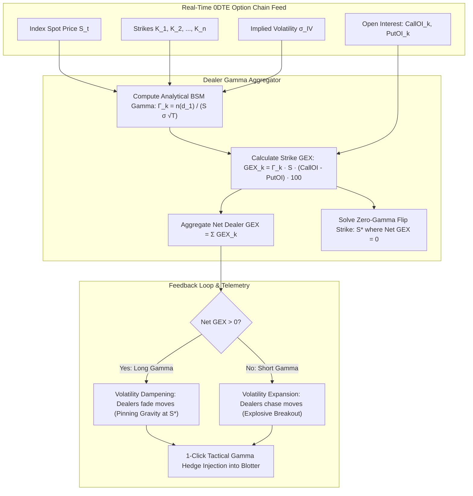

#### Diagram 18: LBO Multi-Tier Debt Waterfall & Cash Sweep Deleveraging
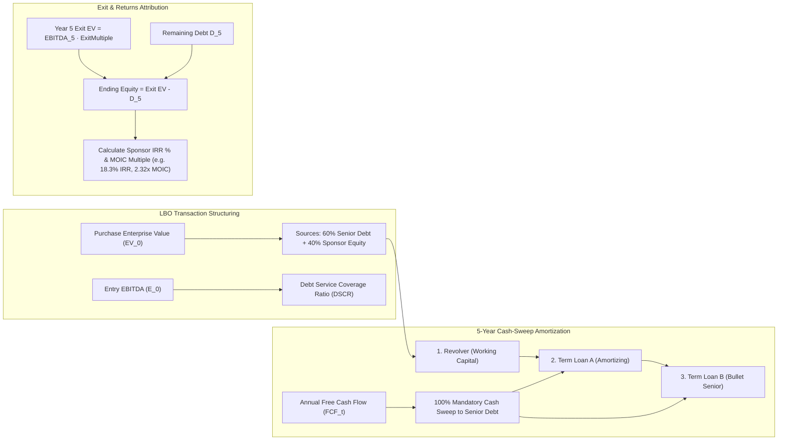

#### Diagram 19: Solvency II EVT Catastrophe Tail Risk & SCR Capital Sizing
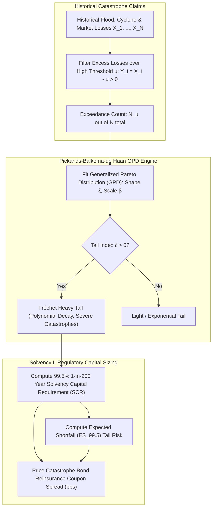

#### Diagram 20: CLO Tranche Cash Flow Priority of Payments & Default Absorption
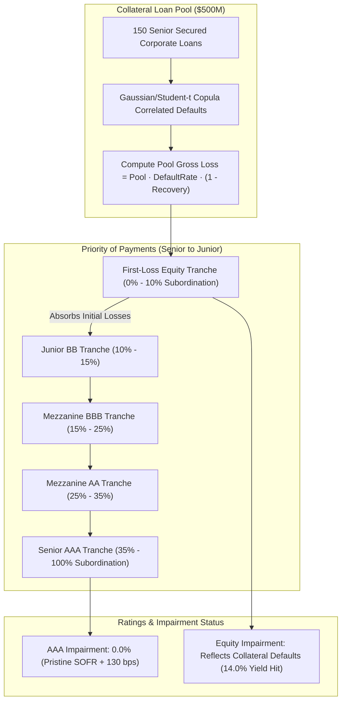

---

### Pure Vector LaTeX Proofs 26–30

#### Proof 26: Dealer Delta-Hedging Velocity & Zero-Gamma Inversion
Let market maker delta be $\Delta_{\text{MM}}(S) = -\sum_{i} \phi_i \Delta_i(S)$. The change in dealer shares required per unit change in underlying price is:
$$\frac{\partial \Delta_{\text{MM}}}{\partial S} = -\text{GEX}(S) = -\left[ \sum_{\text{Calls}} \Gamma_i S \cdot \text{OI}_i \cdot 100 - \sum_{\text{Puts}} \Gamma_j S \cdot \text{OI}_j \cdot 100 \right]$$
When underlying price moves by $dS_t$, dealers execute hedging flow $dQ_t = -\text{GEX}(S_t) dS_t$. By market microstructure equilibrium ($dS_t = \lambda_{\text{Kyle}} dQ_t^{\text{net}}$):
$$\frac{dS_t}{dt} = \mu S_t - \lambda \cdot \text{GEX}(S_t) \frac{dS_t}{dt} \implies \frac{dS_t}{dt} = \frac{\mu S_t}{1 + \lambda \cdot \text{GEX}(S_t)}$$
* If $\text{GEX} > 0$, the denominator exceeds 1, dampening price velocity (mean-reverting volatility suppression).
* If $\text{GEX} < -1/\lambda$, the denominator flips negative, triggering finite-time explosive trend runaway.
The zero-gamma boundary satisfies $\text{GEX}(S^*) = 0$. $\blacksquare$

#### Proof 27: Merton Structural Credit Bivariate Inversion & Distance-to-Default
Let firm asset value follow geometric Brownian motion $dV_t = \mu V_t dt + \sigma_A V_t dW_t$. Equity is a call option on firm assets maturing at debt maturity $T$:
$$E = V_A \mathcal{N}(d_1) - D e^{-rT} \mathcal{N}(d_2), \quad d_1 = \frac{\ln(V_A/D) + (r + \frac{1}{2}\sigma_A^2)T}{\sigma_A \sqrt{T}}, \quad d_2 = d_1 - \sigma_A \sqrt{T}$$
By Itô's lemma, the diffusion coefficient of equity satisfies $\sigma_E E = \frac{\partial E}{\partial V_A} \sigma_A V_A = \mathcal{N}(d_1) \sigma_A V_A$. This defines a non-linear bivariate system in unobservables $(V_A, \sigma_A)$:
$$\begin{cases} f_1(V_A, \sigma_A) = V_A \mathcal{N}(d_1) - D e^{-rT}\mathcal{N}(d_2) - E = 0 \\ f_2(V_A, \sigma_A) = \mathcal{N}(d_1) \sigma_A V_A - \sigma_E E = 0 \end{cases}$$
Solving via 2D Newton-Raphson yields $(V_A^*, \sigma_A^*)$. Distance-to-Default is the number of standard deviations firm asset value sits above debt barrier $D$:
$$\text{DD} = \frac{\ln(V_A^* / D) + (\mu_A - \frac{1}{2}{\sigma_A^*}^2)T}{\sigma_A^* \sqrt{T}} \implies \text{EDF} = \mathcal{N}(-\text{DD}). \quad \blacksquare$$

#### Proof 28: Pickands-Balkema-de Haan Theorem & Solvency II 99.5% SCR
Let $X$ have distribution function $F$. The conditional excess distribution over threshold $u$ is $F_u(y) = \Pr(X - u \le y \mid X > u)$. By the Pickands-Balkema-de Haan theorem (1974, 1975):
$$\lim_{u \to x_F} \sup_{0 \le y < x_F - u} |F_u(y) - G_{\xi, \beta(u)}(y)| = 0$$
where $G_{\xi, \beta}(y) = 1 - (1 + \xi y / \beta)^{-1/\xi}$ is the Generalized Pareto Distribution.
The tail probability for $x > u$ is $P(X > x) = P(X > u) P(X - u > x - u \mid X > u) = \frac{N_u}{N} \left( 1 + \xi \frac{x - u}{\beta} \right)^{-1/\xi}$.
Setting $P(X > x) = 1 - q$ with Solvency II quantile $q = 0.995$:
$$\text{VaR}_q = u + \frac{\beta}{\xi} \left[ \left( \frac{N}{N_u} (1 - q) \right)^{-\xi} - 1 \right]$$
Expected Shortfall integrates the conditional excess:
$$\text{ES}_q = \mathbb{E}[X \mid X > \text{VaR}_q] = \text{VaR}_q + \frac{\beta + \xi(\text{VaR}_q - u)}{1 - \xi} = \frac{\text{VaR}_q}{1 - \xi} + \frac{\beta - \xi u}{1 - \xi}. \quad \blacksquare$$

#### Proof 29: Redington Duration & Convexity Immunization of Balance Sheet Surplus
Let equity surplus be $E(y) = A(y) - L(y)$ where $A(y)$ and $L(y)$ are asset and liability present values at yield $y$. Expanding $E(y + \Delta y)$ via second-order Taylor series around current yield $y_0$:
$$\Delta E = \frac{dE}{dy} \Delta y + \frac{1}{2} \frac{d^2E}{dy^2} (\Delta y)^2 + \mathcal{O}((\Delta y)^3)$$
Substituting modified duration $D = -\frac{1}{P} \frac{dP}{dy}$ and convexity $C = \frac{1}{P} \frac{d^2P}{dy^2}$:
$$\frac{dE}{dy} = \frac{dA}{dy} - \frac{dL}{dy} = -A D_A + L D_L, \quad \frac{d^2E}{dy^2} = A C_A - L C_L$$
Assuming fully funded initial surplus $A = L$:
$$\Delta E \approx -L(D_A - D_L) \Delta y + \frac{1}{2} L(C_A - C_L) (\Delta y)^2$$
For $\Delta E \ge 0$ for all arbitrary yield shifts $\Delta y \in \mathbb{R}$:
1. First-order condition: $\frac{dE}{dy} = 0 \implies D_A = D_L$ (Duration Matching).
2. Second-order condition: $\frac{d^2E}{dy^2} > 0 \implies C_A > C_L$ (Convexity Surplus). $\blacksquare$

#### Proof 30: Calibrated Short-Rate Tree Backward Induction & Option-Adjusted Spread (OAS)
Let short rate $r_{i,j}$ evolve on a recombining binomial lattice: $r_{i,j} = r_{i,0} e^{2j \sigma \sqrt{\Delta t}}$ for $j = 0, \dots, i$.
For a bond with face value $M$, coupon $C$, and call protection schedule with call price $K_i$:
At maturity $T = N \Delta t$: $V_{N,j} = M + C$.
For time steps $i = N-1, \dots, 0$, backward induction discounts expected next-period cash flows adjusted for spread $s = \text{OAS}$:
$$\widetilde{V}_{i,j} = \frac{1}{1 + (r_{i,j} + s)\Delta t} \left[ q V_{i+1, j+1} + (1 - q) V_{i+1, j} \right] + C$$
where risk-neutral branching probability $q = 0.5$.
Applying the issuer early exercise call boundary:
$$V_{i,j} = \begin{cases} \min(K_i, \widetilde{V}_{i,j}) & \text{if bond is callable at step } i \\ \widetilde{V}_{i,j} & \text{otherwise} \end{cases}$$
The model price $P_{\text{model}}(s) = V_{0,0}(s)$ is monotonically decreasing in $s$. The unique Option-Adjusted Spread $s^*$ satisfies $P_{\text{model}}(s^*) = P_{\text{market}}^{\text{clean}}$.
The embedded call option value is $V_{\text{call}} = P_{\text{straight}} - P_{\text{market}}$, with option cost in spread basis points:
$$\text{Option Cost (bps)} = z_{\text{nominal}} - s^*. \quad \blacksquare$$
