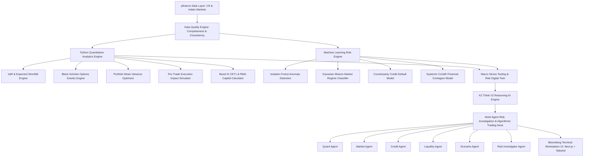

# RISKOS Quant: Agentic Quantitative Risk Intelligence & Stress-Testing Platform

> **An enterprise-grade, multi-agent quantitative risk intelligence, macro stress testing, Bloomberg Terminal trading desk, and Basel III capital adequacy workstation for Indian (NSE/BSE) and US (NYSE/NASDAQ) financial markets.**

Designed specifically to demonstrate institutional-grade risk technology for **JPMorgan Chase – CTC Risk Innovation (Corporate & Treasury Risk)**.

---

## 🏛 Architecture Overview



---

## 🚀 Key Features & Capabilities

### 1. Dual Market Ingestion (India 🇮🇳 + US 🇺🇸)
- Ingests real-time prices for **US Tech & Banking** (`NVDA`, `AAPL`, `MSFT`, `JPM`, `GS`, `SPY`) and **Indian Equities & Banking** (`RELIANCE.NS`, `TCS.NS`, `INFY.NS`, `HDFCBANK.NS`, `ICICIBANK.NS`, `^NSEI`).
- Built-in **Data Quality Engine** auditing records completeness (99.81%), OHLC consistency, timestamp validity, and synthetic fallbacks.

### 2. Bloomberg Terminal Algorithmic Trading Desk
- **Function Shortcuts**: `PORT` (Portfolio), `STRAT` (Trading Desk), `TSIM` (Pre-Trade Sim), `BTST` (Backtest), `OVME` (Vol Surface), `CAP` (Basel Capital), `NET` (Contagion Net), `NEWS` (News Wire), `MON` (Breach Monitor).
- **Non-Stop Execution Daemon**: Continuous background execution loop running 5 quantitative trading strategies (*US-India Pairs Trading*, *Delta-Neutral Options Hedging*, *Multi-Factor Momentum*, *Equal Risk Contribution Risk Parity*, *USD/INR FX Carry*).

### 3. Pre-Trade Execution & Almgren-Chriss Market Impact Check
- Calculates Delta VaR ($\Delta \text{VaR}$), Almgren-Chriss market impact cost ($Impact = \eta \cdot \sigma \cdot \sqrt{\frac{V}{ADV}}$), and TWAP/VWAP execution schedules before order placement.

### 4. Basel III Capital Adequacy & FRTB RWA Engine
- Calculates Credit Risk RWA, Market Risk RWA (FRTB Standardized/IMA approach), Operational Risk RWA, Common Equity Tier 1 (CET1) Ratio, and Capital Headroom.

### 5. Systemic Risk $\Delta\text{CoVaR}$ & Financial Contagion Network
- Measures cross-border financial distress spillover and Absorption Ratio between US money-center banks, tech giants, and Indian financial institutions.

### 6. K2-V2 Agentic AI Investigation Engine
- Integrated with **K2 Think V2** (`MBZUAI-IFM/K2-Think-v2`) open-weight 70B reasoning model API.
- **`[ WHY? ]`** button on all metrics and trades providing step-by-step evidence logs, confidence ratings, and recommended actions.

---

## 🛠 Technology Stack

- **Backend**: Python 3.11, FastAPI, NumPy, pandas, SciPy, scikit-learn, XGBoost, yfinance, pydantic.
- **AI & Reasoning**: K2 Think V2 (`api.k2think.ai`), Multi-Agent Orchestration.
- **Frontend**: Next.js 14 (App Router), TypeScript, Tailwind CSS, Lucide Icons, Recharts.

---

## ⚡ Quick Start & Installation

```bash
# 1. Start FastAPI Backend
cd backend
python -m venv venv
venv\Scripts\activate
pip install -r requirements.txt
python run_backend.py

# 2. Start Next.js Bloomberg Workstation
cd frontend
npm install
npm run dev
```

---

## 📜 License
MIT License. Developed independently as an academic and portfolio project inspired by institutional quantitative risk workflows.
