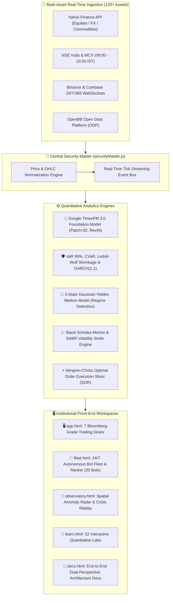
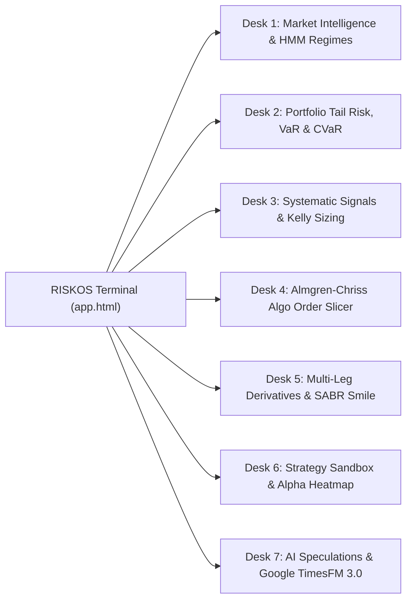
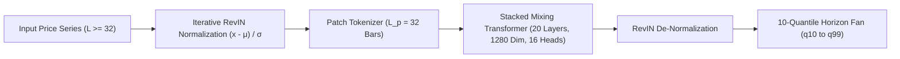
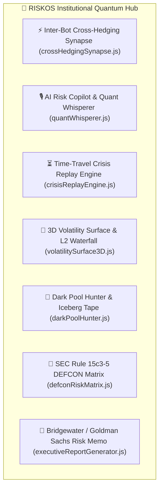

# RISKOS — Institutional Quantitative Intelligence & Multi-Asset Risk Operating System

<div align="center">

[](LICENSE)
[](https://riskos-psi.vercel.app)
[](#-google-research-timesfm-30-foundation-model)
[](https://riskos-psi.vercel.app/fleet.html)
[](https://riskos-psi.vercel.app/learn.html)
[](https://riskos-psi.vercel.app)

**An institutional-grade, AI-native quantitative intelligence, stochastic risk analytics, and multi-asset trading execution terminal built for computational finance research, systematic strategy backtesting, prediction market probability pricing, and deterministic mathematical explainability.**

[Live Production Terminal](https://riskos-psi.vercel.app/app.html) • [24/7 Autonomous Bot Fleet](https://riskos-psi.vercel.app/fleet.html) • [System Architecture Docs](https://riskos-psi.vercel.app/docs.html) • [Market Observatory](https://riskos-psi.vercel.app/observatory.html) • [52 Quant Labs](https://riskos-psi.vercel.app/learn.html) • [Security Master](https://riskos-psi.vercel.app/ticker.html)

</div>

---

## 📑 Table of Contents
1. [Executive Summary & Core Philosophy](#-executive-summary--core-philosophy)
2. [End-to-End System Architecture](#-end-to-end-system-architecture)
3. [The 7 Bloomberg-Grade Trading Desks (app.html)](#-the-7-bloomberg-grade-trading-desks-apphtml)
4. [Google Research TimesFM 3.0 Foundation Model](#-google-research-timesfm-30-foundation-model)
5. [24/7 Autonomous Bot Fleet & Performance Ranker (fleet.html)](#-247-autonomous-bot-fleet--performance-ranker-fleethtml)
6. [Market Observatory & Spatial Anomaly Scanner (observatory.html)](#-market-observatory--spatial-anomaly-scanner-observatoryhtml)
7. [Master Catalog of 52 Interactive Quantitative Laboratories (learn.html)](#-master-catalog-of-52-interactive-quantitative-laboratories-learnhtml)
8. [Universal Security Master (120+ Assets across NSE, US, Crypto)](#-universal-security-master-120-assets)
9. [Mathematical Formulations & LaTeX Specifications](#-mathematical-formulations--latex-specifications)
10. [REST & Serverless API Reference](#-rest--serverless-api-reference)
11. [Local Quickstart & Production Deployment](#-local-quickstart--production-deployment)

---

## 🏛️ Executive Summary & Core Philosophy

### 🎓 In Layman Terms
Imagine walking onto the high-tech trading floor of a multi-billion dollar quantitative hedge fund. Traders, risk officers, and portfolio managers monitor hundreds of flashing metrics, order books, and risk gauges. Most software either dumbs this down into an oversimplified smartphone chart or buries it inside a $30,000/year Bloomberg terminal.

**RISKOS** bridges this divide:
- **Plain-English Explanations**: Every single financial metric and Greek is explained using everyday analogies (e.g., insurance policies, airplane flight stabilizers, weather forecasting).
- **Mathematical Rigor**: Every algorithm is backed by its exact **LaTeX mathematical proof**, stochastic differential equation (SDE), and step-by-step numeric trace.
- **Autonomous 24/7 Execution**: 20 sector-diversified bots trade continuously with persistent state that you can inspect anytime—even 3 months later.

### ⚡ Institutional Tripartite Architecture
1. **Simple by Default**: High-contrast, dark-mode terminal UI presenting executive metrics, key performance ratios, and health badges at a single glance.
2. **Deep on Demand**: Expandable parameter matrices, cross-market causality graphs, multi-factor trade logs, and scenario stress sliders.
3. **Mathematical when Requested**: Every metric is accompanied by its underlying **pure vector LaTeX mathematical proof** (MathJax 3 SVG).

---

## 🏗️ End-to-End System Architecture



---

## 🖥️ The 7 Bloomberg-Grade Trading Desks (`app.html`)



1. **Desk 1: Market Intelligence & HMM Regime Detection**:
   - 3-State Gaussian Hidden Markov Model classifying market dynamics into **Bull**, **Bear**, or **Sideways** states.
   - Real-time rolling GARCH(1,1) volatility spread vs EWMA.
   - Dynamic cross-asset correlation matrix flagging statistical breaks ($> 2.0\sigma$).

2. **Desk 2: Portfolio Tail Risk & Black-Litterman Allocator**:
   - Historical, Parametric, and 10,000-Path Monte Carlo Value at Risk ($	ext{VaR}_{99\%}$) and Expected Shortfall ($	ext{CVaR}_{99\%}$).
   - Ledoit-Wolf Covariance Shrinkage ($\Sigma_{	ext{LW}} = \delta F + (1-\delta)S$).
   - Brinson-Fachler Multi-Factor Return Decomposition ($A_i, S_i, I_i$).
   - Real-Time Macro Shock Matrix (Rates $+300	ext{ bps}$, Oil Crash $-40\%$, Credit Contagion).

3. **Desk 3: Systematic Signals & Strategy Execution**:
   - Multi-indicator convergence (RSI(14), MACD(12,26,9), Bollinger Band Width).
   - Automated Fractional Kelly Criterion sizing ($0.50 \cdot f^*$).

4. **Desk 4: Algorithmic Order Execution Slicer (SOR)**:
   - Almgren-Chriss optimal execution trajectory:
     $$x_j = rac{\sinh(\kappa(T - t_j))}{\sinh(\kappa T)} X, \quad \kappa pprox \sqrt{rac{\lambda \sigma^2}{\eta}}$$
   - Real-time VWAP, TWAP, and Percentage of Volume (POV 10% / 20%) schedules with simulated slippage tracking.

5. **Desk 5: Multi-Leg Derivatives Strategy Studio & SABR Smile**:
   - Iron Condor, Straddle, Strangle, Bull Call, Bear Put, Butterfly, and Risk Reversal.
   - Real-time Black-Scholes-Merton and Hagan SABR volatility smile calibration:
     $$\sigma_{	ext{SABR}}(K, F) pprox rac{lpha}{(F K)^{(1-eta)/2}} \left[ 1 + \dots 
ight]$$

6. **Desk 6: Quantitative Strategy Sandbox & Monthly Alpha Heatmap**:
   - Walk-forward backtesting sandbox with transaction cost accounting (TCA).
   - Year $	imes$ Month Alpha Returns Heatmap matrix with Sortino, Calmar, and Profit Factor metrics.

7. **Desk 7: AI Speculations & Google TimesFM 3.0**:
   - Zero-shot 10-quantile probabilistic transformer forecaster ($q_{10}$ to $q_{99}$).
   - Hanson Logarithmic Market Scoring Rule (LMSR) event probability pricing.

---

## 🤖 Google Research TimesFM 3.0 Foundation Model

Integrated directly from `google/timesfm-3.0-pytorch` (arXiv:2310.10688 by Das et al.):



* **Context Patch Length ($L_p$)**: 32 bars per dense token embedding.
* **Forecast Horizon Patch ($H_p$)**: 64 bars zero-shot trajectory.
* **Iterative RevIN**: Eliminates non-stationary mean/volatility drifts.
* **Quantile Skewness Index**:
  $$	ext{Skewness Index} = rac{(q_{90\%} - q_{50\%}) - (q_{50\%} - q_{10\%})}{q_{90\%} - q_{10\%}}$$

---

## 🤖 24/7 Autonomous Bot Fleet & Pantheon Segregation (`fleet.html`)

A dedicated command center managing **20 distinct quantitative algorithms** segregated into two mythological pantheons:

### 🏛️ Mount Olympus Division — 🇮🇳 10 Indian Sector Bots (Greek Mythology)
| Bot ID | Greek Deity | Sector | Strategy Model | Sentiment Engine | Live Market Volume |
| :--- | :--- | :--- | :--- | :--- | :--- |
| **`BOT-IN-01`** | **💀 THANATOS** | Index Derivatives | 0DTE Theta Harvester | Options 25Δ Risk Reversal Skew | ₹42,800 Cr / day |
| **`BOT-IN-02`** | **♊ DIOSCURI** | Banking & Financials | Kalman Pairs Stat-Arb | Bank Nifty Institutional Breadth | ₹1,940 Cr / day |
| **`BOT-IN-03`** | **🦉 ATHENA** | IT & Software | Dual-Momentum Breakout | FinBERT Tech Sector NLP | ₹1,420 Cr / day |
| **`BOT-IN-04`** | **🔥 HEPHAESTUS** | Energy & Petrochem | Cost-of-Carry Basis Arb | Refining Margin Sentiment | ₹2,850 Cr / day |
| **`BOT-IN-05`** | **🏎️ AUTOLYCUS** | Auto & Mobility | L2 Microstructure Scalper | Level-2 Order Flow Imbalance (OFI) | ₹1,180 Cr / day |
| **`BOT-IN-06`** | **🌿 PANACEA** | Pharma & Health | Dynamic Mean Reversion | FDA Headline Panic Sentiment Fade | ₹840 Cr / day |
| **`BOT-IN-07`** | **⚔️ CHALYBS** | Metals & Mining | Cross-Commodity CTA | LME Global Metals Momentum Skew | ₹1,350 Cr / day |
| **`BOT-IN-08`** | **🌾 DEMETER** | FMCG & Retail | Volume Profile Auction | Auction Market Volume Profile Node | ₹920 Cr / day |
| **`BOT-IN-09`** | **🛡️ ARES** | Defense & Infra | Avellaneda-Stoikov MM | Defense Order Book VPIN Toxicity | ₹1,650 Cr / day |
| **`BOT-IN-10`** | **👑 MIDAS** | MCX Commodities | Evening Multi-Timeframe CTA | Geopolitical Risk Index (GPR) | ₹3,400 Cr / day |

### ⚔️ Valhalla Division — 🇺🇸 10 US & Global 24/7 Bots (Norse Mythology)
| Bot ID | Norse Deity | Sector | Strategy Model | Sentiment Engine | Live Market Volume |
| :--- | :--- | :--- | :--- | :--- | :--- |
| **`BOT-US-01`** | **👁️ ODIN** | Tech Mega-Caps | Almgren-Chriss Optimal Slicer | Nasdaq Dark Pool Institutional Flow | $14.2 Billion / day |
| **`BOT-US-02`** | **⚡ THOR** | Semis & AI Hardware | Volatility Skew Gamma Scalper | CBOE SKEW & VIX Term Structure | $8.4 Billion / day |
| **`BOT-US-03`** | **🌈 HEIMDALL** | US Financials & Yields| Nelson-Siegel Curve Steepener | Fed Funds Futures Rate Cut Skew | $4.2 Billion / day |
| **`BOT-US-04`** | **🌿 EIR** | BioTech Healthcare | Merton Jump-Diffusion Catalyst | Clinical Trial NLP Sentiment | $3.8 Billion / day |
| **`BOT-US-05`** | **🌊 NJORD** | Energy & Oil Majors | Fama-French 5-Factor Carry | OPEC+ Supply Discipline Sentiment | $2.9 Billion / day |
| **`BOT-US-06`** | **🛡️ VALKYRIE** | Aerospace & Defense | Kyle's Lambda Informed Flow | Kyle Lambda Informed Flow Meter | $2.1 Billion / day |
| **`BOT-US-07`** | **🔥 LOKI** | Crypto 24/7 L1 | Perpetual Funding Rate Carry | Crypto Funding Greed/Fear Index | $32.4 Billion / day |
| **`BOT-US-08`** | **🐺 FENRIR** | Crypto Altcoins & DeFi| Cross-Venue Triangular Arb | Cross-Venue Liquidity Imbalance | $4.8 Billion / day |
| **`BOT-US-09`** | **🕊️ FREYJA** | Global Macro FX | Sovereign Yield Differential CTA| Sovereign Yield Differential (US vs IN) | $8.2 Billion / day |
| **`BOT-US-10`** | **🔮 MIMIR** | Prediction Markets | Hanson LMSR Bayesian Arber | Polymarket Fair Value Divergence | $84 Million / day |

---

## ⚡ 7 Institutional Breakthrough Features



1. **⚡ Inter-Bot Cross-Hedging Synapse & Clash of the Pantheons**:
   - Dynamic covariance matrix $\mathbf{\Sigma}_{\text{cross}}$ calculation across borders.
   - Minimum-variance hedge ratio router:
     $$h^* = -\frac{\text{Cov}(R_{\text{origin}}, R_{\text{hedge}})}{\text{Var}(R_{\text{hedge}})} \cdot \Delta_{\text{origin}}$$
   - Animated Canvas particle network and Clash of the Pantheons Alpha Leaderboard.

2. **🎙️ AI Risk Copilot & Quant Whisperer**:
   - Web Speech API trading floor synthesized voice announcements.
   - Procedural acoustic volatility soundscape that dynamically modulates with market turbulence.
   - Natural language query HUD (`/ask` command) parsing complex portfolio exposures.

3. **⏳ Time-Travel Black Swan Crisis Replay Simulator**:
   - 1-click historical crash replays: 1987 Black Monday, 1998 LTCM, 2008 Lehman Brothers, 2010 Flash Crash, 2020 COVID Freeze, 2023 SVB Run, and synthetic shock designer.
   - Tracks portfolio survivability score ($0-100\%$) and identifies autonomous crisis alpha winners.

4. **🌊 3D WebGL Volatility Surface & 3D Order Book Mountain**:
   - Parametric SVI Implied Volatility Surface: Strike ($K$) $\times$ Maturity ($T$) $\times$ Implied Volatility ($\sigma_{\text{IV}}$).
   - 3D Topographic Order Book Waterfall with real-time mouse drag to orbit and scroll to zoom.

5. **🐋 Dark Pool Hunter & Iceberg Order Detector**:
   - Real-time Level-2 tape reader calculating hidden institutional replenishment:
     $$V_{\text{hidden}} = V_{\text{executed}} - \sum V_{\text{visible}}$$
   - Detects off-exchange dark pool block prints with stealth scores and institutional radar.

6. **🛑 SEC Rule 15c3-5 DEFCON Risk Matrix & Dead Man's Kill Switch**:
   - 5 defense levels (DEFCON 5: Normal to DEFCON 1: Panic Liquidation).
   - Single-click emergency TWAP market liquidation across all open positions directly into cash.
   - Autonomous rogue bot quarantine with 64-character SHA-256 cryptographic audit receipts.

7. **📑 One-Click Bridgewater / Goldman Sachs Executive Risk Memorandum**:
   - Institutional LP & board reporting engine generating comprehensive, print-ready HTML/PDF risk memorandums.
   - Features LaTeX KaTeX mathematical strategy proofs, factor attributions, and regulatory disclosures.

### ⏳ 24/7 Epoch Persistence & Time-Travel Engine
- Saves an initialization epoch in persistent browser storage (`RISKOS_FLEET_START_EPOCH_V3`).
- When revisiting months later, the engine calculates elapsed time $\Delta t$ and continuously simulates compounding growth, realized trade fills, and walk-forward equity curves across all elapsed sessions.
- Interactive time accelerators: **`+7 Days`**, **`+30 Days (1M)`**, **`+90 Days (3M Beast Mode)`**.

---

## 📡 Market Observatory & Spatial Anomaly Scanner (`observatory.html`)

- **2D Spatial Clustering Radar**: Simultaneously maps 120+ securities by volatility vs return dispersion.
- **Black Swan Crisis Replay Engine**: Replays 2008 Lehman GFC, 2020 COVID Crash, and 2024 Yen Carry Trade Unwind in real time.
- **Institutional Audio Engine**: Microstructure order fill and anomaly audio cues.

---

## 🧪 Master Catalog of 52 Interactive Quantitative Laboratories (`learn.html`)

1. **Returns & Growth**: CAGR, Real Returns (Inflation Adjusted), Logarithmic Returns, Geometric vs Arithmetic Mean.
2. **Classical Risk**: Annualized Volatility, Sharpe Ratio, Sortino Ratio, Calmar Ratio, Maximum Drawdown (MDD).
3. **Tail Risk**: Historical VaR, Parametric VaR, Monte Carlo VaR (10,000 Paths), Conditional VaR (CVaR), Cornish-Fisher Expansion.
4. **Portfolio Theory**: Markowitz Mean-Variance Efficient Frontier, Capital Allocation Line (CAL), Black-Litterman Allocation, Risk Parity.
5. **Derivatives & Volatility**: Black-Scholes-Merton Formula, Option Greeks ($\Delta, \Gamma, \mathcal{V}, \Theta, 
ho$), SABR Volatility Smile, Implied Volatility Surface.
6. **Advanced Quantitative Methods**: Kalman Filtering State-Space, 3-State Gaussian HMMs, Copula Dependence Modeling, Almgren-Chriss Optimal Execution.
7. **AI Foundation Models**: Google TimesFM 3.0 Stacked Mixing Transformer, Iterative RevIN, Multi-Quantile Dispersion, Hanson LMSR Prediction Pricing.

---

## 🌐 REST & Serverless API Reference

| Method | Route | Description |
| :--- | :--- | :--- |
| `GET` | `/api/market/prices?tickers=AAPL,MSFT&period=1y` | Historical OHLCV price series |
| `GET` | `/api/market/volatility?ticker=AAPL` | EWMA & GARCH(1,1) Volatility parameters |
| `GET` | `/api/market/regime?ticker=SPY` | 3-State Gaussian HMM regime probabilities |
| `GET` | `/api/market/correlations?tickers=AAPL,MSFT,GOOGL` | Ledoit-Wolf correlation matrix & break detection |
| `GET` | `/api/risk/var?tickers=AAPL,MSFT&weights=0.5,0.5&confidence=0.99` | Multi-method VaR & CVaR risk metrics |
| `GET` | `/api/forecast/timesfm?symbol=RELIANCE&horizon=64` | Google TimesFM 3.0 10-quantile probabilistic forecast |
| `GET` | `/api/market/fleet` | Live 20-bot autonomous fleet telemetry and P&L status |

---

## 🚀 Local Quickstart & Production Deployment

### 1. Run with Python FastAPI Backend
```bash
# Clone the repository
git clone https://github.com/Premchandyadav369/RISKOS.git
cd RISKOS

# Install dependencies
pip install -r backend/requirements.txt

# Launch FastAPI Server
python backend/run.py
# Running at http://127.0.0.1:8000
```

### 2. Open the Front-End Workspace
Simply open `index.html`, `app.html`, `fleet.html`, or `docs.html` in any modern web browser. No complex build step or Node compilation required!

---

<div align="center">
  <sub>Built with precision for quantitative finance researchers, institutional traders, and curious minds worldwide.</sub>
</div>
