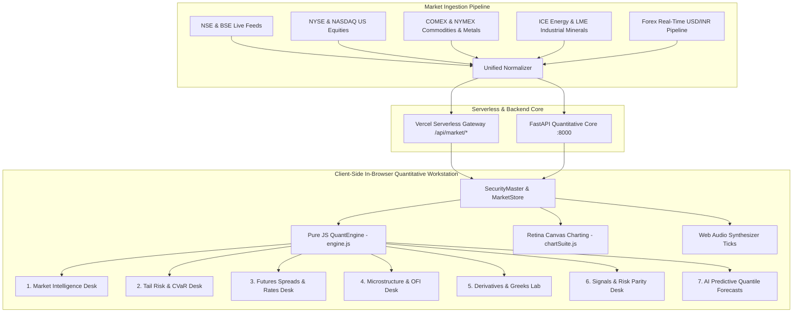

<div align="center">


# RISKOS
### Institutional Quantitative Intelligence & Multi-Asset Execution Workstation

[](https://riskos-psi.vercel.app)
[](https://www.python.org)
[](https://fastapi.tiangolo.com)
[](https://katex.org)
[](https://opensource.org/licenses/MIT)

**Simple by Default • Deep on Demand • Mathematical when Requested**

*An institutional-grade financial intelligence and quantitative risk workstation engineered for proprietary trading desks, asset managers, and quant researchers.*

[🌐 **Live Web Application**](https://riskos-psi.vercel.app) • [📊 **Ticker Library**](https://riskos-psi.vercel.app/ticker.html) • [🧪 **Learn & Lab**](https://riskos-psi.vercel.app/learn.html) • [🛰️ **Observatory**](https://riskos-psi.vercel.app/observatory.html) • [💻 **Quant Terminal**](https://riskos-psi.vercel.app/app.html)

</div>

---

## 🏛️ System Architecture

RISKOS combines a **zero-latency client-side mathematical computing engine** with **asynchronous serverless pipelines** and an **institutional Python quantitative core**:



---

## 📦 Multi-Asset Coverage & Instrument Registry

RISKOS monitors hundreds of live securities across all major global asset classes:

| Asset Class | Covered Instruments & Benchmarks | Real-Time Identifier |
| :--- | :--- | :--- |
| **Indian Benchmark Indices** | NIFTY 50, S&P BSE SENSEX, NIFTY BANK, NIFTY IT | `^NSEI`, `^BSESN`, `^NSEBANK`, `^CNXIT` |
| **US & Global Benchmarks** | S&P 500, NASDAQ 100, Dow Jones Industrial Average | `^GSPC`, `^IXIC`, `^DJI` |
| **Precious Metals** | Gold Futures (100 oz COMEX), Silver Futures (5,000 oz), Platinum, Palladium | `GOLD` (`GC=F`), `SILVER` (`SI=F`), `PL=F`, `PA=F` |
| **Energy Commodities** | Brent Crude Oil (ICE), WTI Light Sweet Crude, Henry Hub Natural Gas | `BRENT` (`BZ=F`), `CRUDE` (`CL=F`), `NATGAS` (`NG=F`) |
| **Industrial Base Metals** | Copper High Grade (COMEX), Aluminium (LME), Zinc, Nickel (EV Battery Grade) | `COPPER` (`HG=F`), `ALI=F`, `ZN=F`, `NI=F` |
| **Agricultural Softs** | Chicago SRW Wheat, Corn Futures (CBOT), Cotton #2 (ICE) | `WHEAT` (`ZW=F`), `CORN` (`ZC=F`), `COTTON` (`CT=F`) |
| **Indian Equities & ETFs** | Reliance, TCS, HDFC Bank, Infosys, ICICI, Tata Motors, Nifty BeES, Gold BeES | `RELIANCE.NS`, `TCS.NS`, `HDFCBANK.NS`, `GOLDBEES.NS` |
| **US Mega-Cap Equities** | NVIDIA, Apple, Microsoft, Alphabet, Amazon, Tesla, Meta, AMD, JPMorgan | `NVDA`, `AAPL`, `MSFT`, `GOOGL`, `AMZN`, `TSLA` |
| **Forex & Currencies** | US Dollar / Indian Rupee Real-Time Dynamic Live Sync | `USDINR=X` (Live Tick Converter) |

---

## 🧮 7 Institutional Trading Desks: Dual Explanations & Quantitative Mathematics

---

### Desk 1: Market Intelligence & Volatility Clustering

#### 💡 In Layman Terms
> Market risk does not remain constant. After a sudden crash or major earnings surprise, volatility clusters together—high-volatility days follow high-volatility days. Our system tracks this "momentum of fear" using GARCH equations and employs a 3-state AI radar to classify whether the market is in a sunny **Bull**, stormy **Bear**, or sideways **Consolidation** regime.

#### ⚡ Technical Quant Specification & Mathematical Formulation

1. **GARCH(1,1) Conditional Volatility Recursive Estimator**:
   $$\sigma_t^2 = \omega + \alpha \epsilon_{t-1}^2 + \beta \sigma_{t-1}^2$$
   where $\omega > 0$, $\alpha \ge 0$, $\beta \ge 0$, and stationarity requires $\alpha + \beta < 1$. The unconditional long-run variance is:
   $$\sigma_{\infty}^2 = \frac{\omega}{1 - (\alpha + \beta)}$$

2. **RiskMetrics Exponentially Weighted Moving Average (EWMA)**:
   $$\sigma_{t,\text{EWMA}}^2 = \lambda \sigma_{t-1}^2 + (1 - \lambda) r_{t-1}^2, \quad \text{with decay factor } \lambda = 0.94$$

3. **Ledoit-Wolf Optimal Covariance Shrinkage**:
   $$\Sigma_{\text{LW}} = \delta F + (1 - \delta) S$$
   where $S$ is the sample covariance matrix, $F$ is the structured constant-correlation target, and $\delta \in [0, 1]$ is the asymptotically optimal shrinkage intensity minimizing Frobenius risk $\| \Sigma_{\text{LW}} - \Sigma \|_F^2$.

4. **3-State Gaussian Hidden Markov Model (HMM)**:
   $$P(S_t = j \mid S_{t-1} = i) = A_{ij}, \quad r_t \mid (S_t = k) \sim \mathcal{N}(\mu_k, \sigma_k^2)$$

---

### Desk 2: Tail Risk & Conditional Value-at-Risk (CVaR) Optimization

#### 💡 In Layman Terms
> Traditional finance only calculates average risk, but hedge funds fail during rare catastrophic tail events. **Value-at-Risk (VaR 99%)** tells you the worst loss expected on 99 out of 100 days. **Expected Shortfall (CVaR 99%)** tells you what happens on the 1 nightmare day when everything breaks down. Our optimizer constructs allocations that shield against extreme market tail risk.

#### ⚡ Technical Quant Specification & Mathematical Formulation

1. **Value-at-Risk (VaR) & Expected Shortfall (CVaR)**:
   $$\text{VaR}_\alpha(L) = \inf \left\{ \ell \in \mathbb{R} : P(L > \ell) \le 1 - \alpha \right\}$$
   $$\text{CVaR}_\alpha(L) = \frac{1}{1 - \alpha} \int_\alpha^1 \text{VaR}_u(L) \, du = \mathbb{E}\left[ L \mid L \ge \text{VaR}_\alpha(L) \right]$$

2. **Rockafellar-Uryasev Convex CVaR Optimization (SLSQP)**:
   $$\min_{w \in \mathcal{W}, \zeta \in \mathbb{R}} F_\alpha(w, \zeta) = \zeta + \frac{1}{(1 - \alpha) S} \sum_{s=1}^S \max\left(0, -w^T R_s - \zeta\right)$$
   $$\text{subject to} \quad \sum_{i=1}^N w_i = 1, \quad 0 \le w_i \le w_{\max}, \quad w^T \mathbb{E}[R] \ge R_{\text{target}}$$

3. **Regulatory Backtesting (Kupiec POF & Christoffersen Independence Tests)**:
   - **Kupiec Likelihood Ratio (Unconditional Coverage)**:
     $$LR_{\text{uc}} = -2 \ln \left[ \frac{(1 - p)^{N - x} p^x}{\left(1 - \frac{x}{N}\right)^{N - x} \left(\frac{x}{N}\right)^x} \right] \sim \chi^2(1)$$
   - **Christoffersen Independence Test**:
     $$LR_{\text{ind}} = -2 \ln \left[ \frac{\hat{\pi}^{\,n_{01} + n_{11}} (1 - \hat{\pi})^{\,n_{00} + n_{10}}}{\hat{\pi}_{01}^{\,n_{01}} (1 - \hat{\pi}_{01})^{\,n_{00}} \hat{\pi}_{11}^{\,n_{11}} (1 - \hat{\pi}_{11})^{\,n_{10}}} \right] \sim \chi^2(1)$$

---

### Desk 3: Futures Spreads & Yield Curve Rates Desk

#### 💡 In Layman Terms
> While individual assets move unpredictably, economic pairs (like Brent vs WTI crude oil or 2Y vs 10Y bonds) act as if linked by a rubber band. When the price spread stretches excessively, it mean-reverts. We calculate the exact half-life (days to reversion) and model sovereign interest rate curves across 11 maturities.

#### ⚡ Technical Quant Specification & Mathematical Formulation

1. **Ornstein-Uhlenbeck (OU) Mean-Reverting Stochastic Process**:
   $$d S_t = \theta (\mu - S_t) \, dt + \sigma \, dW_t$$
   $$\mathbb{E}[S_t \mid S_0] = \mu + (S_0 - \mu) e^{-\theta t}, \quad \text{Half-Life } \tau_{1/2} = \frac{\ln(2)}{\theta}$$

2. **Kalman Filter Dynamic State-Space Hedge Ratio**:
   $$\beta_t = \beta_{t-1} + \omega_t, \quad y_t = \alpha_t + \beta_t x_t + v_t$$
   $$K_t = P_{t|t-1} x_t \left( x_t^2 P_{t|t-1} + \sigma_v^2 \right)^{-1}, \quad \beta_{t|t} = \beta_{t|t-1} + K_t (y_t - \hat{y}_t)$$

3. **Nelson-Siegel-Svensson (NSS) Sovereign Zero-Coupon Yield Curve**:
   $$y(t) = \beta_0 + \beta_1 \left( \frac{1 - e^{-t/\tau_1}}{t/\tau_1} \right) + \beta_2 \left( \frac{1 - e^{-t/\tau_1}}{t/\tau_1} - e^{-t/\tau_1} \right) + \beta_3 \left( \frac{1 - e^{-t/\tau_2}}{t/\tau_2} - e^{-t/\tau_2} \right)$$
   - $\beta_0$: Long-term asymptotic level.
   - $\beta_1$: Short-term decay component (Slope).
   - $\beta_2, \beta_3$: Medium-term humps (Curvature 1 & 2).

---

### Desk 4: Market Microstructure & Order Flow Imbalance (OFI)

#### 💡 In Layman Terms
> At the millisecond level, prices move because of order book inventory pressure. When buyers outnumber sellers at the top of the queue, the true fair price (Micro-Price) tilts upward before the actual trade occurs. We track toxic informed institutional order flow and compute optimal order-slicing trajectories to prevent execution slippage.

#### ⚡ Technical Quant Specification & Mathematical Formulation

1. **Order Flow Imbalance (OFI)**:
   $$\text{OFI}_t = I_{\{P_{b,t} \ge P_{b,t-1}\}} v_{b,t} - I_{\{P_{b,t} \le P_{b,t-1}\}} v_{b,t-1} - I_{\{P_{a,t} \le P_{a,t-1}\}} v_{a,t} + I_{\{P_{a,t} \ge P_{a,t-1}\}} v_{a,t-1}$$

2. **Micro-Price Fair Value Estimator**:
   $$P_{\text{micro}} = \frac{Q_b P_a + Q_a P_b}{Q_b + Q_a} = P_b + \left( \frac{Q_b}{Q_b + Q_a} \right) (P_a - P_b)$$

3. **Volume-Synchronized Probability of Toxicity (VPIN)**:
   $$\text{VPIN} = \frac{\sum_{\tau=1}^N |V_\tau^B - V_\tau^S|}{N \cdot V_{\text{bucket}}}$$

4. **Almgren-Chriss Optimal Trade Execution Schedule**:
   $$x_j = \frac{\sinh\left(\kappa (T - t_j)\right)}{\sinh(\kappa T)} X, \quad \text{where } \kappa \approx \sqrt{\frac{\lambda \sigma^2}{\eta}}$$
   balancing temporary impact parameter $\eta$, permanent impact $\gamma$, and trader risk aversion $\lambda$.

---

### Desk 5: Derivatives, Volatility Surface & Greeks Lab

#### 💡 In Layman Terms
> Option market makers do not gamble on whether a stock will rise or fall. Instead, they buy/sell underlying shares to remain **Delta Neutral ($\Delta = 0$)**, capturing the volatility spread. We calculate all first- and second-order Greeks and simulate discrete dynamic hedging with live rebalancing costs.

#### ⚡ Technical Quant Specification & Mathematical Formulation

1. **Black-Scholes-Merton Partial Differential Equation & Pricing**:
   $$\frac{\partial V}{\partial t} + \frac{1}{2}\sigma^2 S^2 \frac{\partial^2 V}{\partial S^2} + r S \frac{\partial V}{\partial S} - r V = 0$$
   $$C(S, K, T, r, \sigma) = S N(d_1) - K e^{-rT} N(d_2)$$
   $$P(S, K, T, r, \sigma) = K e^{-rT} N(-d_2) - S N(-d_1)$$
   $$d_1 = \frac{\ln(S/K) + \left(r + \frac{1}{2}\sigma^2\right)T}{\sigma \sqrt{T}}, \quad d_2 = d_1 - \sigma \sqrt{T}$$

2. **Analytical First & Second-Order Greeks**:
   $$\text{Delta } \Delta_c = N(d_1), \quad \text{Gamma } \Gamma = \frac{\phi(d_1)}{S \sigma \sqrt{T}}, \quad \text{Vega } \mathcal{V} = S \phi(d_1) \sqrt{T}$$
   $$\text{Theta } \Theta_c = -\frac{S \phi(d_1) \sigma}{2 \sqrt{T}} - r K e^{-rT} N(d_2), \quad \text{Rho } \rho_c = K T e^{-rT} N(d_2)$$
   $$\text{Vanna} = -\frac{\phi(d_1) d_2}{\sigma}, \quad \text{Volga} = \mathcal{V} \frac{d_1 d_2}{\sigma}, \quad \text{Charm} = -\phi(d_1) \left[ \frac{r}{\sigma \sqrt{T}} - \frac{d_2}{2 T} \right]$$

3. **Newton-Raphson Implied Volatility Solver**:
   $$\sigma_{n+1} = \sigma_n - \frac{C_{\text{BSM}}(\sigma_n) - C_{\text{market}}}{\mathcal{V}(\sigma_n)}$$

---

### Desk 6: PnL Attribution & Systematic Risk Parity

#### 💡 In Layman Terms
> If your portfolio gained 25%, did you profit because of stock-picking skill (Selection) or broad sector momentum (Allocation)? **Brinson-Fachler Attribution** proves the origin of your gains. **Risk Parity** allocates capital so every individual asset contributes an equal share of risk, rather than letting a single volatile holding dictate total fund volatility.

#### ⚡ Technical Quant Specification & Mathematical Formulation

1. **Brinson-Fachler Multi-Factor Active Return Decomposition**:
   $$R_{\text{active}} = R_p - R_b = \text{Allocation} + \text{Selection} + \text{Interaction}$$
   $$\text{Allocation} = \sum_{i=1}^M (w_{p,i} - w_{b,i}) (R_{b,i} - R_b)$$
   $$\text{Selection} = \sum_{i=1}^M w_{b,i} (R_{p,i} - R_{b,i})$$
   $$\text{Interaction} = \sum_{i=1}^M (w_{p,i} - w_{b,i}) (R_{p,i} - R_{b,i})$$

2. **Equal Risk Contribution (Risk Parity)**:
   $$\sigma_p(w) = \sqrt{w^T \Sigma w}, \quad \text{Marginal Risk Contribution } \text{MRC}_i = \frac{(\Sigma w)_i}{\sqrt{w^T \Sigma w}}$$
   $$\text{Total Risk Contribution } \text{TRC}_i = w_i \cdot \text{MRC}_i = \frac{1}{N} \sigma_p(w) \quad \forall i \in \{1, \dots, N\}$$

3. **Multi-Asset Fractional Kelly Criterion**:
   $$f^* = \kappa \cdot \Sigma^{-1} (\mu - r_f \mathbf{1}), \quad \kappa \in (0, 1] \text{ (Half-Kelly for drawdown control)}$$

---

### Desk 7: AI Speculations & Quantile Fan Forecasting

#### 💡 In Layman Terms
> Point forecasts ("the stock will hit \$250") fail because markets are inherently probabilistic. Instead of a single path, our Monte Carlo engine simulates 10,000 geometric Brownian motion paths under drift and volatility clustering, generating a 95% probability corridor of future prices.

#### ⚡ Technical Quant Specification & Mathematical Formulation

1. **Geometric Brownian Motion (GBM) with Itô's Lemma**:
   $$d S_t = \mu S_t \, dt + \sigma S_t \, dW_t \implies S_t = S_0 \exp\left( \left(\mu - \frac{1}{2}\sigma^2\right) t + \sigma W_t \right)$$

2. **10,000-Path Monte Carlo Quantile Fan**:
   $$S_t^{(k)} = S_{t-1}^{(k)} \exp\left( \left(\mu - \frac{1}{2}\sigma_t^2\right) \Delta t + \sigma_t \sqrt{\Delta t} \, Z_k \right), \quad Z_k \sim \mathcal{N}(0, 1)$$
   Computing quantiles $q_{0.05}(t), q_{0.25}(t), q_{0.50}(t), q_{0.75}(t), q_{0.95}(t)$ over horizon $T = 30\text{ days}$.

---

## 💻 Tech Stack & Deployment Architecture

- **Frontend Core**: Vanilla ES6+ JavaScript, Retina-scaled HTML5 Canvas (`chartSuite.js`), Web Audio API Oscillator Synthesis, MathJax / KaTeX LaTeX renderers.
- **Serverless API Layer**: Vercel Node.js Edge Functions (`/api/market/quote`, `/api/market/quotes`, `/api/market/candles`, `/api/market/breadth`).
- **Institutional Quant Backend**: Python 3.11, FastAPI, NumPy, SciPy, Pandas, scikit-learn, Arch (GARCH), statsmodels.
- **Data Providers**: Live Yahoo Finance Direct Gateway, Google Finance, NSE/BSE Exchange Ingestion with auto-reconnecting SSE stream.

---

## ⚡ Quickstart & Local Setup

### 1. Run via Vercel Cloud (Instant Web Access)
Simply open the live production URL in any modern browser:
👉 [**https://riskos-psi.vercel.app**](https://riskos-psi.vercel.app)

### 2. Run Locally with Python Quantitative Backend

```bash
# 1. Clone Repository
git clone https://github.com/Premchandyadav369/RISKOS.git
cd RISKOS

# 2. Install Python Backend Dependencies
cd backend
pip install -r requirements.txt

# 3. Start FastAPI Server
python run.py
```
*Backend runs on `http://127.0.0.1:8000`. Interactive API Docs are available at `http://127.0.0.1:8000/docs`.*

```bash
# 4. Open Frontend
# Open index.html in any browser or launch with Live Server on port 5500
```

---

## 👤 Author & Research Team
**Premchand Yadav** — Quantitative Architecture & Engineering
- **GitHub**: [@Premchandyadav369](https://github.com/Premchandyadav369)
- **Repository**: [https://github.com/Premchandyadav369/RISKOS](https://github.com/Premchandyadav369/RISKOS)

---

<div align="center">
<sub>Engineered with mathematical rigor for institutional equity research, volatility arbitrage, and systematic multi-asset execution.</sub>
</div>
