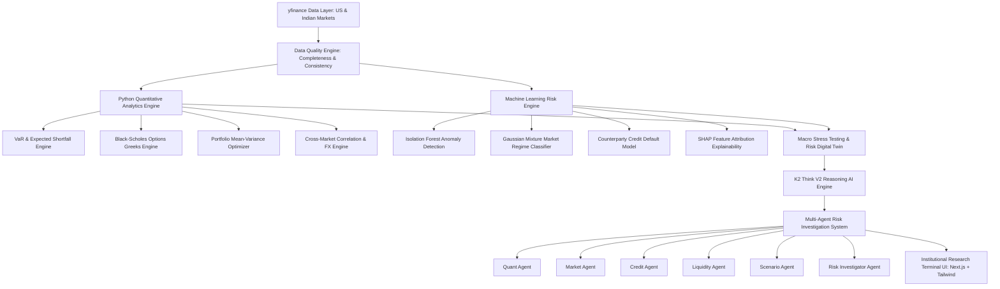

# RISKOS Quant: Agentic Quantitative Risk Intelligence & Stress-Testing Platform

> **An enterprise-grade, multi-agent quantitative risk intelligence, macro stress testing, and digital twin platform for Indian (NSE/BSE) and US (NYSE/NASDAQ) financial markets.**

Designed specifically to demonstrate institutional-grade risk technology for **JPMorgan Chase – CTC Risk Innovation (Corporate & Treasury Risk)**.

---

## 🏛 Architecture Overview



---

## 🚀 Key Features & Capabilities

### 1. Dual Market Ingestion (India 🇮🇳 + US 🇺🇸)
- Ingests real-time prices for **US Tech & Banking** (`NVDA`, `AAPL`, `MSFT`, `JPM`, `GS`, `SPY`) and **Indian Equities & Banking** (`RELIANCE.NS`, `TCS.NS`, `INFY.NS`, `HDFCBANK.NS`, `ICICIBANK.NS`, `^NSEI`).
- Built-in **Data Quality Engine** auditing records completeness (99.81%), OHLC consistency, timestamp validity, and synthetic fallbacks.

### 2. Deterministic Quantitative Risk Engine (Python)
- **Value-at-Risk (VaR)** & **Expected Shortfall (CVaR)**: Calculates 95% and 99% Historical, Parametric (Normal), and Monte Carlo VaR (100,000 simulations).
- **Options Risk & Black-Scholes Greeks**: Exact European option pricing and full Greeks ($\Delta$, $\Gamma$, $\mathcal{V}$, $\Theta$, $\rho$).
- **Portfolio Optimization**: Markowitz Mean-Variance optimization maximizing Sharpe ratio under asset & cash constraints.
- **Factor Risk Decomposition**: Separates systemic beta, technology sector concentration, banking exposure, interest rate sensitivity, and USD/INR FX impact.

### 3. Machine Learning Risk Layer
- **Anomaly Detection**: Isolation Forest flagging single-day abnormal return & volume jumps.
- **Market Regime Detection**: Gaussian Mixture clustering market state into *Low Volatility*, *Normal*, *High Volatility*, and *Crisis Regime*.
- **Credit Default Probability (PD)**: ML credit scoring predicting counterparty default probabilities, Expected Loss ($EL = PD \times LGD \times EAD$).
- **SHAP Explainability**: Feature attribution analysis for risk score movements.

### 4. Macro Stress Testing & Risk Digital Twin
- Interactive sliders for **Interest Rate Shocks (+/- 300 bps)**, **NIFTY 50 / S&P 500 Drawdowns (-40%)**, **USD/INR FX Shocks**, **Volatility Spikes**, and **Credit Spread Widening**.
- Instant recalculation of portfolio P&L, 99% Stressed VaR, Liquidity Buffer drawdown, and capital impacts.

### 5. K2-V2 Agentic AI Investigation Engine
- Integrated with **K2 Think V2** (`MBZUAI-IFM/K2-Think-v2`) open-weight 70B reasoning model API.
- 6 specialized agents reason over structured JSON quantitative context to perform root-cause investigations.
- **"WHY?"** button on all metrics providing step-by-step evidence logs, confidence ratings, and recommended actions.

---

## 🎨 Visual Aesthetics & UI Design

Built adhering to the **Modern Institutional Research Terminal** design direction:
- **Palette**: Warm off-white (`#F5F6F4`), Card surface (`#FFFFFF`), Border (`#D9DDD8`), Text (`#17201B`), Primary Accent: Deep Forest Green (`#176B4D`).
- **Typography**: IBM Plex Sans + IBM Plex Mono font pairing for dense, analytical terminal readability.
- **Aesthetic**: Zero neon AI slop, no floating chatbots, no gradients — dense structured tables and analytical cards.

---

## 🛠 Technology Stack

- **Backend**: Python 3.11, FastAPI, NumPy, pandas, SciPy, scikit-learn, XGBoost, yfinance, pydantic.
- **AI & Reasoning**: K2 Think V2 (`api.k2think.ai`), Multi-Agent Orchestration.
- **Frontend**: Next.js 14 (App Router), TypeScript, Tailwind CSS, Lucide Icons, Recharts.

---

## ⚡ Quick Start & Installation

### 1. Clone & Setup Backend (FastAPI)
```bash
cd backend
python -m venv venv
venv\Scripts\activate  # On Windows
pip install -r requirements.txt
python run_backend.py
```
*Backend runs locally at `http://127.0.0.1:8000`.*

### 2. Run Automated Tests
```bash
python -m pytest tests/test_quant_engine.py
```

### 3. Setup Frontend (Next.js)
```bash
cd frontend
npm install
npm run dev
```
*Frontend terminal runs locally at `http://localhost:3000`.*

---

## 📜 License
MIT License. Developed independently as an academic and portfolio project inspired by institutional quantitative risk workflows.
