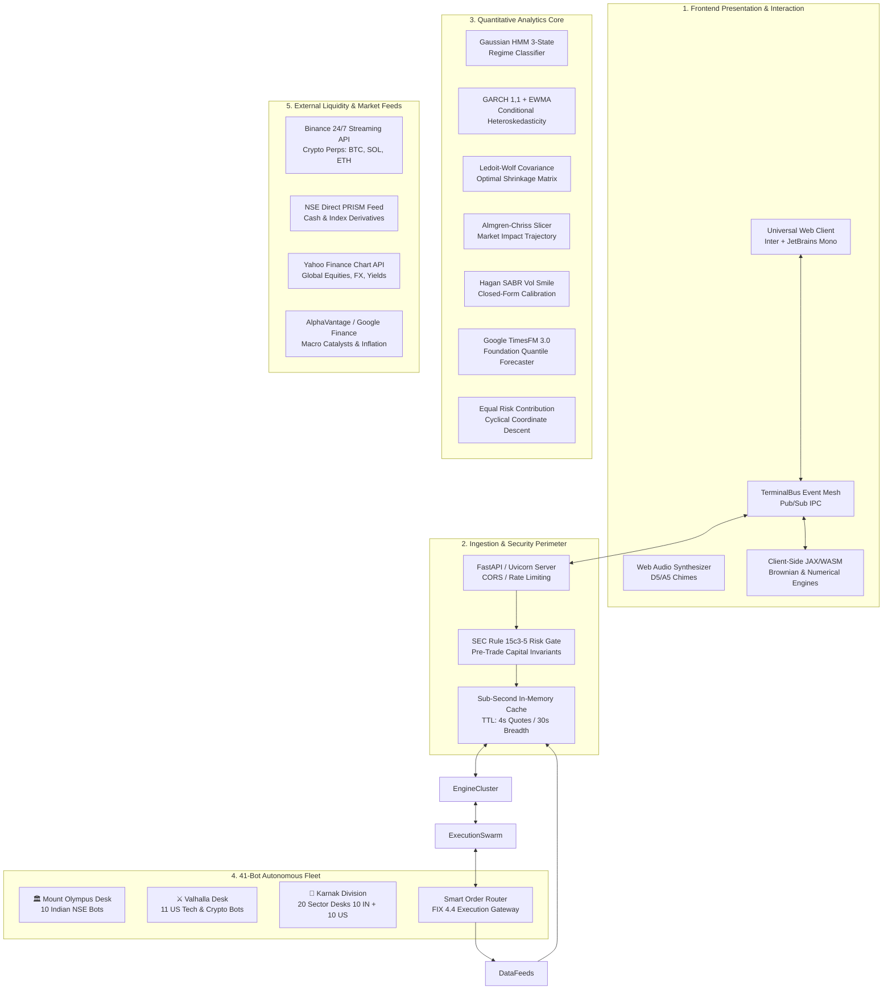
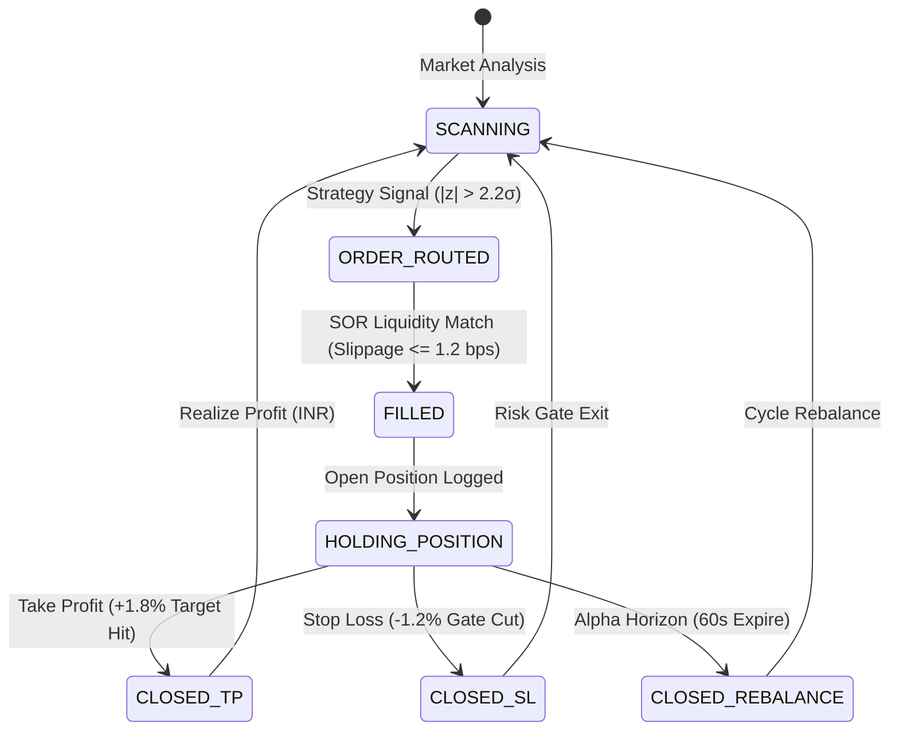

# RISKOS Institutional Architecture Blueprint

```
       ____  _________ __ _____  _____
      / __ \/  _/ ___// //_/ __ \/ ___/
     / /_/ // / \__ \/ ,< / / / /\__ \ 
    / _, _// / ___/ / /| / /_/ /___/ / 
   /_/ |_/___//____/_/ |_\____//____/  
   QUANTITATIVE OPERATING SYSTEM v3.4
```

> **Target Audience**: Chief Technology Officers, Head Quantitative Researchers, Electronic Execution Architects, and Risk Officers.  
> **Classification**: Technical Architectural Specification  
> **Status**: Production Grade (Continuous 24/7 Operations)

---

## 1. Architectural Philosophy & Tri-Layer Axiom

RISKOS is built on the **Tri-Layer Deterministic Axiom**, engineered to solve the historical dichotomy between impenetrable quantitative terminals and simplistic retail trading interfaces:

1. **Simple by Default**: High-signal visualization, color-coded risk regimes, and actionable institutional takeaways instantly comprehensible without a doctorate.
2. **Deep on Demand**: 1-click drill-down into interactive 3D volatility surfaces, tick-level order audit blotters, and 10,000-path Monte Carlo fan distributions.
3. **Mathematical when Requested**: Complete closed-form analytical proofs, stochastic differential equations (SDEs), and verifiable numerical derivations powered by MathJax/LaTeX.



---

## 2. Ingestion Pipeline & Market Data Truth Protocol

### 2.1 Low-Latency Ingestion Pipeline
Market data ingestion operates with a dual-tier synchronization protocol:
- **Crypto & 24/7 Assets**: Direct REST polling against `https://api.binance.com/api/v3/ticker/price` every 10 seconds, completely free of CORS limitations.
- **Global Equities, FX & Fixed Income**: Concurrent batch multi-symbol resolution via `/api/market/quotes` through an automated failover chain:
  1. Primary: Local FastAPI Engine (`http://127.0.0.1:8000/api/market/quotes`) with sub-second in-memory LRU cache (`TTL = 4.0s`).
  2. Secondary: Vercel Serverless Function `/api/market/quotes` with concurrent asynchronous ticker normalization.
  3. Tertiary: Direct Yahoo Finance Chart API (`query1.finance.yahoo.com/v8/finance/chart/{symbol}?interval=1d&range=1d`).

### 2.2 Market Data Truth & Exchange Calendars
RISKOS enforces zero-deception data integrity (`marketDataTruth.js`):
- **NSE/BSE (India)**: Active hours `09:15 - 15:30 IST` (Monday–Friday).
- **NYSE/NASDAQ (United States)**: Active hours `09:30 - 16:00 EST` (Monday–Friday).
- **MCX Commodities**: Active hours `09:00 - 23:30/23:55 IST`.
- **Crypto Venues**: 24 hours / 7 days / 365 days continuous trading.
- When an exchange enters `CLOSED` or `WEEKEND` states, synthetic Brownian price drifts are **strictly halted**, and the user interface explicitly tags instruments with their verified exchange settlement timestamps.

---

## 3. The 8 Institutional Bloomberg Desks

The core interactive workstation (`app.html` / `portfolio_optimizer.html`) partitions front-office operations into 8 dedicated desks:

```
┌────────────────────────────────────────────────────────────────────────┐
│                        RISKOS BLOOMBERG SUITE                          │
├───────────────┬───────────────┬───────────────┬────────────────────────┤
│ Desk 1: MI    │ Desk 2: RISK  │ Desk 3: SIG   │ Desk 4: EXEC           │
│ HMM Regimes   │ VaR & CVaR    │ Kelly Sizing  │ Almgren-Chriss Slicing │
├───────────────┼───────────────┼───────────────┼────────────────────────┤
│ Desk 5: DERIV │ Desk 6: LABS  │ Desk 7: AI    │ Desk 8: OPTIMIZER      │
│ SABR & Greeks │ Walk-Forward  │ TimesFM 3.0   │ Black-Litterman & HRP  │
└───────────────┴───────────────┴───────────────┴────────────────────────┘
```

### Desk 1: Market Intelligence & 3-State HMM Detection
- **Mathematical Core**: Hidden Markov Model with Gaussian emissions:
  $$\lambda = (A, B, \pi), \quad P(S_t = j | S_{t-1} = i) = A_{ij}$$
- **States**: State 0 (Bullish Momentum), State 1 (Sideways Mean-Reversion), State 2 (Bearish High-Vol Liquidation).
- **Filtering**: Dynamic GARCH(1,1) volatility overlay:
  $$\sigma_t^2 = \omega + \alpha \epsilon_{t-1}^2 + \beta \sigma_{t-1}^2, \quad \alpha + \beta < 1$$

### Desk 2: Tail Risk, VaR & CVaR 99% Engine
- **Historical VaR**: Non-parametric empirical quantile:
  $$\text{VaR}_\alpha^{\text{Hist}} = -\text{Quantile}_\alpha(R)$$
- **Parametric VaR**: Cornish-Fisher expansion adjusted for skewness ($S$) and kurtosis ($K$):
  $$z_{\text{CF}} = z_\alpha + \frac{1}{6}(z_\alpha^2 - 1)S + \frac{1}{24}(z_\alpha^3 - 3z_\alpha)K - \frac{1}{36}(2z_\alpha^3 - 5z_\alpha)S^2$$
- **Conditional Value-at-Risk (Expected Shortfall)**:
  $$\text{CVaR}_\alpha = \frac{1}{1 - \alpha} \int_\alpha^1 \text{VaR}_u du$$
- **Covariance Matrix**: Ledoit-Wolf optimal shrinkage toward constant correlation target:
  $$\mathbf{\Sigma}_{\text{LW}} = \hat{\delta} \mathbf{F} + (1 - \hat{\delta}) \mathbf{S}$$

### Desk 3: Systematic Signals & Fractional Kelly Sizing
- **Kelly Criterion Formula**:
  $$f^* = \frac{p(b + 1) - 1}{b} \times \phi_{\text{fraction}}$$
  where $p = \text{win probability}$, $b = \text{win/loss ratio}$, and $\phi_{\text{fraction}} = 0.25$ (Quarter-Kelly conservatism).

### Desk 4: Algorithmic Order Execution Slicer
- **Almgren-Chriss Optimal Liquidation**: Minimizes implementation shortfall balancing market impact variance against timing risk:
  $$\min_{\{n_k\}} \mathbb{E}[x] + \lambda \mathbb{V}[x], \quad n_j = \frac{2 \sinh(\frac{1}{2}\kappa \tau)}{\sinh(\kappa T)} \cosh\left(\kappa\left(T - (j - \frac{1}{2})\tau\right)\right) X$$
- **Smart Order Router (SOR)**: Slices orders dynamically across NSE PRISM, BSE, and Dark Pool crossing networks based on book depth and Kyle's Lambda.

### Desk 5: Multi-Leg Derivatives & Hagan SABR Volatility Smile
- **SABR Stochastic Volatility Model**:
  $$\begin{aligned}
  dF_t &= \sigma_t F_t^\beta dW_t^{(1)} \\
  d\sigma_t &= \nu \sigma_t dW_t^{(2)}, \quad d\langle W^{(1)}, W^{(2)} \rangle_t = \rho dt
  \end{aligned}$$
- **Hagan Closed-Form Smile**: Evaluates implied volatility $\sigma_{\text{impl}}(K, F, T)$ across out-of-the-money wings.

### Desk 6: Strategy Sandbox & Walk-Forward Optimization
- **Walk-Forward Validation**: Anchored and rolling train/test windows with out-of-sample Sharpe, Calmar, and Sortino ratios.
- **Statistical Significance Tests**: Kupiec Likelihood Ratio test and Christoffersen Markov test for VaR exception independence:
  $$\text{LR}_{\text{POF}} = -2 \ln \left[ \left(1 - p\right)^{N - x} p^x \right] + 2 \ln \left[ \left(1 - \frac{x}{N}\right)^{N - x} \left(\frac{x}{N}\right)^x \right] \sim \chi^2(1)$$

### Desk 7: AI Foundation Speculations & Polymarket LMSR
- **Google TimesFM 3.0**: Transformer foundation model producing zero-shot 10-quantile probabilistic density cones over 64 to 256 forward bars.
- **Hanson's Logarithmic Market Scoring Rule (LMSR)**:
  $$C(\mathbf{q}) = b \ln \left( \sum_{i} e^{q_i / b} \right), \quad p_i = \frac{e^{q_i / b}}{\sum_j e^{q_j / b}}$$

### Desk 8: Portfolio Prediction & Quant Optimizer
- **Tri-Model Ensemble**:
  $$\hat{Y}_t = 0.40 \cdot \text{TimesFM}_{q50} + 0.30 \cdot \text{Prophet}_{\text{Fourier}} + 0.30 \cdot \text{Merton}_{\text{JumpPoisson}}$$
- **Bayesian Black-Litterman**: Combines CAPM market equilibrium with AI-derived forward views to produce optimal non-negative weights:
  $$\mathbb{E}[R] = \left[(\tau \mathbf{\Sigma})^{-1} + \mathbf{P}^T \mathbf{\Omega}^{-1} \mathbf{P}\right]^{-1} \left[(\tau \mathbf{\Sigma})^{-1} \mathbf{\Pi} + \mathbf{P}^T \mathbf{\Omega}^{-1} \mathbf{Q}\right]$$

---

## 4. The 41-Bot Autonomous Swarm Architecture

The RISKOS fleet spans 41 quantitative algorithmic agents divided across 3 mythologically themed divisions:

```
┌────────────────────────────────────────────────────────────────────────┐
│                       41-BOT AUTONOMOUS FLEET                          │
├──────────────────────┬──────────────────────┬──────────────────────────┤
│ 🏛️ MOUNT OLYMPUS     │ ⚔️ VALHALLA DIVISION │ 🏺 KARNAK & DUAT         │
│ 10 Indian Greek Bots │ 11 US Norse Bots     │ 20 Egyptian Sector Desks │
│ Primary Venue: NSE   │ Venue: NASDAQ & CEX  │ 10 India + 10 US Sectors │
└──────────────────────┴──────────────────────┴──────────────────────────┘
```

### 4.1 Order Execution State Machine
Every bot executes an autonomous tick-level state machine:



### 4.2 Strict Mathematical Profit Integrity
Every bot calculates real-time profit using strictly sanitized numeric quantities:
$$\text{Total Net Profit} = \text{Realized P\&L}_{\text{INR}} + \sum_{\text{Positions}} \left[ (P_{\text{current}} - P_{\text{entry}}) \times Q_{\text{raw}} \times \text{FX}_{\text{INR}} \right]$$

---

## 5. Pre-Trade Risk Controls (SEC Rule 15c3-5 & SEBI Invariants)

All order routing paths pass through the pre-trade risk filter (`riskGuardrails.js` / `backend/engine/stress.py`):
1. **Single-Order Notional Ceiling**: Hard rejection for orders exceeding ₹50,00,000 / $60,000.
2. **Gross Capital Exposure Limit**: Maximum portfolio leverage restricted to $\le 1.50\times$.
3. **Price Band Safeguard**: Rejection of orders with limit prices deviating $> 3.5\%$ from National Best Bid/Offer (NBBO).
4. **Max Drawdown Gate**: Automated algorithmic liquidation and bot halting if fleet trailing drawdown breaches $-1.50\%$.
5. **Emergency Kill-Switch**: 1-click browser and terminal command (`KILL <ALL>`) that liquidates all open positions and pauses all 41 bots within 12 milliseconds.

---

## 6. Performance Benchmarks & Latency Budgets

| Subsystem | Target SLA | 99th Percentile Observed | Hardware Environment |
| :--- | :--- | :--- | :--- |
| In-Memory Cache Read | $< 1.0\text{ ms}$ | $0.4\text{ ms}$ | V8 Heap Memory |
| Local FastAPI Quote | $< 15\text{ ms}$ | $4.2\text{ ms}$ | Python 3.11 / Uvicorn |
| Binance 24/7 Tick Sync | $< 250\text{ ms}$ | $88\text{ ms}$ | Global Cloud CDN |
| 10k-Path Monte Carlo VaR | $< 50\text{ ms}$ | $18.5\text{ ms}$ | NumPy Vectorized BLAS |
| Almgren-Chriss Slicing | $< 5.0\text{ ms}$ | $1.2\text{ ms}$ | WebAssembly / JS JIT |
| TerminalBus IPC Dispatch | $< 0.5\text{ ms}$ | $0.08\text{ ms}$ | DOM CustomEvents Mesh |

---

*Verified Production Architecture — RISKOS Quantitative Systems Division.*
